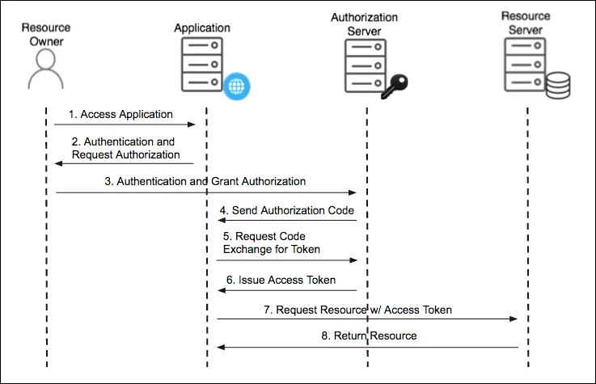
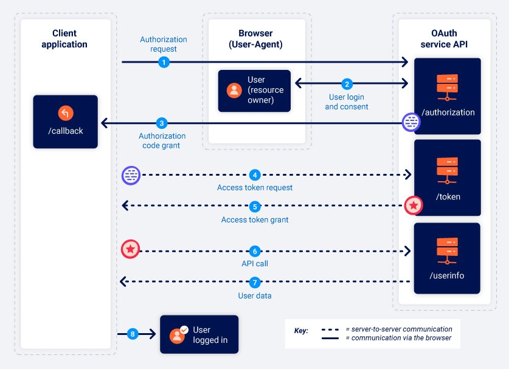
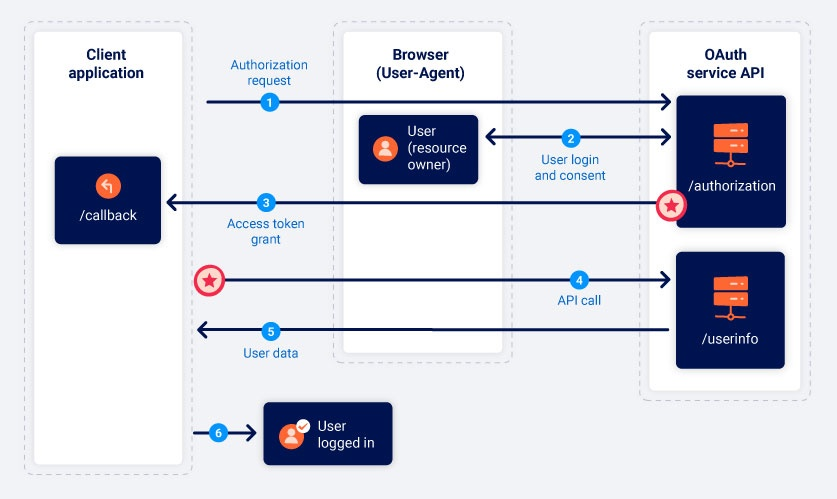

#OAuth

## OAuth 2.0
An **authorization framework** allowing websites (the **Application**) to request limited access to a user's account/data/resources stored on another application (the **Service Provider**), without the user having to directly expose their login credentials to the **Application**.

This is done through a series of interactions between:
- The **`User/Resource Owner`**.
- The **`Client Application`** - the webapp wanting access to the user's data.
- The **`OAuth Service Provider`** - the application controlling the user's data & access to it.
	- Provides OAuth support with an **API** for interacting with the **Authorization** and **Resource** servers.



### Overall Stages:
1. **`Client application`** requests access to a subset of a user's data, specifying the **grant type** and **what kind of access** they want.
2. **`User`** prompted to login to the **`OAuth service provider`** to give consent for the requested access.
3. **`Client application`** receives a unique **`Access Token`** proving they have permission to access the requested data. *(How this occurs depends on grant type)*
4. **`Client application`** issues calls to the Service Provider's `API` using this **`Access Token`** to retrieve the **`User`**'s data.

---

## OAuth Grant Types/Flows:
Determines the **exact sequence of steps in an OAuth process**, **how the client communicates with the OAuth Service** & **how** the `Access Token` is sent. Specified by the client in the **initial authorisation request.**
*Most common types are #Authorization-Code-Grant and #Implicit-Grant.*

### (1) [Authorization Code Grant Type](https://portswigger.net/web-security/oauth/grant-types#authorization-code-grant-type)
#Authorization-Code-Grant *(`response_type=code`)*
Where **all API communication** from the `Authorisation Code`/`Access Token` exchange onwards **takes place over a secure, pre-configured back channel** (Steps 4-8 below), invisible to the end-user.

*As the access token & user data is not sent via the browser, is arguably the most secure method.*

#### Detailed Authorization Code Flow:
#Authorization-Code-Grant
1. **AUTHORISATION REQUEST:**
   **`Client Application`** sends a request to the **`OAuth service`**'s `/authorization` endpoint asking for permission to access specific user data.
   Can identify this endpoint based on parameters in query string:
``` http
GET /authorization?client_id=12345&redirect_uri=https://client-app.com/callback&response_type=code&scope=openid%20profile&state=ae13d489bd00e3c24 HTTP/1.1
Host: oauth-authorization-server.com
```
- `client_id` - **`Client Application`**'s unique ID, generated when it registers with the **`OAuth Service`**.
- `redirect_uri` - The URI the browser should be redirected to when sending the authorisation code to the **`Client Application`**. *Often try to exploit flaws in the validation of this parameter*
- `response_type` - determines the flow/grant type the **`Client Application`** expects
- `scope` - specifies which subset of the user's data the **`Client Application`** wants to access *(can be custom-set by **`OAuth provider`**, or standardised like OpenID Connect)*
- `state` - stores a unique session-based value, which the **`OAuth Service`** should return with the `Authorisation Code` as a form of `CSRF` token. Ensures that the request to **`Client Application`**'s `/callback` endpoint is from the same person who initiated the OAuth flow.

2. **USER LOGIN & CONSENT:**
   When the **`OAuth Service`**'s authorization server receives the authorization request, redirects user to log in to OAuth provider account & select what data to share with the **`Client Application.`**
   Once approved, *this step will be completed automatically as long as the user still has a valid session with the OAuth service.*

3. **AUTHORISATION CODE GRANT**
   Browser is redirected to the `/callback` endpoint specified in the `redirect_uri` parameter, with the resulting `GET` request **containing the authorization code as a query parameter** (and sometimes the `state`):
``` HTTP
GET /callback?code=a1b2c3d4e5f6g7h8&state=ae13d489bd00e3c24 HTTP/1.1
Host: client-app.com
```

4. **ACCESS TOKEN REQUEST**
   **`Client Application`** **exchanges the** `Authorization Code` for an `Access Token` via a server-to-server `POST` request **using a secure back channel** *(not visible to an attacker).*
``` HTTP
POST /token HTTP/1.1
Host: oauth-authorization-server.com
…
client_id=12345&client_secret=SECRET&redirect_uri=https://client-app.com/callback&grant_type=authorization_code&code=a1b2c3d4e5f6g7h8
```
*Contains the new parameters:*
- `client_secret` - secret key identifying the **`Client Application`**, generated when registering with the **`OAuth Service`**. 
- `grant_type` - identifies the grant type (`authorization_code`) to the new `/token` endpoint.

5. **ACCESS TOKEN GRANT**
   **`OAuth Service`** validates the request, & provides an `Access Token` with the requested `scope`
``` JSON
{ "access_token": "z0y9x8w7v6u5", "token_type": "Bearer", "expires_in": 3600, "scope": "openid profile", … }
```

6. **API CALL TO ACCESS USER DATA**
   **`Client Application`** fetches user data from the **`OAuth Service`**'s resource server (typically `/userinfo`), using its `Access Token` in the `Authorization: Bearer` header to prove it is allowed to access the resource. 
``` HTTP
GET /userinfo HTTP/1.1
Host: oauth-resource-server.com
Authorization: Bearer z0y9x8w7v6u5
```

7. **RESOURCE GRANTED BY OAuth RESOURCE SERVER**
   **`OAuth Service`**'s resource server **verifies** the `Access Token` is **valid & belongs to the `Client Application`,** before returning the requested resource.
   
   The **`Client Application`** can now use resource this for its intended purpose *(e.g. for OAuth authentication, will sign the user in.)*
``` json
{"username":"carlos", "email":"carlos@carlos-montoya.net"}
```

---
### (2) [Implicit Grant Type](https://portswigger.net/web-security/oauth/grant-types#implicit-grant-type)
#Implicit-Grant *(`response_type=token`)*
Rather than first obtaining an `Authorisation Code` & exchanging it for an `Access Token`, the **`Client Application`** receives the `Access Token` ***immediately after the user gives their consent***.
Often used in SPAs & desktop applications, where the `client_secret` **cannot be easily stored on a back-end**.

This is **far less secure**, as **all communication happens via browser redirects**, with no secure back channel. Thus, exposes the **sensitive** `Access Token` **and the user's data** to #AiTM attacks.

#### Detailed Implicit Grant Flow 
Has been marked where this process *(Differs)* from the #Authorization-Code-Grant.

1. **AUTHORISATION REQUEST:** *(Differs)*
   **`Client Application`** sends a request to the **`OAuth service`**'s `/authorization` endpoint asking for permission to access specific user data, but with `response_type=token`:
``` HTTP
GET /authorization?client_id=12345&redirect_uri=https://client-app.com/callback&response_type=token&scope=openid%20profile&state=ae13d489bd00e3c24 HTTP/1.1
Host: oauth-authorization-server.com
```

2. **USER LOGIN & CONSENT**

3. **ACCESS TOKEN GRANT** *(Differs)*
   **`OAuth service`** redirects the browser to the `redirect_uri` specified in the authorization request, & *(differently)* sends the `Access Token` & other token-specific data via a **URL fragment**.
   This must be **extracted & stored** by the **`Client Application`** (via a script, etc.) as is no longer sent directly via a back channel.
``` HTTP
GET /callback#access_token=z0y9x8w7v6u5&token_type=Bearer&expires_in=5000&scope=openid%20profile&state=ae13d489bd00e3c24 HTTP/1.1
Host: client-app.com
```

4. **API CALLS TO RESOURCE SERVER** *(Differs)*
   After **`Client Application`** extracts `Access Token` from URL fragment, uses it to fetch user data via `API` calls to the **`OAuth Service`**'s resource server (typically `/userinfo`). *Unlike the Authorisation Code flow, this happens via the browser:*
``` HTTP
GET /userinfo HTTP/1.1
Host: oauth-resource-server.com
Authorization: Bearer z0y9x8w7v6u5
```
   
   5. **RESOURCE GRANTED BY OAuth RESOURCE SERVER**
   **`OAuth Service`**'s resource server **verifies** the `Access Token` is **valid & belongs to the `Client Application`,** before returning the requested resource.
   
   The **`Client Application`** can now use resource this for its intended purpose *(e.g. for OAuth authentication, will sign the user in.)*
``` json
{"username":"carlos", "email":"carlos@carlos-montoya.net"}
```


### [OAuth Scopes](https://portswigger.net/web-security/oauth/grant-types#oauth-scopes)
For any grant type, the `scope` parameter in the initial authorization request specifies **which data it wants to access and what kind of operations it wants to perform**.
The format can vary between providers, such as:
``` bash
scope=contacts
scope=contacts.read
scope=contact-list-r
scope=https://oauth-authorization-server.com/auth/scopes/user/contacts.readonly
```
When OAuth is used for **authentication**, standardized #OpenID-Connect scopes are often used instead (e.g. `openid profile`).

---