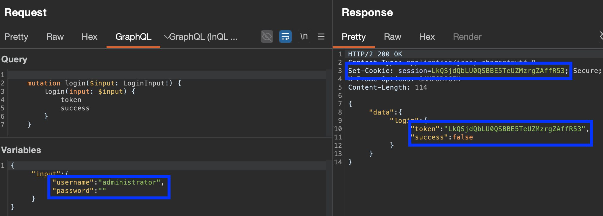
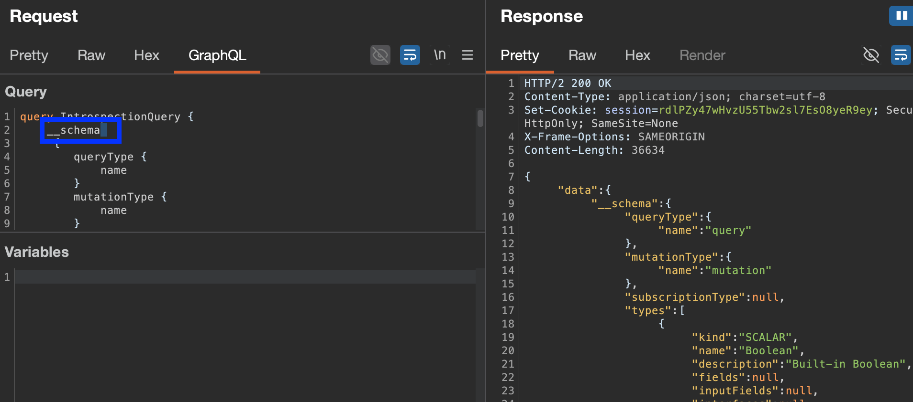
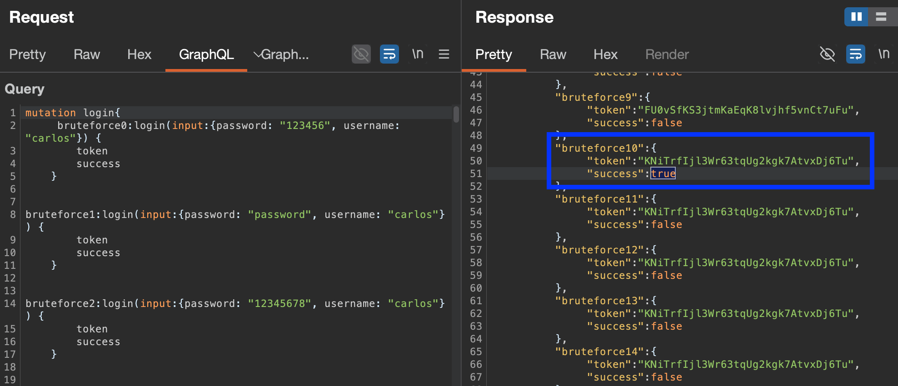

## Discovering the endpoint:
Use a #universal-query (`query{__typename}`) to common root endpoint locations (try appending `/v1` if no luck, or using a [wordlist](https://github.com/danielmiessler/SecLists/blob/master/Discovery/Web-Content/graphql.txt)):
- `/graphql`
- `/api`
- `/api/graphql`
- `/graphql/api`
- `/graphql/graphql`
 
GraphQL often responds with *"query not present"* to any **non-GraphQL request.**

Whilst GraphQL best practices use `POST` requests with a content-type of `application/json` (*protecting against `CSRF` vulns)* try `GET` when discovering endpoints.

Once discovered, send requests in BURP & filter for `JSON` type responses, to see how much is sent/received by the app, and craft simple queries in response to understand.

### The golden tools for GraphQL:
- **[InQL](https://github.com/doyensec/inql) (burp extension)** - identifies schema for endpoints, constructs batched queries/mutations/subscriptions, POIs, and sends them to Repeater with variables in-built. Also integrates with:
	- **GraphiQL** (dynamic query builder based on your schema)
	- **Voyager** (schema visualiser)
- 

## Exploiting unsanitized arguments:
If the GraphQL uses **arguments to access objects directly**, it may be vulnerable to access control vulnerabilities. 
Examine the results returned from a query, and if there are **any IDs in use**, attempt to **query missing ones directly**.
E.g.:
``` json
// QUERY
 query { products { id name listed } } 

// RESPONSE
 { "data": { "products": [
 { "id": 1, "name": "Product 1", "listed": true },
 { "id": 2, "name": "Product 2", "listed": true },
 { "id": 4, "name": "Product 4", "listed": true }
 ] } }
 
 // Follow-up direct query for product(id:3)
 query { product(id: 3) { id name listed } }
 // may reveal "hidden" data:
 { "data": { "product": 
 { "id": 3, "name": "Product 3", "listed": no } } }
```

#### Generating Introspection Queries:
- Paste base URL into InQL / right click on request & "Set Introspection Query" (try legacy, too)
- When wanting to understand a **specific request**, right click on it and add *"Set Introspection Query"* - can retrieve more info about that endpoint/request type. **Save these to sitemap/visualise**
- Use a full schema dump [here](https://portswigger.net/web-security/graphql#discovering-schema-information)

#### Suggestion Queries:
Even if introspection is disabled, can try and glean/fuzz info from suggestions, if enabled. 
A tool like [clairvoyance](https://github.com/nikitastupin/clairvoyance) can help with this, and 

#### Lab: Private GraphQL Posts
Notice when observing the request made by the app to get points, there's an `id` field and post `3` is missing.
Query the `/graphql` endpoint with introspection to get the schema, find the relevant query to `getPostByID`, and directly query for the missing blog post with `getBlogPost(id: $id)`:


#### Lab: Accidental exposure of private GraphQL fields
#introspection #graphql
User management functions for this lab are powered by a GraphQL endpoint. The lab contains an access control vulnerability whereby you can **induce the API to reveal user credential fields.**
Can see when log in, the graphQL login retrieves a `token` which is then set as the session cookie for access.

Attempting to query this with another username and, for example, a blank password... *also* reveals a session token, even though `success:false`.

However, reusing this session results in a refresh, so likely dead end.
**Changing tact:** right click on a specific query like this, **Generate Introspection Query**, and it will send one **tailored to this request.** Then, **save to sitemap**, and inspect it:

This reveals a `getUser()` query that takes an ID. Iteration maybe...? Yep.


---

## Bypassing GraphQL introspection defenses 
#introspection #graphql #bypass-introspection-defenses
Bypass defenses by:
- **inserting special characters after `__schema` keyword** (as often regex-based defences), like a new line, space, etc.:
``` json
// new line introspection bypass
    {
        "query": "query{__schema
        {queryType{name}}}"
    }
```
- try **different request types** (`GET`) or a `POST` with a content-type of `x-www-form-urlencoded`.
``` json
//Introspection probe as GET request

GET /graphql?query=query%7B__schema%0A%7BqueryType%7Bname%7D%7D%7D
```

#### [Lab](https://portswigger.net/web-security/graphql/lab-graphql-find-the-endpoint): Finding a hidden GraphQL endpoint
#hidden-graphql #bypass-introspection-defenses 
Endpoint seems hidden, not visible on frontend of app. However, querying some common paths reveals `/api` potentially having some GraphQL smell to it, getting `"Query not present"` when hitting it with GET.

Trying to do introspection via GET:

Yay! But, introspection not allowed... time to bypass with characters after `__schema`? 


By adding a space after `__schema` to try and trick regex based parsers, we get the schema!

Pop it into InQL, and we can search for interesting mutations. `DeleteOrganizationUserResponse` is one...
Right click response from introspection, **Save To Site Map**, then inspect the requests it can populate:

Can delete user by id! First, use the other GET to query users by id:

Then iterate until we find `carlos`, and use that `id` in the other GET to delete him.


## Bypassing rate limiting using aliases 
#rate-limit-bypass #graphql #Aliases 
Normally, GraphQL objects **can't contain multiple identically-named properties** (e.g. `{user { name name lastname }}`). However, #Aliases enable you to **bypass this restriction** by explicitly naming the properties you want the API to return. 
You can use aliases to **return multiple instances of the same type of object** in one request (see: [Aliases](GraphQL.md#Aliases))

This *ALSO* can potentially **bypass rate limiting mechanisms** which analyse the **number of HTTP requests received**, given you can **batch multiple queries within one request with #Aliases**.
``` json
    #Request with aliased queries

    query isValidDiscount($code: Int) {
        isvalidDiscount(code:$code){
            valid
        }
        isValidDiscount2:isValidDiscount(code:$code){
            valid
        }
        isValidDiscount3:isValidDiscount(code:$code){
            valid
        }
    }
```

#### [Lab](https://portswigger.net/web-security/graphql/lab-graphql-brute-force-protection-bypass): Bypassing GraphQL brute force protections
#Aliases #rate-limit-bypass #graphql 
Goal is to brute force login for `carlos`'s account, with a list of passwords.
A single login query looks like this:

Attempting to brute force the variable `password` in intruder results in rate limiting. So, we use aliases.
Using a python script created (or in-browser javascript/find & replace) to take the query we want to brute force, and add brute-forceable values within it, we can create:

 


### GraphQL CSRF 
#csrf #graphql 
Performed as per usual CSRF - *manipulating a victim's browser to send a malicious query as the victim user* - but must satisfy:
- GraphQL endpoint **does not validate the `content type`** of the requests sent to it (allowing `GET` queries & any requests with `x-www-form-urlencoded`)
- **No CSRF tokens** are implemented.

If the GraphQL endpoint uses `POST` requests with a content type of `application/json`, they tend to be "secure" against forgery.

#### Lab: Performing CSRF exploits over GraphQL
Notice we use GraphQL mutation to change email, and only requires an email & logged in session. No token, or previous email required. CSRF gold!

See how we can issue this request. Try switching to GET (method not allowed), and then to POST, but changing the query with a tool like [graphQLConverter](https://github.com/Justice-Reaper/graphQLConverter) to be sent as `Content-Type: application/x-www-form-urlencoded`:


Successful email change! Now to just develop the POC using burp, and change the email to another one & deliver to victim.


---
## Resources:
- [GraphQL (Hacktricks)](https://hacktricks.wiki/en/network-services-pentesting/pentesting-web/graphql.html)
- [GraphQL Security Overview](https://blog.doyensec.com/2018/05/17/graphql-security-overview.html)
- [insiderPHD on GraphQL Vulns](https://www.youtube.com/watch?v=jyjGneKJynk) + [demo](https://www.youtube.com/watch?v=viWzbPuGqpo)
- [Hacker101 GraphQL Labs](https://www.hackerone.com/blog/graphql-week-hacker101-capture-flag-challenges)