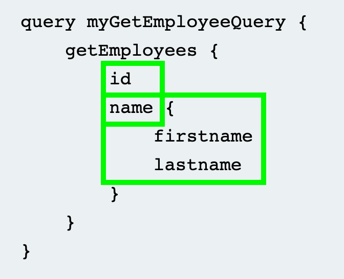
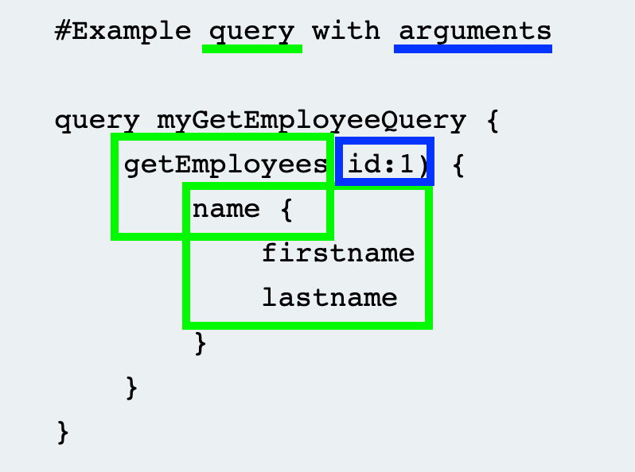

#api #graphql 
GraphQL is a platform-agnostic API query language that is designed around **one endpoint** (as opposed to REST/SOAP's multiple), enabling the user to **specify exactly what data they want in the response** and avoiding multiple calls & large, extraneous response objects.

They typically use `POST` requests with `JSON` bodies, with the **type & name** of the operations determining how they're handled & what data is returned.

Can be queried with the #universal-query to validate it's a GraphQL endpoint, and then be probed by an #introspection query to return the defined endpoint's **schema**.

- **Universal Query:** `query{__typename}` to a GraphQL endpoint (e.g. `/graphql`)--> `{"data": {"__typename": "query"}}`

The schema defines how to communicate to the endpoint, with a hierarchy of available **objects**, and the **fields** and **arguments** they have. 
- **Fields have their own *types*,** being either another object or a scalar, enum, union, interface, or custom type.
- Queries **can't contain multiple objects with the same name**: e.g. 
``` json
// invalid 
query getProductDetails {
        getProduct(id: 1) {
query getProductDetails {
        getProduct(id: 2) {

```

### Query Rules:
- `query XXXX` **operation type**, and **name** - tells server to expect a query.
- One or more arguments, to return details of a **specific object.**
``` json
    query myGetProductQuery {
        getProduct(id: 123) {
            name
            description
        }
```

### GraphQL Query Types:
- **Queries**: fetch data.
- **Mutations**: add, change, or remove data.
- **Subscriptions**: set up a permanent connection through which the server can **proactively push data** to a client in the **specified format**.

### Components of GraphQL Queries

#### Fields:
**Elements** of the requested **object**: in this case, `id`, `name.firstname`, and `name.lastname` are the fields requested. 
**Required fields are prefaced by a `!`:** `!myfield {}`


#### Arguments:
**Values provided** for specific **fields**. *Often a high target for IDORs if user-supplied arguments are used to **access objects directly***.


#### Variables:
A way to **pass dynamic arguments**, defined in a separate JSON blob sent with the request, with only the values of the variable changing. Must:
- Declare the **variable and type**.
- **Be defined & then referenced** in the query as `$variables`
- Pass the variable key and value from the variable dictionary
``` json
    // Example query with variable
    query getEmployeeWithVariable($id: ID!) {
        getEmployees(id:$id) {
            name {
                firstname
                lastname}
    }}} // Define variables below:
    Variables:
    {"id": 1}
```

#### Aliases:
Enables you to **specify a unique name for all (top level hierarchy) objects**, and **return multiple instances** of the **same type of object** in one request. 
``` json
query getProductDetails {
        product1: getProduct(id: "1") {
            id
            name
        }
        product2: getProduct(id: "2") {
            id
            name
        }
    }
```
*Combining #Aliases and #Mutations allows sending multiple GraphQL messages in one request!*

#### Fragments:
**Reusable parts of queries/mutations** that **define a subset of fields** to be requested for a given **object**.

E.g.: 
``` json
 fragment productInfo on Product {
        id
        name
        listed
    }
// Query calling fragment:
query {
        getProduct(id: 1) {
            ...productInfo
            stock
        }
    }
```

### Mutations
**Actions that change data** by adding, deleting or editing it (similar to REST API's POST, PUT, and DELETE methods). Often take **argument(s)** to specify what element to target, and several **fields**
```json
    mutation {
        createProduct(name: "Flamin' Cocktail Glasses", listed: "yes") {
            id
            name
            listed
        }
    }
```

### Aliases:
Allow you to return multiple instances of the same type of object (e.g. `product1`, `product2`) in the same request, by **explicitly naming the properties you want the API to return**.
E.g. getting product details for **multiple** instances of the `product` request:

``` json
    query getProductDetails {
        product1: getProduct(id: "1") {
            id
            name
        }
        product2: getProduct(id: "2") {
            id
            name
        }
    }
```

### Subscriptions
A special type of query that **opens a long-lived connection between client & server**, enabling the server to push small, real-time updates ***to the client*** instead of the client querying over and over. 

The initial subscription request determines the **types & shape of the data to be returned.**

**Used for:** small changes to large objects, real-time functionality/updating (chat, collab. editing etc.), in Websockets.
