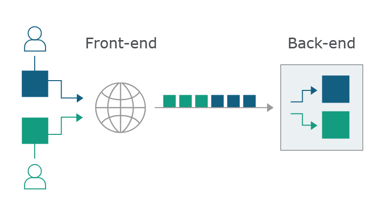
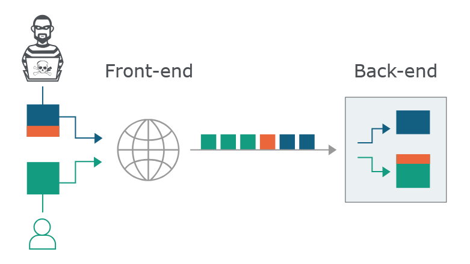
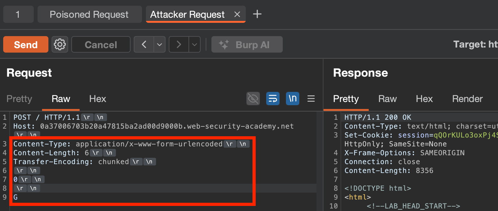
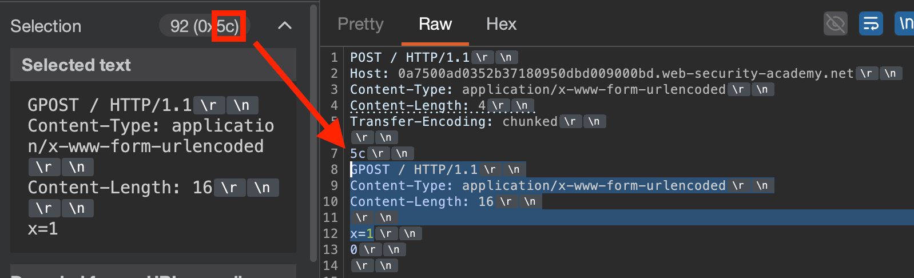
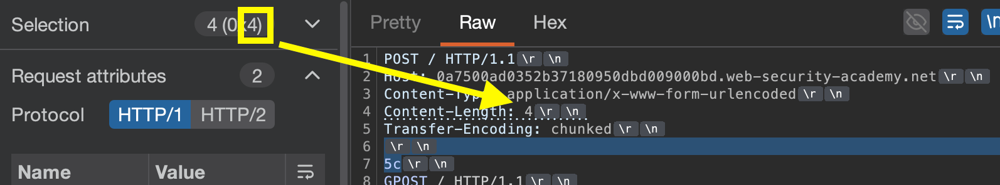
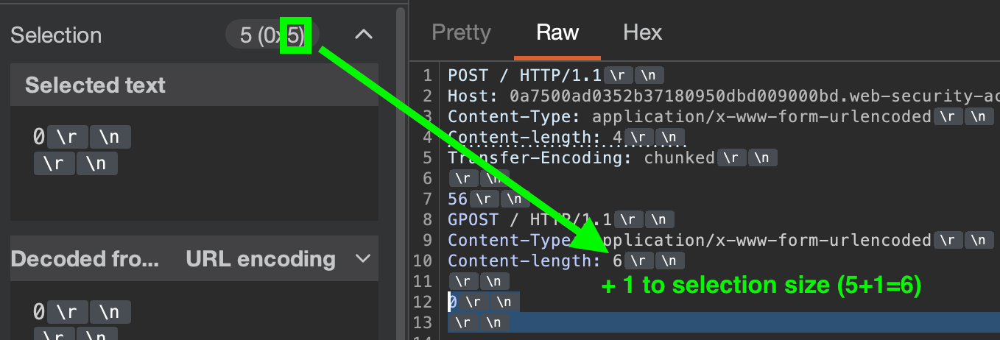
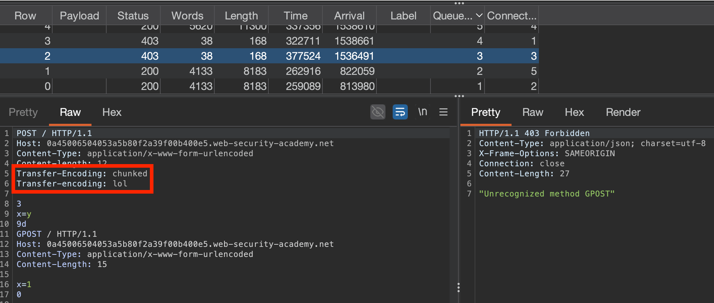

**HTTP Request Smuggling:** a technique for interfering with **how a website process a series of HTTP requests**, to bypass security controls/access sensitive data & directly compromise other users.
Occurs typically when using HTTP 1.1 (but HTTP2 may also be vulnerable, depending on the backend architecture)

## How HTTP Request Smuggling Works
Users send **requests to a front-end server** (load balancer/proxy) and this server forwards requests to **one or more back-end servers**. Requests are often **sent in batches over the same connection** for efficiency, and as such the **back end must determine where each request starts & ends.**

Request smuggling occurs when **the front & back ends don't agree about the boundary between requests,** allowing ambiguous requests to be smuggled through & prepended/interpreted as **different requests** by the front & back-end.


## How HTTP Smuggling Arises:
Typically, as the `HTTP/1` specification **provides two different ways to specify where a request ends**:
- **the `Content-Length` header**: specifies the length of the body in bytes.
- **the `Transfer-Encoding` header**: specifies that the message body uses **chunked encoding**, with each chunk consisting of:
	- Chunk **size in bytes**, using **hexadecimal** (`b = 11 bytes`)
	- Chunk **contents** (e.g. `q=smuggling`)
	- Chunk with **size of** `0`
e.g.
``` HTTP
POST /search HTTP/1.1
Host: normal-website.com
Content-Type: application/x-www-form-urlencoded
Transfer-Encoding: chunked

b
q=smuggling
0
```

Typically, the `Content-Length` is **ignored if `Transfer-Encoding`** is present, BUT when **two+ servers are present (front/backend)**, problems arise when:
- One server **doesn't support `Transfer-Encoding`**
- One server can be **induced to ignore `Transfer-Encoding`** via obfuscation

While `HTTP/2` servers are mostly immune, if used **in front of a backend server using `HTTP/1`**, will perform **HTTP downgrading** & can thus become vulnerable.

### Performing HTTP request smuggling:
Place **BOTH** both the `Content-Length` header **and** the `Transfer-Encoding` header **into a single `HTTP/1` request**. This depends on the order the servers' behaviours:
1. `CL.TE`: **Front-end server** uses `Content-Length`, **back-end server** uses `Transfer-Encoding`.
E.g. send the below twice to smuggle through "`G`"
``` http
POST / HTTP/1.1
Host: host.net
Content-Type: application/x-www-form-urlencoded
Content-Length: 6
Transfer-Encoding: chunked

0

G
```

2. `TE.CL`: vice versa, & **must set `Update Content-Length automatically` -> `OFF`**

3. `TE.TE`: **Both servers support** the `Transfer-Encoding` header, but **one can be induced into not processing it via obfuscation or similar**

*Note: manually switch protocols in Burp using **Request Attributes!***

#### Example: [Lab #1](https://portswigger.net/web-security/request-smuggling/lab-basic-cl-te) - Basic `CL.TE`
**Lab objective:** Smuggle a request to the back-end server, so that the next request processed by the back-end server appears to use the method `GPOST`. 

Need to smuggle a `G` to append to the back end server request. POST functionality exists in the comment feature. 
- Confirmed `HTTP/1` supported by switching request attribute. 
- Selected `\n` to show all hidden characters (to verify `Content-Length` byte size)
- Removed extraneous headers for simplicity (test request still goes through)
- Determine **which server supports `CL` and which supports `TE`**. Details on how to do that [here](https://youtu.be/4S5fkKJ4SM4).

If `CL.TE`:

To smuggle through a letter to be included at beginning of next request, create an **Attacker Request** (uses `TE`) & a **Poisoned Request** (uses `CL`):

**Attacker Request**:

For the **Attacker Request**:
- Front-end server (`CL`) processes `Content-Length: 6`, and so terminates the request at `G`

- Backend server (`TE`) sees `Transfer-Encoding` & processes message as **chunked**. Sees `0`, which is a chunk size of `0`, and thus **terminates the request**. The following bytes `G` are **left unprocessed,** and will be treated as the **start of the next request** received by the backend server. 
- This is why you have to send **two subsequent requests** to ensure the next request has this unprocessed `G` prepended, becoming `GPOST`. 
  The content is smuggled by sending the **Poisoned Request** that uses **just `Content-Length`**:


#### Example: [Lab #2](https://portswigger.net/web-security/request-smuggling/lab-basic-te-cl) - Basic `TE.CL`
**Lab objective:** Smuggle a request to the back-end server, so that the next request processed by the back-end server appears to use the method `GPOST`. 
#### Setup:
- Show non-printable characters -> `ON`
- Update Content-Length automatically -> `OFF`
- Switch to HTTP 1.1
- Send a sanity check `POST` to base endpoint `/`

Check **whether frontend supports chunked encoding**, by specifying chunk size of `3`, which encompasses `abc`, and then an **invalid chunk size of `X`**, which will result in an error.


#### Determine backend:
- **Frontend:** processes `Transfer-Encoding: chunked` with a chunk size of `0\r\n\r\n` (specifying end of a chunked message), so forwards request to backend
- **Backend:** processes that **full request** with `Content-Length: 6`, but as message is only **5** bytes long (`0\r\n\r\n`), will **time out waiting for final byte**.


Thus, backend uses CL, and front end uses TL!

So, to smuggle the request:
- Double check HTTP 1.1 & Update Content-Length automatically -> `OFF`
- Send a POST request specifying `Transfer-Encoding: chunked` for front end, and specify the chunk size of the smuggled request by **highlighting the smuggled request from `METHOD` to end of payload, NOT including the final `\r\n`**:
   so for this, the chunked size is `5c`
- Follow the smuggled request with EXACTLY `0\r\n\r\n`, to tell the front-end that the chunked message block is over.

The `Content-Length` of the MAIN request should be the highlighted selection size of the chunk byte size value (`5c`), so the back end will stop reading the request here.


The `Content-Length` of the SMUGGLED request must be the **size of the body of smuggled request `+ 1`**.
This is in order to ensure that at least 1 byte of our normal request/the victim's request, is appended to this **smuggled/poisoned `GPOST` backend request.**


Thus, final request:
``` http
POST / HTTP/1.1
Host: YOUR-LAB-ID.web-security-academy.net
Content-Type: application/x-www-form-urlencoded
Content-length: 4
Transfer-Encoding: chunked

5c
GPOST / HTTP/1.1
Content-Type: application/x-www-form-urlencoded
Content-Length: 15

x=1
0
```

==This did not work for some godforsaken reason but i understand the concepts so gonna move on==
- https://www.youtube.com/watch?v=9YvZvuoNp8g
- https://www.youtube.com/watch?v=kIRIV-BwBTE

*UPDATE: Just use [HTTP Request Smuggler Extension](Using%20HTTP%20Request%20Smuggler%20Extension.md) and its inbuilt `TE.CL` tester, after converting to chunked encoding!*

---

### TE.TE behaviour: obfuscating the TE header
Where **both** the front-end and back-end servers support the `Transfer-Encoding` header, and we induce **one server not to process the `Transfer-Encoding` header via obfuscating it.**
This can be done via any subtle departure from the `HTTP` specification, and the attack method will follow whether the identified server behaviour is `CL.TE` or `TE.CL`.

#### Example `TE` Obfuscations:
``` http
Transfer-Encoding: xchunked

Transfer-Encoding : chunked

Transfer-Encoding: chunked
Transfer-Encoding: x

Transfer-Encoding:[tab]chunked

[space]Transfer-Encoding: chunked

X: X[\n]Transfer-Encoding: chunked

Transfer-Encoding
: chunked
```

#### [Lab #3](https://portswigger.net/web-security/request-smuggling/lab-obfuscating-te-header) HTTP request smuggling, obfuscating the TE header

Confirmed supports chunked encoding:

Confirmed that front-end expects it, by making the payload invalid by removing final `/r/n`. If this was backend, we'd likely receive a *different* error displayed on the page like before, but we got JSON so I'm assuming it's the front-end.

Example backend error:


We can try various ways of obfuscating the headers, which is what the lab suggests. Using a base request generated by the `TE.CL` attack, performed various alterations to the `Transfer-Encoding` header until:


*Can likely also determine this via the HTTP request smuggler scan.*


