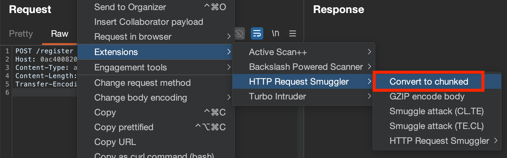
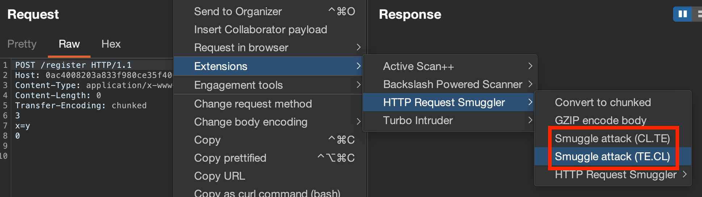

Convert a request to chunked:

Then can launch automatic TE.CL/CL.TE attacks:

Ensure to, when working with requests:
#### Setup:
- Show non-printable characters -> `ON`
- Update Content-Length automatically -> `OFF`
- Switch to HTTP 1.1
- Send a sanity check `POST` to base endpoint `/`