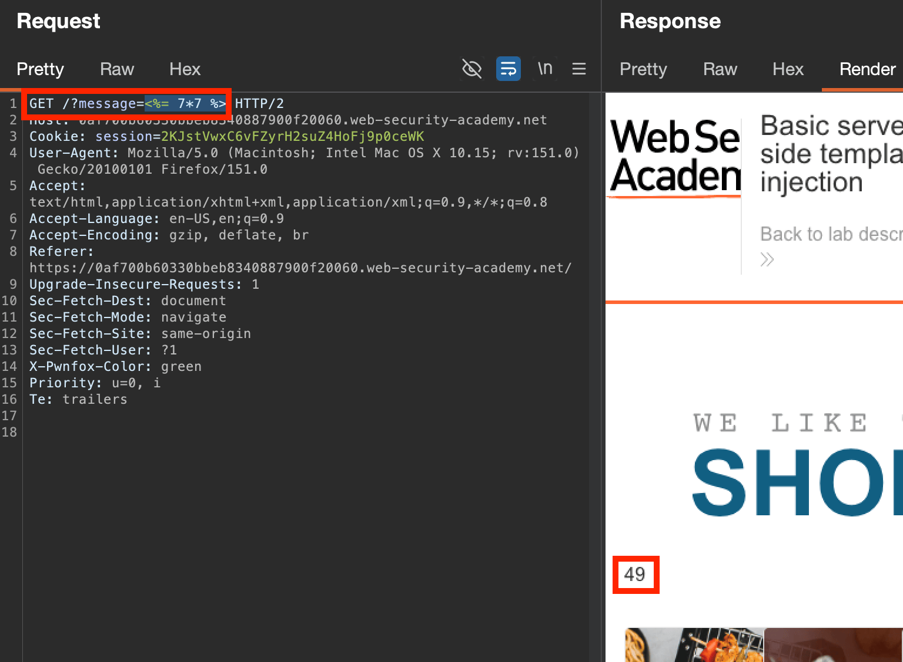
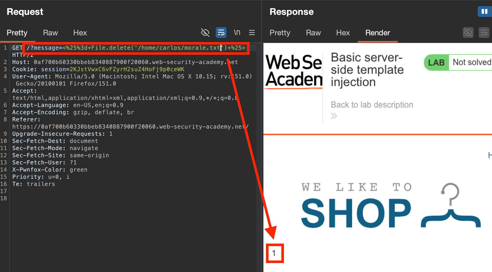

Once discovered via [methods to detect SSTI](Server%20Side%20Template%20Injection.md#How%20to%20detect%20SSTI?), typically follow this process:

- [Read](https://portswigger.net/web-security/server-side-template-injection/exploiting#read)
    - [Template syntax](https://portswigger.net/web-security/server-side-template-injection/exploiting#learn-the-basic-template-syntax)
    - [Security documentation](https://portswigger.net/web-security/server-side-template-injection/exploiting#read-about-the-security-implications)
    - [Documented exploits](https://portswigger.net/web-security/server-side-template-injection/exploiting#look-for-known-exploits)
- [Explore the environment](https://portswigger.net/web-security/server-side-template-injection/exploiting#explore)
- [Create a custom attack](https://portswigger.net/web-security/server-side-template-injection/exploiting#create-a-custom-attack)

## Read the docs!
Try and determine the engine using various payloads + decision tree, as well as any verbose error messages/tell-tale signs. Then, **read the SST documentation** to understand the basic template syntax, how to use it, **key functions**, how to **embed native code blocks**, & how **variables are handled**.
- Often templates use a high-level coding language inside the blocks to perform system commands (e.g. [Python](https://github.com/swisskyrepo/PayloadsAllTheThings/blob/master/Server%20Side%20Template%20Injection/Python.md#tornado)) - so always check the docs for the specific language after breaking out/injecting
- Always check **security implications or warnings** in the documentation, as it may reveal additional flaws/entry points for the language
- Always check for **known exploits for the language**
E.g. in ERB, docs disclose you can list all directories & read files with:
``` ruby
<%= Dir.entries('/') %>
<%= File.open('/example/arbitrary-file').read %>
```
##### Lab: [Basic SSTI](https://portswigger.net/web-security/server-side-template-injection/exploiting/lab-server-side-template-injection-basic)
**Clue:** server uses ERB (ruby-based) server side templates
- Clicked on products, tried testing product ID with fuzzing payloads, no dice.
- First product returns reflected text: `Unfortunately this product is out of stock` (via `GET /?message=Unfortunately this product is out of stock`)
- Tried various (URL-encoded) ERB payloads here: `/?message=<=% 7*7 %>`
  
- Now need to read/execute code on the server. File reads can be performed via: `/?message=<%= Dir.entries('/') %>` (URL-encoded). See [here](https://github.com/swisskyrepo/PayloadsAllTheThings/blob/master/Server%20Side%20Template%20Injection/Ruby.md). ([ERB Docs](https://docs.ruby-lang.org/en/master/Dir.html#method-c-entries)) 
- Now to delete the required file (via [docs here](https://docs.ruby-lang.org/en/master/File.html#method-c-delete)) & solve the lab! 

##### Lab: [Basic server-side template injection (code context)](https://portswigger.net/web-security/server-side-template-injection/exploiting/lab-server-side-template-injection-basic-code-context)
**Hint:** uses tornado templating engine

After browsing the app, identify that you can change your name profile preference "nickname", "name", "full name", presumably to change how your comments are rendered. This sends a POST request with a body of `blog-post-author-display=user.nickname`, likely using a template to access a component (`nickname`) of the `user` object.

Injecting straight into this and then viewing the comments page as an oracle, we have SSTI with basic `{{7*7}}`, and even just `7*7`, suggesting this is injected right into an evaluated server code block: 

- [Tornado docs](https://www.tornadoweb.org/en/stable/guide/templates.html)
- Tornado [paylodsallthethings](https://github.com/swisskyrepo/PayloadsAllTheThings/blob/master/Server%20Side%20Template%20Injection/Python.md#tornado)
- [Simple python functions](https://www.w3schools.com/python/python_file_remove.asp)
We can also troubleshoot with the verbose error output generated on the blog post page (after commenting at least once), disclosing the templating engine (tornado) and any errors should our injection fail.
After multiple injection attempts and several errors, figured out needed to keep the existing `user.name` otherwise would get `Empty Template expression` error, and then inject a fresh statement *after* it.
As tornado just allows execution of arbitrary python between `{{}}`, can just use a url-encoded python statement:


To then list all files in the current directory: `user.name}}{%25import+os%25}{{os.listdir('.')`


And [delete](https://www.w3schools.com/python/python_file_remove.asp) morale.txt by simply changing it to `user.name}}{%25import+os%25}{{os.remove('morale.txt')` !

##### Lab: [Server-side template injection using documentation](https://portswigger.net/web-security/server-side-template-injection/exploiting/lab-server-side-template-injection-using-documentation)
**Objective:** identify the template engine, use the documentation to work out how to execute arbitrary code, then delete the `morale.txt` file from Carlos's home directory. 

After logging in and viewing items, see we can edit the templates on the pages. By injecting our normal payload & following the example's syntax:


Based on the syntax alone, tried a few generic payloads, and one produced the error message disclosing the engine as **Freemarker:**


Reading the docs & searching for "security" reveals the engine disables access to several "unsafe" methods for templating, unless an override is given.:


However, by trying some [freemarker payloads here](https://github.com/swisskyrepo/PayloadsAllTheThings/blob/master/Server%20Side%20Template%20Injection/Java.md#freemarker), found out directly executing commands is fairly easy:

Can then delete file with `<#assign ex = "freemarker.template.utility.Execute"?new()>${ ex("rm morale.txt")}`!

(turns out the clue is in the docs, but in the FAQ section: [23. Can I allow users to upload templates and what are the security implications?](freemarker.apache.org/docs/app_faq.html), disclosing the `new()` function, which creates Java objects implementing the `TemplateModel` class, [docs here](https://freemarker.apache.org/docs/pgui_datamodel_basics.html), which in turn introduces the `execute` functionality - [docs here](https://freemarker.apache.org/docs/api/freemarker/template/TemplateDirectiveModel.html))


#### Lab: [Server-side template injection in an unknown language with a documented exploit](https://portswigger.net/web-security/server-side-template-injection/exploiting/lab-server-side-template-injection-in-an-unknown-language-with-a-documented-exploit)
**Objective:** This lab is vulnerable to server-side template injection. To solve the lab, identify the template engine and find a documented exploit online that you can use to execute arbitrary code, then delete the `morale.txt` file from Carlos's home directory. 

After fuzzing a potential injection point (clicking on first item again reveals a `GET /?message=XXXX` request), discovered a verbose error message identifying the templating engine as **Handlebars**.

Can confirm this by injecting `{{this}}` and retrieving `[object Object]`
Looking up RCE exploits for handlebars, for a specific version the following payload can allow RCE. Trying it, it... works?

Not very neat, am surprised it sent, but can be cleaned up in a text editor to remove the excess spaces, and/or URL encode it to then `rm` the file!

---

## Exploring SSTI environment & objects
Once SSTI has been discovered, you want to **explore the operating system & server environment**. This is typically done via a `"self"` or `"environment"` object, which acts as a namespace for all objects, attributes & methods supported by the templating engine. Can try and access this object, if it exists, to determine the attack surface/variables in scope.
E.g. in `Java`: `${T(java.lang.System).getenv()}`
- *Can also use **Intruder** to brute-force potential variable names*

#### Developer-supplied objects
Both **inbuilt objects** can exist, as well as **site-specific objects** implemented by the developer, which should be investigated as they **likely contain application-specific/sensitive information.** 
If typical RCE via inbuilt template objects isn't possible, **always check for custom/non-standard objects**, examine their behaviour within the specific template, and can attempt to use/abuse it for things like **file path traversal, & data exfiltration**.

##### Lab: [Server-side template injection with information disclosure via user-supplied objects](https://portswigger.net/web-security/server-side-template-injection/exploiting/lab-server-side-template-injection-with-information-disclosure-via-user-supplied-objects)
**Objective:**  This lab is vulnerable to server-side template injection due to the way an object is being passed into the template. This vulnerability can be exploited to access sensitive data.
To solve the lab, steal and submit the framework's secret key. 

