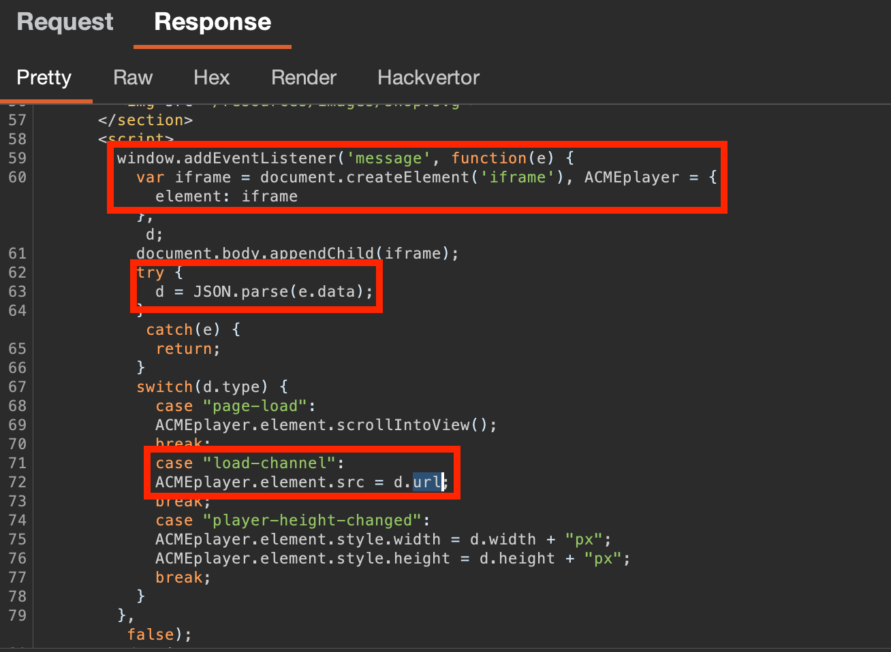

### [Lab](https://portswigger.net/web-security/dom-based/controlling-the-web-message-source/lab-dom-xss-using-web-messages-and-json-parse): DOM XSS using web messages and `JSON.parse`

Can see that at the bottom of the page, multiple `<iframes>` are being loaded, based on **web messages received by the page**.

Can see that there is `javascript` on the page that handles this `iframe` creation. It:
- defines event listener that will listen for a Webmessage, and upon receiving one, will execute `e()` - which is a function creating an `iframe` based off data in the webmessage.
- Parses the JSON data in `var = d`
- Adds various elements to an `iframe` based on data within `d`
	- e.g. if `d` has `{"type : load-channel", "url : xxxx"}`, will activate the change the `load-channel` case and change the `src` of the created `iframe` to the `"url: xxxx"` value in JSON)

A test webmessage containing JSON data can be sent to this `<iframe>` using the console.
We target `load-channel` as the value of `url` becomes the `src` attribute of the iframe, meaning we can **inject javascript functions into it, like `print()`**:


When the vulnerable page is embedded as an `iframe` on an attacker-controlled domain, on load can send a `postMessage` to it containing the `javascript:print()` as the `data`, thus spawning a new `iframe` on the vulnerable page with `src="javascript:print()"`, as seen above. 

The second part of the HTML-based Web Message, `"*"`, specifies **the origin that the message can be sent to**. A `*` allows delivering to any website, i.e. the vulnerable page that creates its own `iframes` based on Web Messages received.
``` html
<iframe src="https://0a9d00be03e5409680342b63008800ab.web-security-academy.net/" onload='this.contentWindow.postMessage(`{"type" : "load-channel", "url" : "javascript:print()"}`,"*")'>
```