## Exploiting DOM XSS with different sources and sinks
Whilst DOM XSS theoretically only needs **an executable path by which data can propagate from source to sink**, in practice need to contend with **validation or other processing of data by scripts** to achieve XSS.
### Resources:
- [DOMXSS Wiki](https://github.com/wisec/domxsswiki/wiki)

### Main DOM XSS Sinks:
``` js
document.write()
document.writeln()
document.domain
element.innerHTML
element.outerHTML
element.insertAdjacentHTML
element.onevent
```
#### [Lab](https://portswigger.net/web-security/cross-site-scripting/dom-based/lab-document-write-sink): DOM XSS in `document.write` sink using source `location.search`
Using DOM invader: insert into forms, search on site, and then search for the response in DOM invader.

Can check the sink, which is `document.write()` via `window.location.search`.


#### [Lab:](https://portswigger.net/web-security/cross-site-scripting/dom-based/lab-document-write-sink-inside-select-element) DOM XSS in `document.write` sink using source `location.search` inside a select element
Examining the JS for the **StockCheck** feature, can deduce the following:
- Stockcheck script gets data from `location.search`, which is controlled by the URL query parameter `storeID`. Isn't in current URL, but can be added with `&storeId=XXXX`
- `storeId` query parameter from URL (stored inside `var=store`) is passed to the `document.write` function, which writes data out to the page within a `<select>` element, adding it as a selectable option.
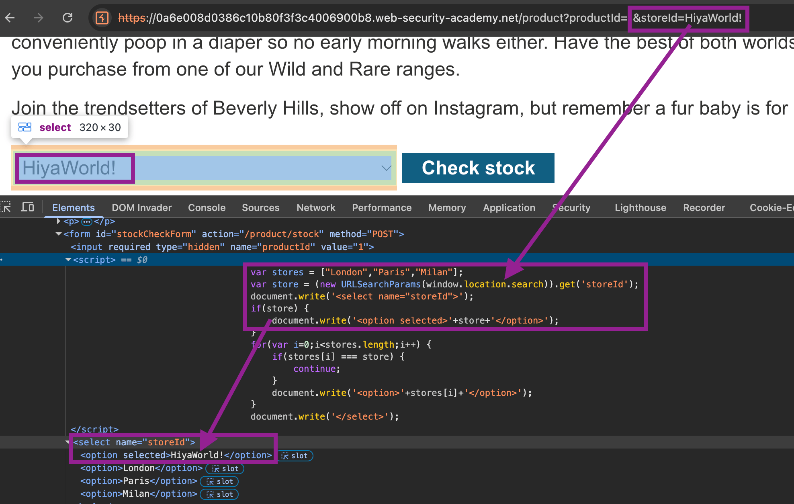

Can now use this to break out of the context & execute Javascript. Trying closing tag & inserting a script:
- `&storeId=Hiya</option><script>alert(1)</script>`
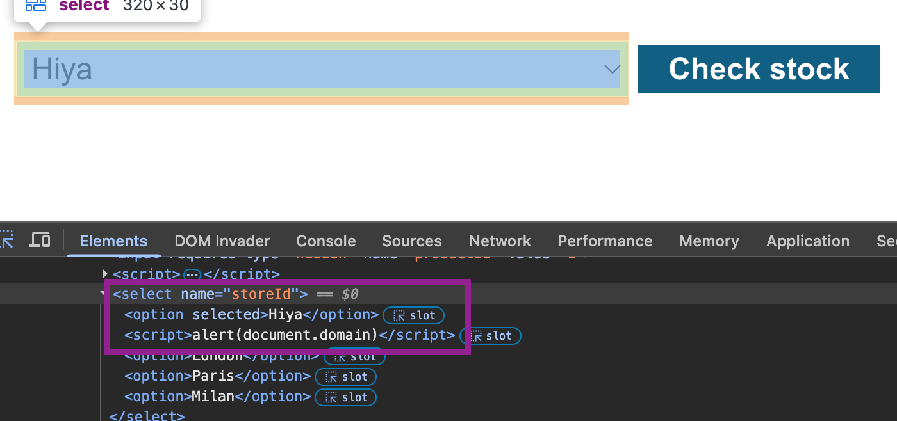

#### Lab: DOM XSS in `innerHTML` sink using source `location.search`
As the JS uses `innerHTML`, cannot use a `<script>` tags - use alternative elements like `img` or `iframe`.
Thus: `` works.

---
### Sources and sinks in third-party dependencies

#### jQuery:
#jquery
Sinks that can alter DOM elements on the page:
- `attr()`
- jQuery's `$()` selector function
##### `attr()`
If `attr()` is used to change an element, like `href`,  based on data from the URL query parameter `?returnUrl`, can pass malicious data into it.
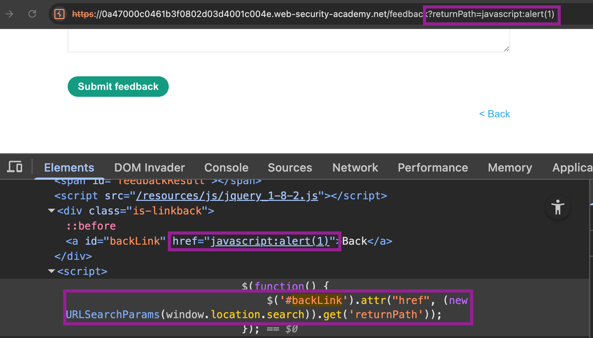
Above code injects whatever `returnPath` is into the DOM as a `href`. Thus, just inject the #payload `?returnPath=javascript:alert(document.domain)` (as `href` supports Javascript pseudo-protocols).

##### `$()` selector function ([Lab](https://portswigger.net/web-security/cross-site-scripting/dom-based/lab-jquery-selector-hash-change-event))
The `$()` selector function was often used alongside a `location.hash` source, for animations/auto-scrolling to a particular page element. E.g., `site.com/#heading1` to scroll to `heading1`, by passing the `#` value into selector `$()`:
``` js
$(window).on('hashchange', function() {
	var element = $(location.hash);
	element[0].scrollIntoView();
});
```
Can try and exploit this by injecting malicious input within the URL after the `#`, **triggering a `hashchange`** event to pass the XSS vector into the DOM:

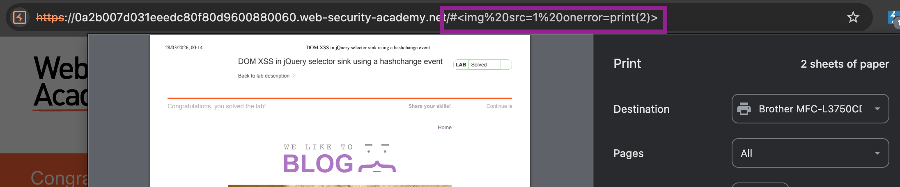

To do so **without user interaction**, can use an `<iframe>` whose `src` attribute points to the vulnerable page with an empty hash value. When the `iframe` is loaded, an XSS vector is appended to the hash & triggering the `hashchange` event.
#Payload:
- `<iframe src="https://vulnerable-website.com#" onload="this.src+=''">`

Whilst now sites typically **prevent injecting HTML when input begins with `#`**, some versions of jQuery are still vulnerable IF you have full control over its input from a **source that doesn't require a `#` prefix.** 

***So, when a site supports auto-scroll with `#`:** check whether it uses a `$()` selector function, and whether can inject user-controlled data.*

#### AngularJS - `ng-app` attributes ([Lab](https://portswigger.net/web-security/cross-site-scripting/dom-based/lab-angularjs-expression))
#ng-app #angular
May be possible to execute javascript **without `<>` or events**. When a site uses the `ng-app` attribute on an HTML element, AngularJS will process the contents of HTML nodes containing the `ng-app` attribute and **execute any Javascript inside `{{}}`** - which can occur **directly in HTML or inside attributes.**

As the input is contained inside an HTML `<body>` element with the `ng-app` attribute, if a proper AngularJS expression is passed to it, can be executed, even if **directly in HTML (like `<h1>` in this case) or inside attributes**. 
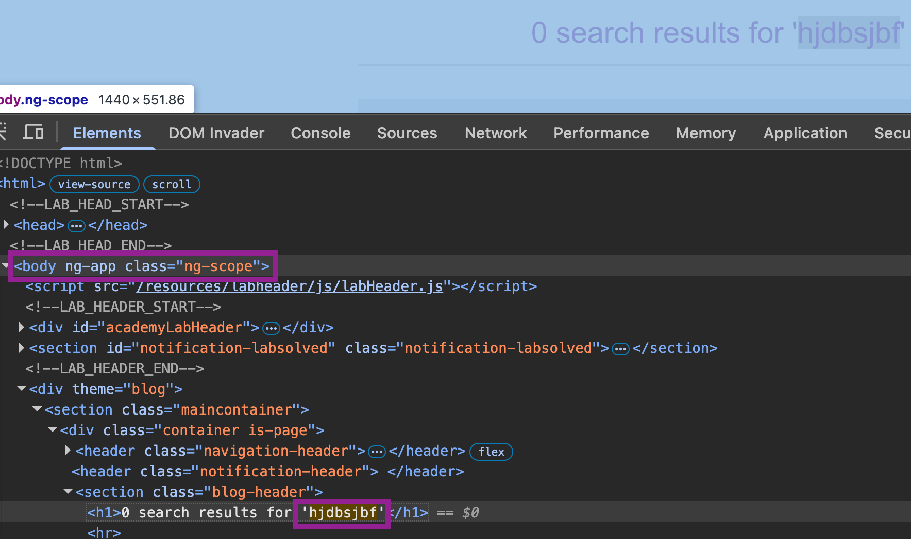
E.g. searching for `{{$on.constructor('alert(1)')()}}` executes an `alert(1)`, with the search phrase **stripped from the `<h2>` on the page** and instead executed as Javascript by AngularJS.
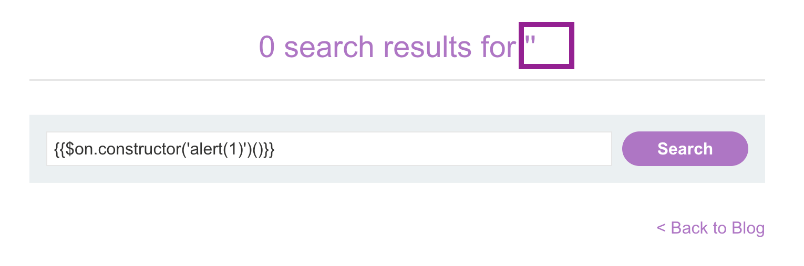

### Reflected & Stored DOM XSS
Sources aren't just data/query params directly exposed by browsers, but **also can originate from the website itself**. 
Opens the possibility for **Reflected/Stored DOM XSS** - where data **reflected into** or **stored within** the page is used **unsafely client side** within JS *(e.g. placed into a JS string literal, or form field)* to alter the DOM, usually after being written to a dangerous sink, like:
- `eval('var data = "reflected string"');`

Similarly with the stored variant, the server:
- Receives data from one request & **stores it**
- **Includes data in a later response**
- A **script within the later response contains a sink** that processes the data unsafely.
E.g.:
- `element.innerHTML = comment.author`

#### [Lab:](https://portswigger.net/web-security/cross-site-scripting/dom-based/lab-dom-xss-reflected) Reflected DOM XSS
When searching, can see that the string is reflected in a JSON response, `searchTerm`.

Examining the client side code, can verify that this `search-results` variable is reflected directly into the DOM with the `search()` function:
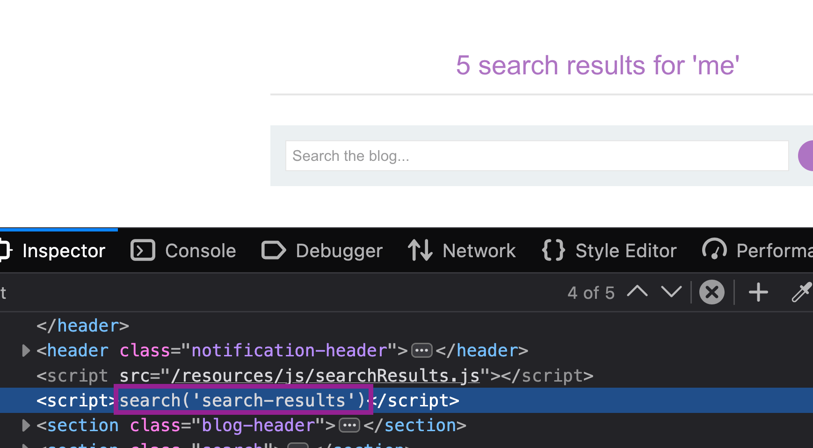
Examining the script, can see the `eval()` function is used with data from the `JSON` response body (`this.responseText`)
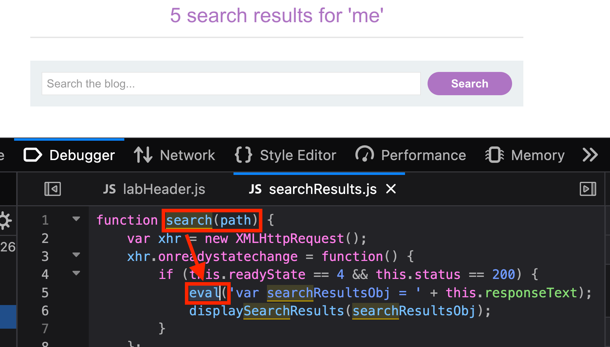
Thus, if we can inject data (like JS code `-alert()`) into the JSON response, and escape the JSON context, we pass the direct javascript into the `eval()` function, causing the command to execute within the context of the DOM.

Can see there is escaping of characters, as when `"` is added, a `\"` is returned. However, **this is not done properly** - can use `\"` to create `\\"` and **escape the backslash, nullifying this** and causing the `"` to processed unescaped. 
This **closes the string** that should contain the search term, allowing context escape.
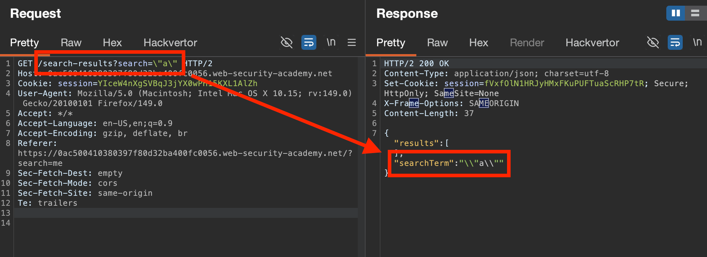
Now, just need to inject the command and clean up any residual characters. Can use JS console in browser to troubleshoot this:

- An arithmetic operator (`+` or `-`) is used to separate the expressions before the `alert()` function is called.
- JSON object is closed by the `}`
- `//` comments out the rest of the object.
As JSON data is in the form:
``` json
{"results":[],"searchTerm":"hello"}
```
Injecting `\"-alert(1)}//` results in escaping the context to return:
``` json
{"results":[],"searchTerm":"\\"-alert(1)}//"}
```


#### [Lab:]() Stored DOM XSS
Likely again located within this loadComments script, which is directly called in the JS.

The comments themselves are a JSON object, which when injecting `\"` into, **are** performing proper escaping (as `\\\"` is returned). Thus, likely can't break out here like before.

Examining the `loadComments` script:
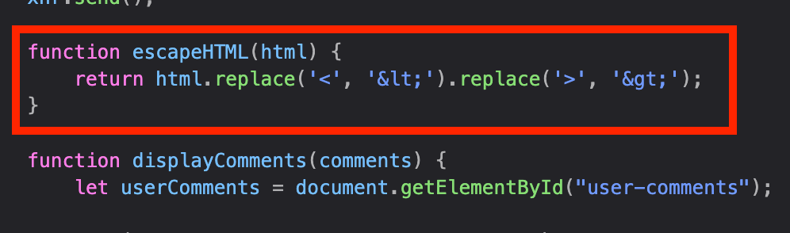
Can see some client-side encoding of `<>` occurs. However, this is notably using the `.replace` command, which only replaces the **first** instance it finds. Thus, can submit `<>` and only the first `<>` will be encoded, which stores the rest in the DOM unescaped.

We can see this visually through testing if we submit something like `<h1>Hello World</h1>` as a comment. **Whatever is rendered to the page (`<h1>`) has been *encoded***, but the closing `</h1>` tag isn't rendered, suggesting it **hasn't been encoded & instead literally processed in the DOM.**

Same below, using the `` payload: 
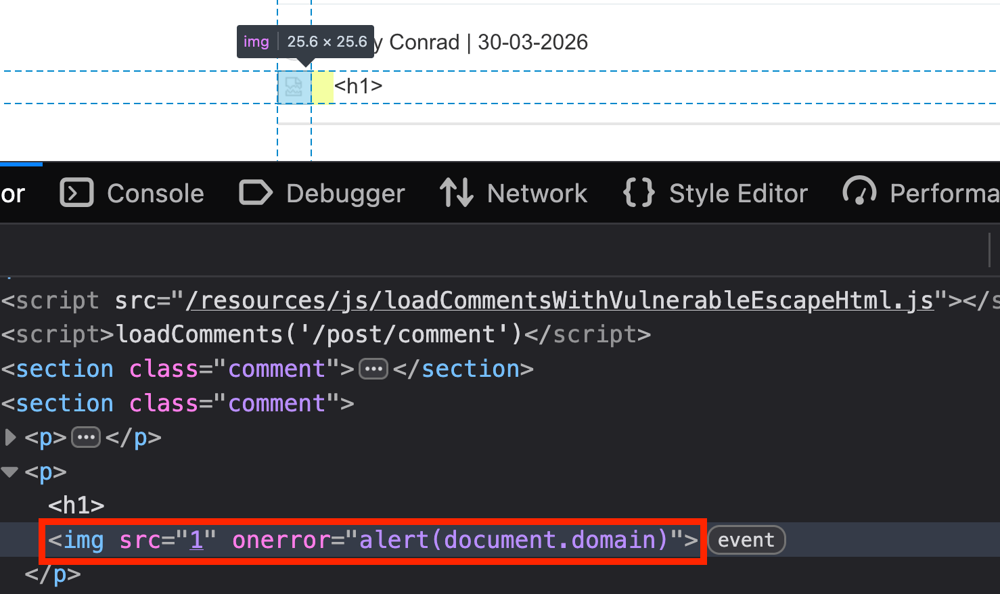
This **stored XSS is DOM based** as comments are fetched **asynchronously after page load** (seen in the `GET /post/comment?postId=1` JSON response) and then Javascript `loadComments` script is used to **render them (unsafely) on the page.** This can be seen as there are **no comments inside of the *initial* raw HTML response**.