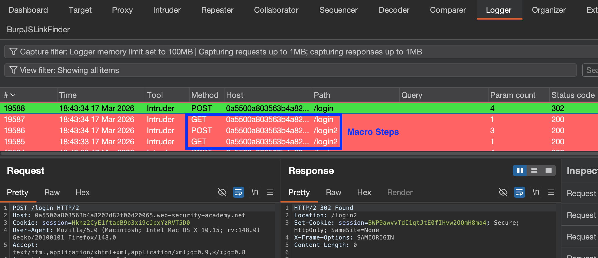

## [Vulnerabilities in MFA Authentication](https://portswigger.net/web-security/authentication/multi-factor)
### Bypassing 2FA
- Users occasionally issued a "logged-in" state before entering a verification code - **try browsing to other pages between successful login & entering MFA code**
### Flawed 2FA Cookie Logic:
If MFA requests **use a user-account-bound cookie**, attacker can login with own credentials **but change the `account` cookie to any arbitrary username**.
- *(Intercept on)* Login with attacker account.
- *(Intercept on)* Modify in-band request for MFA, change `verify=VICTIM-USERNAME`
- If no lockout/rate limiting, **can attempt to brute force MFA code**
``` HTTP
POST /login-steps/second HTTP/1.1
Host: vulnerable-website.com
Cookie: session=XXXX; verify=VICTIM-USERNAME
...
verification-code=123456
```

#### Macros & Multi-step actions
To help automate multi-step actions, can use #Burp-Macros. E.g. to auto-login (send a login request) **before** sending any request (e.g. in repeater/intruder/etc.):
- Add a **Session Handling Rule**, along with the **Scope** for it to be applied to, and the **Action** that it performs: 
- **Add the Macro**, & ensure to **Test Macro**. 
- Once applied, check the Macro requests are being performed with the **Logger** panel. 