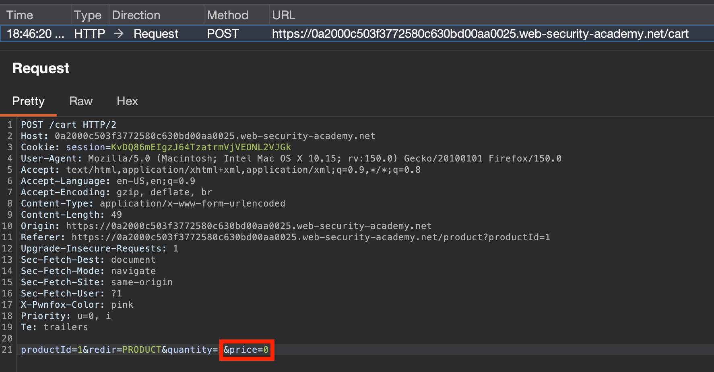
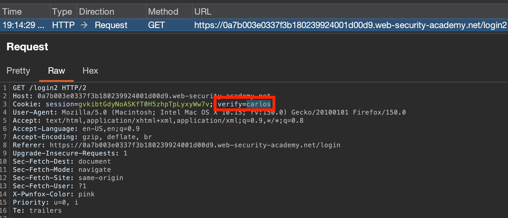
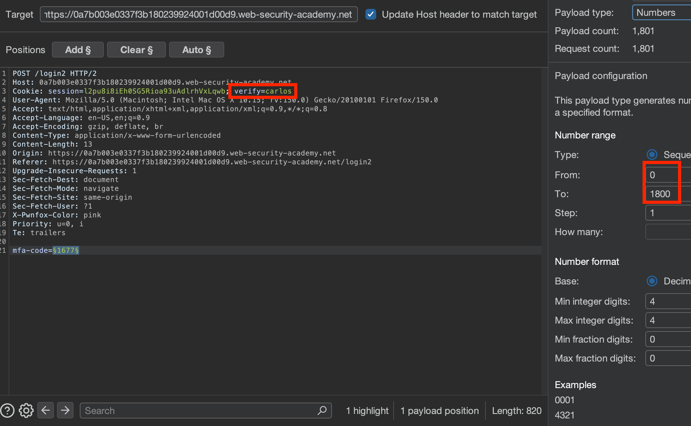
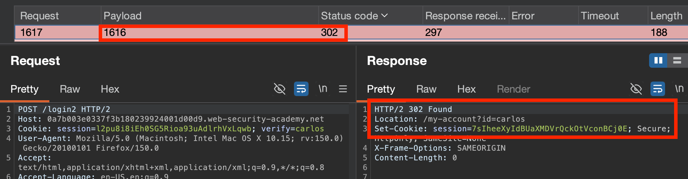
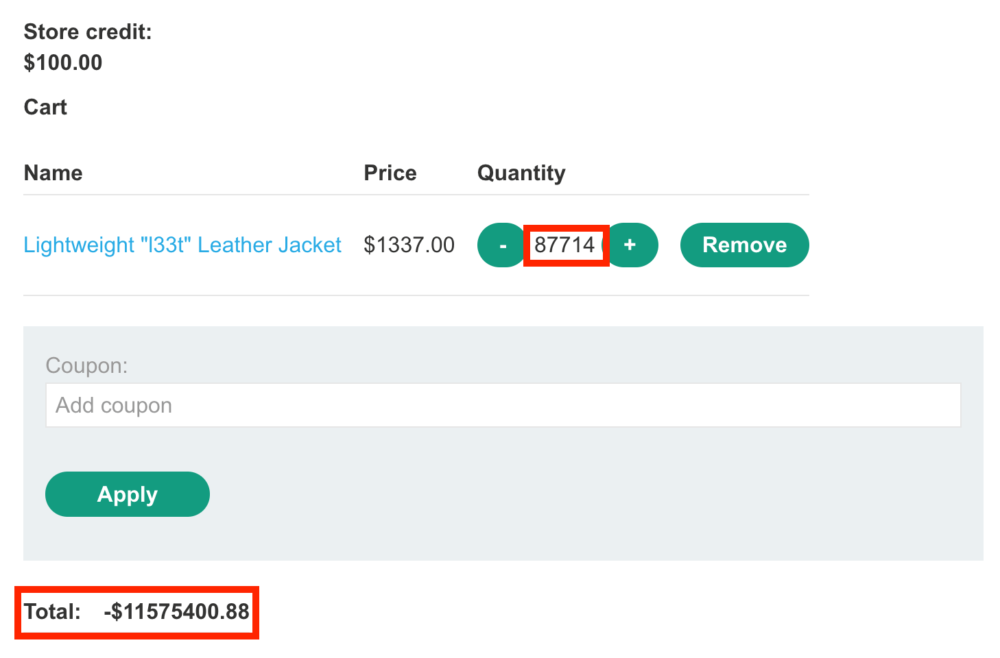
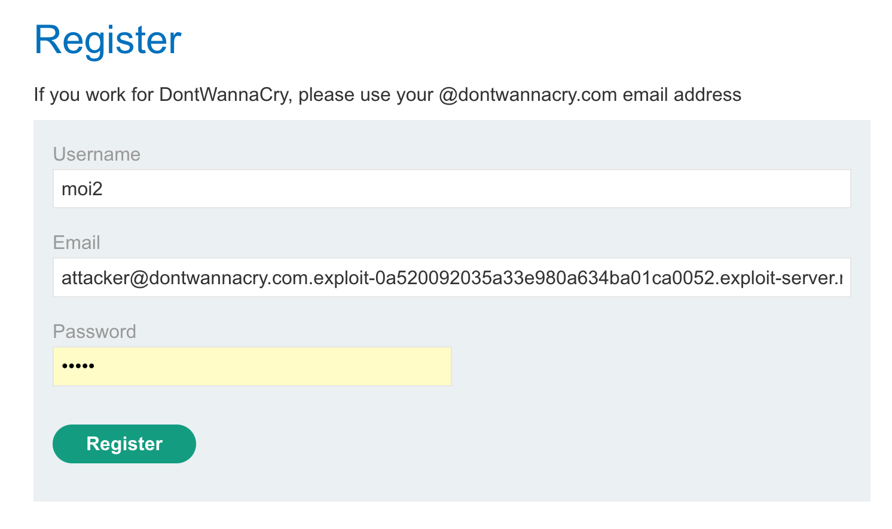

---
aliases:
  - "Business Logic Vulnerabilities:"
sticker: emoji//1f4bc
---
Occur when an application fails to safely handle a user **deviating from the expected behaviour/flow of the application logic.** 
Is extremely broad and requires **knowledge of how the app is *intended* to operate**, exploring & **flagging any potential functions of interest**, analysing the flow of the function, and **considering "how could this be abused?"**
- Insufficient user input validation
- Weak client-side controls
- Authentication bypasses
- Leaking protected resources
- Negative transactions
- Cross-account accessing/poor boundary enforcement.
- etc.

## Examples:

### Weak client-side controls

#### Lab #1: Weak client-side controls
Task: Buy a "*Lightweight "l33t" Leather Jacket*"
- Manipulate price in-band


#### Lab #2: Vulnerable MFA Logic
When you log in, a `POST /login` request results in setting a `verify=username` cookie, and then a code is generated for that user and sent to their email.

Then redirected to `GET /income2`, where you enter the code. Upon entering, that code **plus the cookie** is sent to `POST /login2`, which sets the session cookie for the account access. **However, just changing `verify=carlos` doesn't work** as the code is sent to their email upon changing the `verify` parameter, not yours.

**However... code is 4 digits, and this ensures we can GENERATE a valid code for their account.**

So:
- Log in 
- Sent a `GET /login2` with verify=carlos to generate a code for their account:  
- Send the code validation request `POST /login2` to intruder, and brute force based on observed MFA code range 
- Use this session to hijack the account!

### Failing to handle unconventional input
A significant number of vulnerabilities arise from apps accepting arbitrary values of a given data type, and not applying strict enough logic checks on **both the server & client side**. E.g.:
- Negative product values
- Non-integer values
- Non-existent values
- Massive/tiny numeric values that exceed limits
- Abnormally long strings for text-based fields
- Unexpected data types

Consider what is happening to this data, and whether it can be exploited:
- **Are there limits imposed**, if so, **what is the logic**/can it be circumvented (negative checks?)
- What happens when **limits are reached?**
- **Is input being transformed/normalised**? Can this be maniupulated?

#### [Lab #3](https://portswigger.net/web-security/logic-flaws/examples/lab-logic-flaws-high-level): Weak high-level logic
**Goal:** Buy a "Lightweight l33t leather jacket" for an unintended price.

Can **add negative quantities**, and will **rack up a negative number amount in the cart**. However, it will not process if the cart number is negative.

So, add a sufficient number of "negative" other high cost items to offset the cost of the jacket to be within your store credit amount:


#### [Lab #4](https://portswigger.net/web-security/logic-flaws/examples/lab-logic-flaws-low-level): Low-level logic flaw (Backend Integer Limit)
**Objective:** Buy a "Lightweight l33t leather jacket" - lab doesn't adequately validate user input logic.
- Browsing the lab, we can't see much to manipulate with the quantity, unfortunately. Negative numbers will empty the cart & non-integers aren't accepted.

The **Hint** suggests we need Burp Intruder, so perhaps generating a large cart value could help?

By repeatedly issuing a request for 99 jackets, the cart value inflates **until the price cycles back into the negative**! This suggests an integer got too large for the backend to process, and is confirmed by the solution: *"The integer exceeded the maximum value permitted for an integer in the back-end programming language (2,147,483,647)"*.

We can work from here to offset this into the positive again.

The number of 99-jacket requests we'd need to issue to get back into the positive is:
`11575400/(99*1337)=87.45`
However, I ended up going over a bit, so after some manual fiddling, we got there eventually:


#### [Lab #5](https://portswigger.net/web-security/logic-flaws/examples/lab-logic-flaws-inconsistent-handling-of-exceptional-input): Inconsistent handling of exceptional input
**Objective:** You can exploit a logic flaw in its account registration process to gain access to administrative functionality. To solve the lab, access the admin panel and delete the user `carlos`.

Two important informational disclosures: 
- Known email address structure: `@dontwannacry.com`
- Username enumeration: `carlos` account exists


Further, if we try to access `/admin`, we get:
`Admin interface only available if logged in as a DontWannaCry user`

So, want to try and log in with this address. Registering our own account requires a verification email, which is sent to the supplied address with a temporary verification token:

https://0ac4008203a833f980ce35f400ca000d.web-security-academy.net/register?temp-registration-token=TxrFQjPQnGUsfPqLLj1AfHcxQtSZUnU7

So, want to try and get this link registered for a dontwannacry address. Looking at the hint, we have an email client that will "display all messages sent to `@YOUR-EMAIL-ID.web-security-academy.net` ***and any arbitrary subdomains***".

Tried registering using: `attacker@dontwannacry.com.exploit-0a520092035a33e980a634ba01ca0052.exploit-server.net`
to see if was matching strings:

No dice - `/admin` still locked.

I wonder if we have an email length limit?


Tried registering with a very long email, and...!

It's truncated! If this is the value retrieved directly from the backend (i.e. reached a maximum backend number value), by counting the number of available characters left, we can now register an account with a character length in such a way that our email ends in @dontwannacry.com on the account page. *Perhaps this is used to access admin...*
So, using:
longlongmanlongmanlonglongmanlonglongmanlonglongmanlonglongmanlonglongmanlonglongmanlonglongmanlonglongmanlonglongmanlonglongmanlonglongmanlonglongmanlonglongmanlonglongmanlonglongmanlonglongmanlonglongmanlonglongmanlonglongmanlonglongman@dontwannacry.com.exploit-0a520092035a33e980a634ba01ca0052.exploit-server.net
The email integer value seems to only support 255 characters, so using this email will truncate it in such a way that it ends in @dontwannacry.com, required to access the `/admin` page!


### Flawed User Behaviour Assumptions:

#### Trusted users/input won't always remain trustworthy
Search the application for any points at which a **value that was previously strictly validated** (like an email signup) could be **changed to a malicious value**.
- Email/name/password change in account without confirmation of ownership
- Role assignments
- Editing previously uploaded posts/profile pictures/files
##### [Lab #6](https://portswigger.net/web-security/logic-flaws/examples/lab-logic-flaws-inconsistent-security-controls): Inconsistent Security Controls
Register for a normal account, then change your email to end in the required @dontwannacry.com to access admin page. No confirmation sent, so easily exploitable.


#### Users won't always supply mandatory input
While browsers/client side controls may encourage users to supply all parameters for requests, can be circumvented with Burp. Removing specific values can cause issues when passed to back-end scripts that perform multiple functions, and potentially allow access to unintended code paths. 
- Test **removing/altering parameter values individually** (e.g. every `&parameter=` or the like), and **observe how the application responds**.
	- Do it **ONE AT A TIME**
	- Test deleting **just the name** as well as **the value**. Are **arbitrary values permitted? Encoded values?**
	- Follow multi-stage processes through, and **note where changing parameters affect a later state of the process**

##### Lab #6: Weak isolation on dual-use endpoint
**Goal:** *This lab makes a flawed assumption about the user's privilege level based on their input. As a result, you can exploit the logic of its account management features to gain access to arbitrary users' accounts. To solve the lab, access the `administrator` account and delete the user `carlos`.*

Appears can change arbitrary user passwords from account detail screen.
- Tested can change own password - `Password changed successfully!`
- Tried changing password of account `administrator` with current user's password - get `Password incorrect`. **This confirms their account is being targeted & password check is being applied to it,** with what's inside `Current Password`.
  
- Tried removing the value of `Current Password`, then the whole parameter --> **success when removing whole `&current-password=` parameter!** Check is no longer applied. Can then log out, log back in to `administrator` with the changed password, and delete good old `carlos`.
  
  
##### [Lab #7](https://portswigger.net/web-security/authentication/other-mechanisms/lab-password-reset-broken-logic): Password reset broken logic
*Similar lab:* **Using a temporary password token (which wasn't actually temporary)** to forget/reset password of any user:


#### Users won't always follow the intended sequence
Where operations rely on a predefined workflow/process of steps (e.g. MFA flow), these may be bypassed or interacted with in an unintended order.
- Observe the **flow of the process** - and consider what is necessary, what can be skipped. Map out the process in terms of **requests**.
- Attempt to **force-browse**/**replay specific steps**, access it **out of order**, **skip steps**, submit steps **multiple times/repeatedly**
- Modify **`HTTP` Method** & **Parameters** in each request, one at a time. Are any errors thrown? Is it still accepted? 
- **Pay attention to error messages/backend behaviour** when interfering with a process flow, to tailor attacks.

##### [Lab #8](https://portswigger.net/web-security/logic-flaws/examples/lab-logic-flaws-insufficient-workflow-validation): Insufficient Workflow Validation
**Objective:** *This lab makes flawed assumptions about the sequence of events in the purchasing workflow. To solve the lab, exploit this flaw to buy a "Lightweight l33t leather jacket".*

By purchasing a low-cost item to begin with, observe that minimal parameters are in use - a simple `POST /cart/checkout` with a `session` token identifying the cart & `csrf` token - and page redirection seems to occur after purchase, to either:
- `GET /cart?err=INSUFFICIENT_FUNDS` if there are insufficient funds
- `GET /cart/order-confirmation?order-confirmed=true` if there are **sufficient funds.**
Simply modifying the request in-transit to **force-browse to the `/cart/order-confirmation?order-confirmed=true` page after purchasing the jacket** solves the lab:


##### [Lab #9](https://portswigger.net/web-security/logic-flaws/examples/lab-logic-flaws-authentication-bypass-via-flawed-state-machine): Authentication bypass via flawed state machine
**Objective:** *This lab makes flawed assumptions about the **sequence of events in the login process**. To solve the lab, exploit this flaw to bypass the lab's authentication, access the admin interface, and delete the user `carlos`.*

When logging in, can "select a role" at `GET /role-selector`, submit said role with a `POST` request containing `role=content-author` or similar, and then a session token is set for that role.
Can access this page without login, but attempting to change the value with no current login session cookie will result in an error:

Changing in-band to `role=admin` & `role=administrator` doesn't allow access to `/admin` page, either.
However, **what about skipping the role selection entirely? What will it default to?**
- Dropping parameter from `POST` request: `Missing query parameter`
- Dropping parameter value from `POST` request: Logged in as normal
- **Dropping `POST` request entirely:** Doesn't continue.
Hmm.
What about skipping the initial `GET /role-selector` ? By **dropping this request**, and then returning to the home page, it apparently defaults the account role to `administrator` without breaking the login session, and can now access `/admin` panel!


#### Domain/application functionality-specific flaws
Always consider the application's **domain/business purpose/functionality**, and whether that can be abused. Functionality like:
- Any situation where **prices/criteria are adjusted based on user input actions** (e.g. adding a certain number of items to cart)
- **When** these domain/functionality specific checks are performed (try altering values after checks)
- Whether any domain/functionality specific steps can be **skipped**.
	- E.g. Discounting items when order total > $1000 --> *e.g. Reach $1000, apply discount, then remove unwanted items **while keeping discount***
Ensure to **fully understand the application/domain functionality**, and use what is available/could be bypassed to **combine functions in malicious ways/break intended logic.**

##### [Lab #10](https://portswigger.net/web-security/logic-flaws/examples/lab-logic-flaws-flawed-enforcement-of-business-rules): Flawed enforcement of business rules
**Objective:** *This lab has a logic flaw in its purchasing workflow. To solve the lab, exploit this flaw to buy a "Lightweight l33t leather jacket".* 

Banner advertising a coupon for new users: `"New customers use code at checkout: NEWCUST5"`
Upon signing up to newsletter, get another coupon: `"SIGNUP30"`.
- Can't apply multiple of the **SAME** coupon... ('`Coupon Already Applied`') but what about alternating between the two?


##### [Lab #11](https://portswigger.net/web-security/logic-flaws/examples/lab-logic-flaws-infinite-money): Infinite money logic flaw
**Objective:** *This lab has a logic flaw in its purchasing workflow. To solve the lab, exploit this flaw to buy a "Lightweight l33t leather jacket".* 

Once again, can sign up with email to get: `Use coupon SIGNUP30 at checkout!`
And... **can buy gift cards on the account page.**
If we buy X gift cards, and get the 30% off, we make a 30% profit as we get 100% of the funds back while paying for 70% of it!
After applying the below funds, account balance is **$128.52**. Now to automate the process!


- Buy gift card --> `POST /cart` with `productId=2&redir=PRODUCT&quantity=1`
- Apply 30% discount --> `POST /cart/coupon` with `csrf=X&coupon=SIGNUP30`
- Buy gift card --> `POST /cart/checkout`
- Retrieve gift card code --> `GET /cart/order-confirmation?order-confirmed=true`
- Apply new discount code --> `POST /gift-card` with `&gift-card=THve1ovNO4`

**Automate this with Macros!**
1. Add new Session Rule --> Session Handling Rule Editor --> Scope (Include all URLS) --> Add Macro
2. Macro: 
	1. Select all the relevant requests to be performed, in order.
	2. Select `Configure Item` for the request `GET /cart/order-confirmation?order-confirmed=true` --> Highlight gift card code in body --> Set as custom parameter `gift-card`. 
	3. Select `Configure Item` for the request `POST /gift-card` --> Set `Parameter handling` to use the `gift-card` variable from previous response 4 
	4. Test the macro, and configure any `csrf` tokens if needed (same process as above if dynamically generated on a given page) 
3. Click `Ok` until the session handling rule is created & saved. Ensure it's enabled for **Intruder**
   
4. If we get $3 profit each time, need to make ~412 requests to reach a store credit of 1337. Send the `GET /my-account?id=wiener` request to Intruder, and select Null Payload, and set 413 of them (for good luck ;). **ENSURE TO SET A CUSTOM RESOURCE POOL with `Maximum concurrent requests` set `1`** so the requests are sent in order, as for each request the custom Macro set above will be performed.
    
    
5. Once your account credit is sufficient, purchase the jacket!
   
   

#### Providing an encryption (& decryption) oracle
**Encryption Oracle:** when user-controlled input is encrypted & used within the application, but **the resulting ciphertext is made available to the user**, allowing an attacker to **generate valid, encrypted input** and then **pass it into other sensitive functions**. If another function is exposed providing the reverse decryption process, this can make determining the process even easier.

#####  Lab #12: [Authentication bypass via encryption oracle](https://portswigger.net/web-security/logic-flaws/examples/lab-logic-flaws-authentication-bypass-via-encryption-oracle)

Analysing the lab, the only thing that seems of interest is the `stay-logged-in` cookie, which looks to be encoding *something*:


Tried analysing these statically, no luck. Posed around more, and when submitting a comment with an invalid email, get the following error on the page, and a cookie set that looks very familiar to the encoding of the `stay-logged-in` cookie:

Sending the same invalid email again and again, the same `notification` content is generated. This suggests it is encrypting the supplied email in some way, which means we may have a way to decipher the ciphertext!


```

input  "g" --> output: "Invalid email address: g"
OUTPUT: x4xfaJp6f%2bcizm6WdZ%2fedZBofkMjqit1%2feuGF334P%2bY%3d
OUTPUT (URL-DECODED): x4xfaJp6f+cizm6WdZ/edZBofkMjqit1/euGF334P+Y=

INPUT: "helloworld" --> output: "Invalid email address: helloworld"
OUTPUT: x4xfaJp6f%2bcizm6WdZ%2fedQCDZuABb%2bjS4DpV0XeKO76a%2f%2bhSbJNHVHzJigUYOyKJ
OUTPUT (URL-DECODED): x4xfaJp6f+cizm6WdZ/edQCDZuABb+jS4DpV0XeKO76a/+hSbJNHVHzJigUYOyKJ

input "iamaverlongstringwith!#$%^&amp;*" --> output: "Invalid email address: iamaverlongstringwith!#$%^&amp;*"
OUTPUT: x4xfaJp6f%2bcizm6WdZ%2fedTKYLHlDzMV10ce84YBXbUKKC1%2fe27TxDYT3G1vIjFgwbDIsPf%2fq4eIsxnCq5d5HeQ%3d%3d
OUTPUT (URL-DECODED): x4xfaJp6f+cizm6WdZ/edTKYLHlDzMV10ce84YBXbUKKC1/e27TxDYT3G1vIjFgwbDIsPf/q4eIsxnCq5d5HeQ==

```
As the beginning of each input remains the same, this `notification` encrypted blob is likely the encrypted version of the entire error message "Invalid email address: [USER-INPUT]"?
If so, we have an `encrypt` (`email` parameter in `POST /post/comment`) and `decrypt` function (`error` message in `GET /post?postId=5`).

Testing by inputting our own `stay-logged-in` cookie, we can understand what is being encrypted at login - appears to be `username:timestamp`!

So, we can try and change this to another acccount and a valid timestamp, like `administrator:1779618912418`. However, we have to remove the first 23-character `"Invalid email address: "` prefix that our `decrypt` function produces. Can do so with Burp Decoder: by URL then base-64 decoding the encrypted `notification`, deleting the first 23 bytes (in the `Hex` view), and then re-base64 encoding & re-url encoding the result.

However, when supplying the result to our `decrypt` request, get this error:


So, we can't delete **just 23 bytes**, but but a multiple of 16 - so, **32**. So, if we pad our invalid email address input with 32-23=**9** junk characters, encode that via the error message notification, delete the first 32 bytes, and then re-encode it, we can successfully get an encrypted value for **just** the input we want: `administrator:1779618912418`.

*(i meant "bytes" in above image)*
Supplying the result to our `decrypt` request confirms we padded & deleted the right amount!

A nicer version (only key URL characters encoded): `O%2bSnHkbKqF2uS%2bxAOxO1Qk3HXupVcsns/AQ1uHmyjTw%3d`

And, we can see that by deleting our current `session` cookie, we are immediately re-issued a valid session token for the encoded account inside whatever `stay-logged-in` cookie that's present. 
So, by deleting our current user's session cookie, replacing `stay-logged-in` with the encoded value of `administrator:1779618912418` (`stay-logged-in=O%2bSnHkbKqF2uS%2bxAOxO1Qk3HXupVcsns/AQ1uHmyjTw%3d;`), we are logged in to the `administrator` account and can see the admin panel!


#### Email address parser discrepancies
When websites parse & extract information from email addresses (e.g. the domain to determine which organization the email owner belongs to), this can be exploited when there are **discrepancies in how email addresses are parsed**. This can lead to adversaries attempting to register accounts using **seemingly valid email addresses** from restricted domains, and create authorization issues.

The following email: 
- =?iso-8859-1?q?=61=62=63?=foo@ginandjuice.shop
Might be interpreted as the email `abcfoo@ginandjuice.shop`, just with the `abc` portion encoded using **Q encoding**, which is part of the "encoded-word" standard (if the server supports Q-encoding).
- **Always try various encoding formats, as less common ones may not be picked up by any security validation checks on the server!**

> The "=?" indicates the start of an encoded-word, then you specify the charset in this case UTF-8. Then the question mark separates the next command which is "q" which signifies "Q-Encoding" after that there's another question mark that states the end of the encoding format and the beginning of the encoded data. Q-Encoding is simply hex with an equal prefix. In this example I use =41=42=43 which is an uppercase "ABC". Finally, ?= indicates the end of the encoding. When parsed by an email library the email destination would be ABCUSER@psres.net!


*For more info, read the [Splitting the Email Atom: Exploiting Parsers to Bypass Access Controls](https://portswigger.net/research/splitting-the-email-atom) whitepaper by Gareth Heyes*

##### Lab #13: [Bypassing access controls using email address parsing discrepancies](https://portswigger.net/web-security/logic-flaws/examples/lab-logic-flaws-bypassing-access-controls-using-email-address-parsing-discrepancies)
Can only register with an `@ginandjuice.shop` email, which is a domain we don't control. However, if we can pass the validation check by supplying an encoded version of our legit email (e.g. an uncommon encoding like UTF-7) followed by the required @ginandjuice.shop domain *which will be interpreted as part of the email by the validator, but NOT on the server*, we may be able to register an account.

To do this, we preface the email address with the **=?utf-7?q?** string, telling the server to perform utf-7 decoding of any test that follows.

Then we supply the payload: =?utf-7?q?attacker&AEA-exploit-0a72002303a892b0812fa1e50144000d.exploit-server.net&ACA-?=@ginandjuice.shop 
(with the first `@` symbol and space encoded in UTF-7, so it's parsed as our real email on the server when decoded & the `@ginandjuice.shop` is discarded)


And we get an account registered despite not being in the @ginandjuice.shop domain, with the email sent to our real email client!

This is because the application itself parsed this below email (reflected on the `My Account` page after logging in), saw it contained the required `@ginandjuice.shop` string, and allowed the account registration request through. **BUT** once the backend server received the below string, it **decoded the first section to parse and register the account email as the one under our control, "attacker@exploit-0a72002303a892b0812fa1e50144000d.exploit-server.net"**, with the utf-7 encoded space immediately after it resulting in the server presumably discarding the rest of the dummy `@ginandjuice.shop` string used to satisfy the front-end validator.
