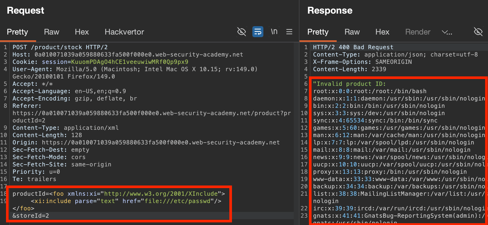

## XML external entity injection
#XML #XXE
Exploiting a server's/application's processing of XML data, to retrieve files/contact external or internal systems.

### #DTD - Document Type Definition
Contains declarations **defining an XML document's structure**, and the **types of data** it can contain. 
- Takes the form: `<!DOCTYPE foo [ <!ENTITY ext SYSTEM "file:///path/to/file" > ]>`
Can be **internal** (self-contained within the document itself) or **external** (loaded from elsewhere), or a **combination**.
### XML Entities
XML is a language designed for storing & transmitting data, using a tree-like structure. 
Entities are **ways of representing data within an XML document**, without using the data itself. E.g.:
- `>` = `&gt;`
- `<` = `&lt;`
To include tags **within `<xml>` data (surrounded by tags)**, must use their corresponding **XML entities**.

#### XML Custom Entities:
Can define custom entities within the #DTD, and refer to them within XML with entity reference `&myentity;`: For example:
- `<!DOCTYPE foo [ <!ENTITY myentity "my entity value" > ]>`

#### XML External Entities (XXEs):
Entities whose definition is **located outside of the DTD** where they are delcared (e.g. an external site).
- **Called with the `SYSTEM` keyword**, and the **URL from which the entity is loaded**.
- Can also pass the `file://` protocol to URL to **load external files.**
E.g.:
`<!DOCTYPE foo [ <!ENTITY ext SYSTEM "file:///path/to/file" > ]>`

As they allow an entity to be defined **based on the contents of a file path or URL**, can be a way to both **exfiltrate data** & **include malicious data.**

### XML Attacks & High-level Method:
- [File retrieval](https://portswigger.net/web-security/xxe#exploiting-xxe-to-retrieve-files): define an XXE with the contents of a well-known system file, & reference it in XML tree.
- [SSRF attacks](https://portswigger.net/web-security/xxe#exploiting-xxe-to-perform-ssrf-attacks), defining an XXE based on a URL to a back-end system.
- [Blind XXE to exfiltrate data out-of-band](https://portswigger.net/web-security/xxe/blind#exploiting-blind-xxe-to-exfiltrate-data-out-of-band): define XXE as a URL to an adversary-controlled server, & monitoring for interactions.
	- [Blind XXE to retrieve data via error messages](https://portswigger.net/web-security/xxe/blind#exploiting-blind-xxe-to-retrieve-data-via-error-messages), triggering parsing error messages containing sensitive data.
- Inclusion of user-supplied data to back-end XML systems/documents (e.g. SOAP API) use an [XInclude attack](https://portswigger.net/web-security/xxe#xinclude-attacks) linked to a well-known operating system file.

---

## Retrieving Files with XXE
- Introduce a `DOCTYPE` element defining an XXE containing the **path to the file**.
- **Edit a data value** in the returned response XML to **reference the defined external entity**.
E.g. the below payload:
- *Defines an external entity `&xxe;` whose value is the contents of the `/etc/passwd` file.*
- *Uses the entity within the `productId` value.*
``` xml
<?xml version="1.0" encoding="UTF-8"?>
<!DOCTYPE foo [ <!ENTITY xxe SYSTEM "file:///etc/passwd"> ]>
<stockCheck><productId>&xxe;</productId></stockCheck>
```
**NOTE:** when testing, there are often **many data values within the submitted XML,** so must **submit your entity to each data node in the XML individually**, and seeing whether it appears within the response


### Retrieving files with `Xinclude`:
Sometimes, after applications **receive client-submitted data**, they **embed it on a server-side XML document** & **parse that document** (e.g. backend SOAP API request). In situations like these where you can't control the whole document, `DOCTYPE` XXEs won't work, but can try and use `Xinclude` instead.

`Xinclude`: part of the XML specification allowing an **XML document to be built from sub-documents**. Involves **referencing the `XInclude` namespace** & the **path to the file** that you wish to include.
- Include `parse="text"` to parse non-XML documents
``` xml
<foo xmlns:xi="http://www.w3.org/2001/XInclude">
<xi:include parse="text" href="file:///etc/passwd"/></foo>
```
Even if the app doesn't seem to accept XML (e.g. `productId=2&storeId=1`, **these values may be passed to a back-end XML API** & so can attempt to inject XXEs regardless.


### XXE attacks via file upload
As many **common file formats use XML/XML subcomponents** (`DOCX, SVG`) and are **processed server-side**, can attempt to exploit XXE through them, or combine with some kind of #file-check-bypass.

#### XXE inside an SVG:
- Declare a `DOCTYPE` with an XXE definition `&xxe;`
- Define `svg` view (dimensions)
- Create a sub-element inside `<svg>`, typically `text`, to display contents of whatever the XXE is referencing.
``` xml
<?xml version="1.0" encoding="UTF-8" standalone="yes"?>
<!DOCTYPE foo [ <!ENTITY xxe SYSTEM "file:///etc/hostname"> ]>
<svg xmlns="http://www.w3.org/2000/svg" width="228px" height="228px">
<text font-size="20" x="0" y="20">
&xxe;
</text>
</svg>
```

#### XXE via Modified `Content-Type`
Some applications will expect a specific content-type **but will also tolerate another**, like `application-data/xml`. ***Always try reformatting requests to use the XML format.***
For example, could change:
- `foo=bar`, to...
- `<?xml version="1.0" encoding="UTF-8"?><foo>bar</foo>`


### SSRF with XXE:
#xxe-ssrf
If you **define an XXE using the targeted URL** & use it in a data value that's returned in the application's response, then you can **view the URL's response within the application's response**, gaining two-way interaction with the back-end system. 
- E.g. contacting/crawling internal back-end systems:
`<!DOCTYPE foo [ <!ENTITY xxe SYSTEM "http://169.254.169.254/"> ]>`


---
